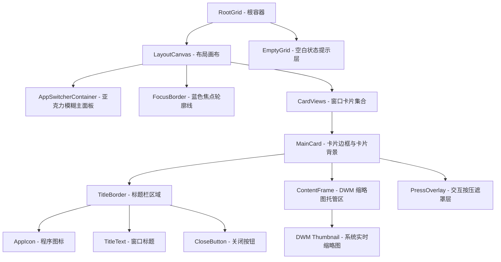
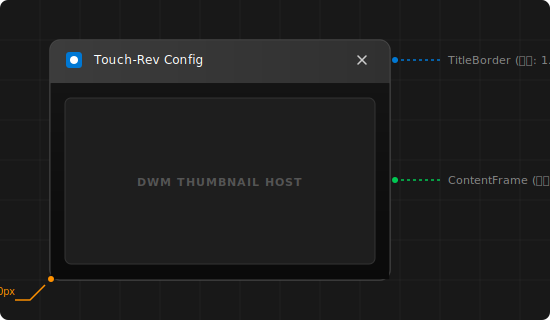

# AppSwitcher 外观组成及视觉设计分析

本文对 `Touch-Rev-GUI` 项目中 `AppSwitcher` 组件的 UI 组成、视觉元素、布局策略以及多态交互效果进行了全面剖析。

---

## 1. 整体视觉层级与嵌套结构

`AppSwitcher` 采用基于 XAML Islands 和 Windows Composition 层的混合渲染。其主界面（由 [AppSwitcherRoot.xaml](file:///d:/source/repos/Touch-Rev-GUI/src/appswitcher/xaml/AppSwitcherRoot.xaml) 承载）与窗口卡片（由 [SwitcherItem.xaml](file:///d:/source/repos/Touch-Rev-GUI/src/appswitcher/xaml/SwitcherItem.xaml) 承载）构成了多层次的视觉表现。

以下是 AppSwitcher 的核心视觉层级和嵌套关系：

---

## 2. 核心外观元素详解

### 2.1 亚克力主容器 (AppSwitcherContainer)

* **亚克力效果 (Acrylic Layer)**：
  主显示面板 `AppSwitcherContainer` 并非单纯的单色透明，而是通过 [MainView.cpp](file:///d:/source/repos/Touch-Rev-GUI/src/appswitcher/MainView.cpp) 接入了 Win32Composition 亚克力材质（`win32acrylic::AcrylicMaterial::Acrylic`），对背后的桌面窗口进行大范围模糊处理（模糊半径 `blurAmount = 80.0f`，加之微弱噪点 `noiseOpacity = 0.02f`），为界面提供了现代的 Windows 11 “云母/亚克力” 视觉质感。
* **圆角与边框**：
  主面板容器具有 `24` 的圆角（`CornerRadius="24"`）。其外围绘制了一圈 `1px` 粗细的半透明白色描边（`BorderBrush="#55FFFFFF"`），使得深色与亮色壁纸下都能清晰辨识界面边缘。

### 2.2 焦点边框 (FocusBorder)

* **视觉特征**：
  拥有 `20` 圆角、高饱和度冰蓝色（颜色由调色板中的 `focusBorder` 决定，默认接近 `#FF4CC2FF`）、`4px` 粗细的焦点框。
* **动态包裹**：
  当用户通过键盘或手势改变选中的卡片时，焦点框的坐标会重新映射，精确地定位到目标卡片四周，且在水平和垂直方向各自预留了 `10.0 DIP` 的外扩量（`inflationDip = 10.0`），呈现“选中”框包围卡片的生动效果。
* **多态可见性**：
  在触发鼠标拖拽（Dragging）时，为了确保视觉清爽，焦点框会被置为 `Collapsed`（隐藏）状态。

### 2.3 空白提示状态 (EmptyGrid)

* **表现形式**：
  当系统没有可切换的有效窗口时，主界面会隐藏卡片画布并激活 `EmptyGrid`。它垂直居中排列，包含：
  - 一个大字号（`48px`）、带 `#88FFFFFF` 半透明白的 Segoe MDL2 字符图标（`&#xE119;` 对应“无应用”图标）。
  - 一个清晰的提示语 “No switchable windows” （`EmptyText`）。

---

## 3. 单个窗口卡片 (CardView) 外观设计

单个切换项卡片（[CardView.cpp](file:///d:/source/repos/Touch-Rev-GUI/src/appswitcher/CardView.cpp)）由标题栏和内容区按 `1.8 : 8.2` 的比例分割（基于高分屏适配，亦可通过 `LayoutEngine::TitleRowWeight` 和 `ContentRowWeight` 控制比例）：

### 3.1 标题栏区 (TitleBorder)

* **背景与多态**：
  圆角为 `10, 10, 0, 0`。常规状态下背景色为半透明深灰 `#F0303030`；当鼠标悬停（Hover）在卡片上时，背景会淡入为稍微亮一些的 `titleHoverBackground`，给予视觉反馈。
* **图标加载**：
  优先尝试利用 Win32 API 抓取对应窗口 HWND 的实际运行图标并赋值给 `AppIcon`。如果某些窗口没有提供图标，则回退显示通用系统齿轮或窗口形状的 Segoe MDL2 字符图标 `&#xE700;`（`DefaultIcon`）。
* **标题文字**：
  使用 `CharacterEllipsis` 截断文本，保证长文件名窗口不会撑大或破坏标题栏。
* **关闭按钮**：
  右侧常驻一个极简的“X”型关闭按钮（Segoe MDL2 字符 `&#xE106;`），大小在交互中自动按比例调整（`std::max(28.0, h * 0.18)`），当鼠标指针对准它时，它会展现出红褐色或深灰色的半透明悬浮底色。

### 3.2 内容缩略图区 (ContentFrame)

* **背景设计**：
  底部圆角为 `0, 0, 10, 10`。背景色设置为近乎纯黑的 `#FF101010`。
* **实时缩略图 (DWM Thumbnail)**：
  该区域实质是宿主在 XAML 控件树上的 Win32 Native 窗口画面投影占位符。`PrivateThumbnailManager` 在该区域加载实时的 DWM 缩略图（DWM Thumbnail Slot），并根据 DPI 适配自动对原窗口截图进行裁剪和拉伸限制，使卡片内容具有物理级别的连贯性。

### 3.3 交互状态反馈与三维微动 (Micro-animations)

卡片内置了一套高灵敏的 Pointer 状态机，根据被选定/拖拽状态实时改变比例和图层：

* **悬停 (Hover)**：卡片对应的标题栏底色变亮。
* **按压 (Pressed)**：整个卡片在二维平面上收缩至原尺寸的 `98.5%`（`Scale = 0.985`），并亮起半透明的暗黑色蒙版 `PressOverlay`，模拟物理按压深度。
* **拖拽 (Grabbed / Dragging)**：整个卡片大幅收缩至原尺寸的 `90%`（`Scale = 0.90`），其他不相关的窗口卡片会被整体暂时隐退，只突出显示当前正在进行大范围拖拽的主活动卡片。

---

## 4. 排列布局算法 (LayoutEngine)

卡片的最终摆放形态受到 [LayoutEngine.cpp](file:///d:/source/repos/Touch-Rev-GUI/src/appswitcher/LayoutEngine.cpp) 算法引擎的严格约束，遵循以下几大视觉规则：

1. **纵横比夹紧限制**：
   从系统抓取出来的窗口其纵横比（Aspect Ratio）是多变的。为了防止卡片呈现过度细长或扁平的畸变，布局引擎将宽高比强行约束在 `0.4`（最窄） 到 `2.5`（最宽） 之间：
   $$
   \text{Aspect} = \text{clamp}\left(\frac{\text{Width}}{\text{Height}}, 0.4, 2.5\right)
   $$
2. **动态自适应缩放 (sn)**：
   依据窗口总数 $N$ 以及系统的横竖屏状态计算缩放系数 `sn`。
   - 横屏状态下：若 $N \le 2$，单张卡片尺寸较大；当 $N > 10$ 时，单张卡片会缩小，从而使得多任务界面能优雅地容纳所有程序卡片而不发生溢出。
3. **整齐折行与行居中**：
   卡片在主面板中横向流式排列，单行累加宽度达到预估的行包裹宽度限额时执行折行。
   为了追求视觉美感，每一行折行后的剩余空间会被计算为偏移量，让每一行里的卡片在其自身所在行内**水平居中对齐**。
4. **边距留白**：
   卡片之间的缝隙固定为 `32.0 DIP`（`ItemGapDip`），内容区域与亚克力主面板边缘则留有宽达 `48.0 DIP`（`PaddingDip`）的呼吸感边际保护区。
