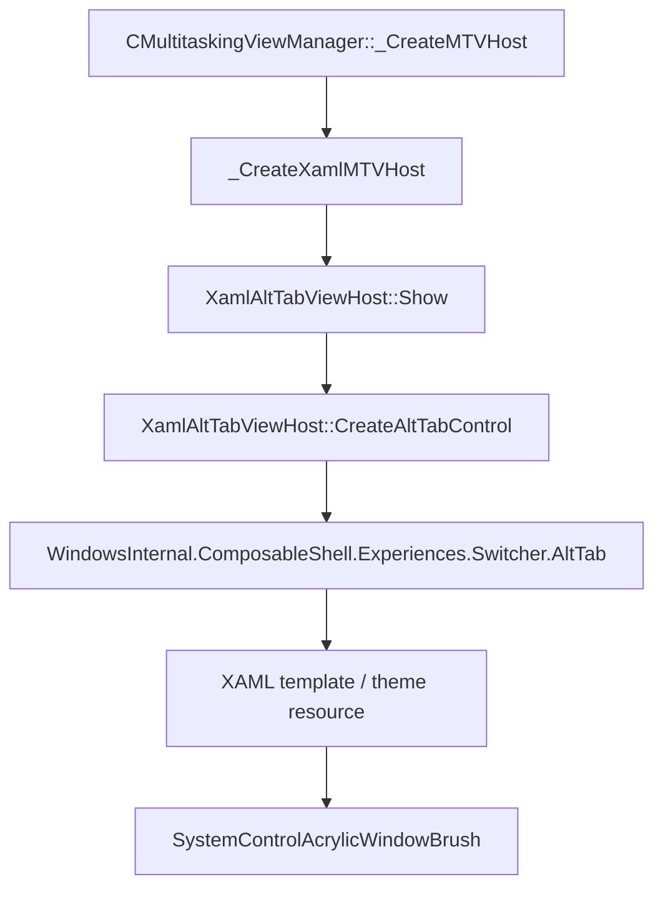

# Alt+Tab Acrylic 样式调查记录

> 日期：2026-06-22  
> 目标二进制：`C:\Windows\System32\twinui.pcshell.dll` / Ghidra program `/twinui.pcshell.dll.0`  
> 约束：不使用 Microsoft Docs；结论来自 Ghidra、PE/PRI/XBF 本地资源、Windows Kits 本机 XAML 资源对照。

## 结论

当前可复刻的 Alt+Tab 背景板 Acrylic 参数，优先使用 `SystemControlAcrylicWindowBrush` 等价配置：

| 场景 | `BackgroundSource` | `TintColor` | `TintOpacity` | `FallbackColor` |
| --- | --- | --- | ---: | --- |
| Dark / Default | `HostBackdrop` | `#FF1C1C1C` | `0.8` | `#FF1F1F1F` |
| Light | `HostBackdrop` | `#FFFFFFFF` | `0.8` | `#FFE6E6E6` |
| HighContrast | 不使用 Acrylic | `SystemColorWindowColor` | N/A | N/A |

判断依据：Alt+Tab 是独立 `XamlExplorerHostWindow` 中承载的 XAML control，需要采样 host window 背后的桌面/窗口内容；因此更匹配 `HostBackdrop` 的 `SystemControlAcrylicWindowBrush`，而不是 `Backdrop` 的 `SystemControlAcrylicElementBrush`。

## 当前实际执行路径



关键 Ghidra 位置：

| 项目 | 地址 / 字符串 | 结论 |
| --- | ---: | --- |
| `XamlAltTabViewHost::Show` | `0x180da35c0` / `0x180da3644` | 显示 Alt+Tab XAML host |
| `XamlAltTabViewHost::CreateAltTabControl` | `0x180da27d8` / `0x180da2800` | 创建 `AltTab` XAML control |
| `AltTab::AltTab` | `0x1801ffcf0` / `0x180da1b90` | 通过 WinRT activation factory 激活 XAML type |
| XAML type 字符串 | `0x180f861a0` | `WindowsInternal.ComposableShell.Experiences.Switcher.AltTab` |
| ViewModel 字符串 | `0x180f86110` | `WindowsInternal.ComposableShell.Experiences.Switcher.AltTabViewModel` |

`CreateAltTabControl` 的 native 层行为：

- 创建 `SwitchItemListViewModelArgs`。
- 设置 `ContextMenuSupported = false`。
- 绑定 Alt+Tab 数据源。
- 创建 `SwitchItemListViewModel` 和 `AltTabViewModel`。
- 创建 `WindowsInternal.ComposableShell.Experiences.Switcher.AltTab`。
- 设置 `SwitcherControlBase.UseRoundedFocusVisuals = true`。
- 调用 `BeginAnimation(...)`。

这里没有直接调用 `AcrylicBrush::AcrylicBrush()`，也没有直接设置 `TintColor`、`TintOpacity`、`FallbackColor`。

## 已排除路径

### `twinui.pcshell.dll` 中的直接 AcrylicBrush 构造不是 Alt+Tab

Ghidra 中存在：

| 字符串 / 函数 | 地址 | 结论 |
| --- | ---: | --- |
| `Windows.UI.Xaml.Media.AcrylicBrush` | `0x180f62cb0` | AcrylicBrush runtime class 字符串 |
| `AcrylicBrush::AcrylicBrush` wrapper | `0x18053b618` | XAML AcrylicBrush 构造包装 |
| `CreateXamlContent` | `0x18053c418` | caller 是 `TouchEdgeGripperWindow` |

`CreateXamlContent` 中确实能看到 `AcrylicBrush()`、`TintColor(...)`、`TintOpacity(...)`、`FallbackColor(...)`、`BackgroundSource(...)` 等调用，但 caller 是 `TouchEdgeGripperWindow`，不是 Alt+Tab。该路径不能作为 Alt+Tab 背景板 Acrylic 的 1:1 来源。

### 没发现 native DWM blur / accent policy 直接路径

已搜索但未命中 Alt+Tab 背景相关 direct native 设置：

- `SetWindowCompositionAttribute`
- `AccentPolicy`
- `DWMWA_SYSTEMBACKDROP_TYPE`
- `Mica`
- `HostBackdrop`
- `DesktopAcrylic`

这支持当前判断：Alt+Tab 背景 Acrylic 由 XAML theme resource / template 解析，而不是 `twinui.pcshell.dll` 手动配置 native blur。

## Theme resource 证据

本机 Windows Kits 文件：

```text
C:\Program Files (x86)\Windows Kits\10\DesignTime\CommonConfiguration\Neutral\UAP\10.0.26100.0\Generic\themeresources.xaml
```

同时通过 `makepri dump` 检查：

```text
C:\Windows\SystemApps\Microsoft.WindowsAppRuntime.CBS_8wekyb3d8bbwe\Microsoft.UI.Xaml.Controls.pri
```

从 `themeresources.xbf` 字符串确认存在同组资源：

- `SystemControlAcrylicWindowBrush`
- `SystemControlAcrylicElementBrush`
- `SystemControlAcrylicWindowMediumHighBrush`
- `SystemControlAcrylicElementMediumHighBrush`
- `TintOpacity`
- `AcrylicBrush`

### Dark / Default theme 展开值

| Resource key | 值 |
| --- | --- |
| `SystemChromeAltHighColor` | `#FF1C1C1C` |
| `SystemChromeMediumColor` | `#FF1F1F1F` |
| `SystemControlAcrylicWindowBrush.BackgroundSource` | `HostBackdrop` |
| `SystemControlAcrylicWindowBrush.TintColor` | `SystemChromeAltHighColor` |
| `SystemControlAcrylicWindowBrush.TintOpacity` | `0.8` |
| `SystemControlAcrylicWindowBrush.FallbackColor` | `SystemChromeMediumColor` |

等价复刻值：`HostBackdrop` + `#FF1C1C1C` + `0.8` + `#FF1F1F1F`。

### Light theme 展开值

| Resource key | 值 |
| --- | --- |
| `SystemChromeAltHighColor` | `#FFFFFFFF` |
| `SystemChromeMediumColor` | `#FFE6E6E6` |
| `SystemControlAcrylicWindowBrush.BackgroundSource` | `HostBackdrop` |
| `SystemControlAcrylicWindowBrush.TintColor` | `SystemChromeAltHighColor` |
| `SystemControlAcrylicWindowBrush.TintOpacity` | `0.8` |
| `SystemControlAcrylicWindowBrush.FallbackColor` | `SystemChromeMediumColor` |

等价复刻值：`HostBackdrop` + `#FFFFFFFF` + `0.8` + `#FFE6E6E6`。

### HighContrast 行为

高对比主题中 `SystemControlAcrylicWindowBrush` 退化为纯色 `SolidColorBrush`，颜色来自 `SystemColorWindowColor`。复刻时应跟随系统高对比设置切换到纯色背景。

## 旧 DComp / MultitaskingViewFrame 路径

旧实现仍存在，但不应直接等价为当前 XAML Alt+Tab Acrylic：

| 函数 / 数据 | 地址 / 路径 | 结论 |
| --- | ---: | --- |
| `CAltTabViewHost::RuntimeClassInitialize` | `0x180aa8910` | 旧 AltTab host 初始化 |
| `GetConfigFromRegistry` | `0x180abe910` | 读取 `MultitaskingViewConfig` |
| `DAT_180fcf410` | `0x180fcf410` | `AltTabViewHost` 默认配置块 |
| Registry override | `HKCU\Software\Microsoft\Windows\CurrentVersion\Explorer\MultitaskingView\AltTabViewHost` | 覆盖旧路径布局/背景参数 |

已识别字段：

| 字段 | 当前理解 |
| --- | --- |
| `Grid_backgroundPercent` | 默认值约 `0.85` |
| `BackgroundDimmingLayer_percent` | 背景 dimming 强度 |
| `ContentDimmingLayer_*` | 内容区域 dimming 边距/偏移 |
| `Wallpaper` | 是否使用壁纸背景 |
| `Grid_*` | grid layout、margin、spacing |
| `ScrollButtonContainer_*` | 滚动按钮 container 样式 |

该路径可作为历史/备用行为参考，但当前 XAML Alt+Tab Acrylic 应继续围绕 XAML template 和 theme resource 验证。

## 复刻建议

### WinUI / Windows App SDK

优先直接使用 `AcrylicBrush`，按当前 theme 展开值配置：

| 属性 | Dark 值 |
| --- | --- |
| `BackgroundSource` | `HostBackdrop` |
| `TintColor` | `#FF1C1C1C` |
| `TintOpacity` | `0.8` |
| `FallbackColor` | `#FF1F1F1F` |

同时处理 Light / HighContrast 分支。

### WPF / Win32 自绘

需要拆成多层近似：

1. 使用 DWM / Composition 实现 host backdrop blur。
2. 叠加 tint：Dark 使用 `#FF1C1C1C`，alpha/tint opacity 为 `0.8`。
3. fallback 使用 `#FF1F1F1F`。
4. 加系统 Acrylic 的 noise 纹理层，否则会比原版更“干净”。
5. 高对比模式改为纯色 `SystemColorWindowColor`。

## 进一步影响 Acrylic 观感的参数

用户要求继续确认 noise、blur、外层 dimming/container、系统状态四类影响项后，新增结论如下。

### 1. Noise texture

本机 `Microsoft.UI.Xaml.Controls.pri` 中确认存在 Acrylic 相关 noise 资源：

```text
NoiseAsset_256X256_PNG.png
```

当前没有在 `twinui.pcshell.dll` 或 `themeresources.xaml` 中找到公开的 `NoiseOpacity`、`NoiseAlpha`、`NoiseScale`、`NoiseIntensity` 字段。当前判断：noise 属于 XAML Acrylic material 内部实现，不是 Alt+Tab template 单独配置的公开参数。

复刻时如果不用原生 `AcrylicBrush`，至少需要叠加一层 256x256 noise texture，否则画面会比系统 Acrylic 更干净。

### 2. Blur / saturation / brightness

`twinui.pcshell.dll` 中存在内部 composition blur effect：

```text
Microsoft.Internal.UI.Composition.Effects.GaussianBlurEffect
```

相关属性名：

```text
BlurAmount
Optimization
BorderMode
```

Ghidra 中 `GaussianBlurEffect` 默认构造路径写入的默认值为：

```text
BlurAmount   = 3.0
Optimization = 1
BorderMode   = 0
```

关键位置：

| 项目 | 地址 / 函数 | 结论 |
| --- | ---: | --- |
| `GaussianBlurEffect` runtime class string | `0x180f5dca0` | 内部 composition blur effect |
| `BlurAmount` string | `0x180f5e5e8` | blur 属性名 |
| `GaussianBlurEffect::GetNamedPropertyMapping` | `0x180ba7240` | 映射 `BlurAmount` / `Optimization` / `BorderMode` |
| `MakeAndInitialize<GaussianBlurEffect>` | `0x180ba1a80` | 默认写入 float `3.0` |

限制：这只能证明 `twinui.pcshell.dll` 内部存在 `GaussianBlurEffect`，不能直接证明当前 XAML Alt+Tab Acrylic 的 blur radius 就是 `3.0`。当前 Alt+Tab 主路径仍是 XAML `AcrylicBrush` / theme resource。

当前没有找到 Alt+Tab 或 Acrylic resource 相关的公开 `Saturation`、`Luminosity`、`Brightness`、`Clamp` 配置。MUX PRI 中出现的 `Saturation` 属于 `ColorPicker` 控件，不是 Acrylic material。

### 3. 外层 container / dimming / layout

旧 `MultitaskingViewFrame` / DComp 配置路径中存在可影响背景观感的 registry override 字段。

`MultitaskingViewConfigHelpers::_ReadFrameMetrics` (`0x180abeed0`) 读取：

```text
ContentDimmingLayer_top_percent
ContentDimmingLayer_top_offset
ContentDimmingLayer_bottom_percent
ContentDimmingLayer_bottom_offset
Wallpaper
ContentDimmingLayer
Grid_desktop_margin
Desktop_height
BackgroundDimmingLayer_percent
NoContentLightDismiss
AllowDrag
DragVisualShrinkRatio
ExternalDrag
ExternalDragOffset_width
ExternalDragOffset_height
ExternalDragMinOpacity
```

`MultitaskingViewConfigHelpers::_ReadGridMetrics` (`0x180abf098`) 读取：

```text
Grid_layoutmode
Grid
Grid_relative
Grid_adjacentspacing
Grid_rowspacing
Grid_backgroundPercent
ScrollButtonContainer
ScrollButtonContainer_buttonspacing
ScrollButtonContainer_button
```

当前最接近 Alt+Tab 背景板观感的字段：

| 字段 | 影响 |
| --- | --- |
| `BackgroundDimmingLayer_percent` | 背景 dimming 强度 |
| `ContentDimmingLayer_*` | 内容区域上下 dimming 分布 |
| `Grid_backgroundPercent` | grid 背景覆盖比例 / 强度候选，旧默认理解约 `0.85` |
| `Wallpaper` | 是否使用 wallpaper 背景 |
| `Grid_*` | 背景区域位置、边距、间距 |
| `ScrollButtonContainer_*` | 滚动按钮容器布局和样式 |

限制：这些字段主要证明旧路径存在额外 dimming / wallpaper / grid background 逻辑，尚不能直接等价为当前 XAML Alt+Tab template。当前 XAML template 是否也叠加 overlay / border / shadow 仍需动态 UI tree 或 XBF template 反查。

### 4. 系统状态 / Acrylic policy

`twinui.pcshell.dll` 中确认存在：

```text
pcshell\twinui\acrylicmanager\lib\acrylicpolicymanager.cpp
```

`AcrylicPolicyManager::UpdateAcrylicState` (`0x18074b400`) 会汇总系统状态并发布：

```text
WNF_IMSN_TRANSPARENCYPOLICY
```

当前逻辑可整理为：

```text
acrylicEnabled =
    !isHighContrast
    && !isBatterySaver
    && isTransparencyEnabled
    && isDeviceCapableOfAcrylic
```

相关证据：

| 条件 | 函数 / 地址 | 判断来源 |
| --- | ---: | --- |
| `EnableTransparency` | `AcrylicPolicyManager::_IsTransparencyEnabled` / `0x18074b5a8` | `HKCU\SOFTWARE\Microsoft\Windows\CurrentVersion\Themes\Personalize\EnableTransparency` |
| High Contrast | `AcrylicPolicyManager::_IsHighContrast` / `0x18074b548` | `SystemParametersInfoW(0x42, ...)` |
| Battery Saver | `AcrylicPolicyManager::OnBatterySaverStateChanged` / `0x180749fc0` | 状态变化后调用 `UpdateAcrylicState` |
| DComp capability | `AcrylicPolicyManager::_IsDeviceCapableOfAcrylic` / `0x18074b4c0` | `NtDCompositionGetFrameStatistics(...)` |
| Composition capability change | `AcrylicPolicyManager::OnCompositionCapabilitiesChanged` / `0x18074a040` | 能力变化后刷新 policy |
| Theme / High Contrast message | `AcrylicPolicyManager::OnMessage` / `0x18074a0b0` | 收到 `0x31a` 后重读 High Contrast |

因此，1:1 复刻时不能只写 brush 参数，还必须跟随系统状态降级：

```text
EnableTransparency = 0 -> fallback
HighContrast       = true -> SolidColorBrush(SystemColorWindowColor)
BatterySaver       = true -> fallback
DComp incapable    = true -> fallback
```

## 补充：本机 theme resource 中可影响复刻的 Acrylic 配置

前面的结论只记录了 `SystemControlAcrylicWindowBrush`。继续检查 `themeresources.xaml` 后，当前需要一并保留以下候选配置，避免复刻时漏掉 shell 可能实际引用的相近 resource。

### 1. Dark / Default 候选 brush

Dark / Default 主题下的基础色：

| Resource key | 值 |
| --- | --- |
| `SystemChromeAltHighColor` | `#FF1C1C1C` |
| `SystemChromeMediumColor` | `#FF1F1F1F` |
| `SystemChromeMediumLowColor` | `#FF2B2B2B` |

Acrylic brush 候选：

| Resource key | `BackgroundSource` | `TintColor` | `TintOpacity` | `FallbackColor` | 复刻含义 |
| --- | --- | --- | ---: | --- | --- |
| `SystemControlAcrylicWindowBrush` | `HostBackdrop` | `SystemChromeAltHighColor` / `#FF1C1C1C` | `0.8` | `SystemChromeMediumColor` / `#FF1F1F1F` | 当前最高置信度基线 |
| `SystemControlAcrylicElementBrush` | `Backdrop` | `SystemChromeAltHighColor` / `#FF1C1C1C` | `0.8` | `SystemChromeMediumColor` / `#FF1F1F1F` | element 内部 Acrylic，不适合独立 host window |
| `SystemControlAcrylicWindowMediumHighBrush` | `HostBackdrop` | `SystemChromeAltHighColor` / `#FF1C1C1C` | `0.7` | `SystemChromeMediumColor` / `#FF1F1F1F` | 比 `WindowBrush` 更透，仍需动态排除 |
| `SystemControlAcrylicElementMediumHighBrush` | `Backdrop` | `SystemChromeAltHighColor` / `#FF1C1C1C` | `0.7` | `SystemChromeMediumColor` / `#FF1F1F1F` | element 版本候选 |
| `SystemControlTransientBackgroundBrush` | `HostBackdrop` | `SystemChromeAltHighColor` / `#FF1C1C1C` | `0.8` | `SystemChromeMediumLowColor` / `#FF2B2B2B` | flyout/transient surface 背景候选，fallback 比基线更亮 |
| `SystemControlChromeMediumLowAcrylicWindowMediumBrush` | `HostBackdrop` | `SystemChromeAltHighColor` / `#FF1C1C1C` | `0.6` | `SystemChromeMediumLowColor` / `#FF2B2B2B` | 更透明的 medium 强度候选 |
| `SystemControlChromeMediumAcrylicWindowMediumBrush` | `HostBackdrop` | `SystemChromeAltHighColor` / `#FF1C1C1C` | `0.6` | `SystemChromeMediumColor` / `#FF1F1F1F` | medium 强度候选 |

### 2. Light 候选 brush

Light 主题下的基础色：

| Resource key | 值 |
| --- | --- |
| `SystemChromeAltHighColor` | `#FFFFFFFF` |
| `SystemChromeMediumColor` | `#FFE6E6E6` |
| `SystemChromeMediumLowColor` | `#FFF2F2F2` |

Acrylic brush 候选：

| Resource key | `BackgroundSource` | `TintColor` | `TintOpacity` | `FallbackColor` | 复刻含义 |
| --- | --- | --- | ---: | --- | --- |
| `SystemControlAcrylicWindowBrush` | `HostBackdrop` | `SystemChromeAltHighColor` / `#FFFFFFFF` | `0.8` | `SystemChromeMediumColor` / `#FFE6E6E6` | 当前最高置信度基线 |
| `SystemControlAcrylicElementBrush` | `Backdrop` | `SystemChromeAltHighColor` / `#FFFFFFFF` | `0.8` | `SystemChromeMediumColor` / `#FFE6E6E6` | element 内部 Acrylic |
| `SystemControlAcrylicWindowMediumHighBrush` | `HostBackdrop` | `SystemChromeAltHighColor` / `#FFFFFFFF` | `0.7` | `SystemChromeMediumColor` / `#FFE6E6E6` | 更透的 window 候选 |
| `SystemControlAcrylicElementMediumHighBrush` | `Backdrop` | `SystemChromeAltHighColor` / `#FFFFFFFF` | `0.7` | `SystemChromeMediumColor` / `#FFE6E6E6` | element 版本候选 |
| `SystemControlTransientBackgroundBrush` | `HostBackdrop` | `SystemChromeAltHighColor` / `#FFFFFFFF` | `0.8` | `SystemChromeMediumLowColor` / `#FFF2F2F2` | transient surface 背景候选，fallback 比基线更亮 |
| `SystemControlChromeMediumLowAcrylicWindowMediumBrush` | `HostBackdrop` | `SystemChromeAltHighColor` / `#FFFFFFFF` | `0.6` | `SystemChromeMediumLowColor` / `#FFF2F2F2` | 更透明的 medium 强度候选 |
| `SystemControlChromeMediumAcrylicWindowMediumBrush` | `HostBackdrop` | `SystemChromeAltHighColor` / `#FFFFFFFF` | `0.6` | `SystemChromeMediumColor` / `#FFE6E6E6` | medium 强度候选 |

### 3. High Contrast / fallback 行为

High Contrast 下，上述 Acrylic resource 均退化为 `SolidColorBrush`，典型值为：

```text
SystemControlAcrylicWindowBrush       -> SolidColorBrush(SystemColorWindowColor)
SystemControlAcrylicElementBrush      -> SolidColorBrush(SystemColorWindowColor)
SystemControlAcrylicWindowMediumHighBrush  -> SolidColorBrush(SystemColorWindowColor)
SystemControlAcrylicElementMediumHighBrush -> SolidColorBrush(SystemColorWindowColor)
```

此外 `SystemControlTransientBackgroundBrush` 在部分 High Contrast/高可读性分支下不是 Acrylic，而是直接映射到 `SystemChromeMediumLowColor` 或系统窗口色。复刻时必须把 High Contrast 视为纯色降级路径，而不是调低透明度。

### 4. Win32 native Acrylic 等价参数记录

在当前项目复刻尝试中，`Windows.UI.Xaml.Media.AcrylicBrush` 放在 `DesktopWindowXamlSource` / XAML Island 内时没有产生可见 Acrylic，只表现为透明或 fallback。继续尝试时转为 Win32 native Acrylic 路径，使用：

```text
SetWindowCompositionAttribute
WCA_ACCENT_POLICY = 19
ACCENT_ENABLE_ACRYLICBLURBEHIND = 4
```

`AccentPolicy` 结构按如下字段组织：

```text
accentState   = 4  // ACCENT_ENABLE_ACRYLICBLURBEHIND
accentFlags   = 0
animationId   = 0
gradientColor = AABBGGRR
```

其中 `gradientColor` 不是 XAML 的 `#AARRGGBB`，而是 Win32 AccentPolicy 常用的 `AABBGGRR` 排列。按 Alt+Tab 基线换算：

| 主题 | XAML tint | XAML `TintOpacity` | Native alpha | Native `gradientColor` |
| --- | --- | ---: | ---: | --- |
| Dark | `#FF1C1C1C` | `0.8` | `0xCC` | `0xCC1C1C1C` |
| Light | `#FFFFFFFF` | `0.8` | `0xCC` | `0xCCFFFFFF` |

注意：native Accent Acrylic 与 XAML Acrylic 不是同一条渲染管线。它可以提供真实 DWM blur/tint，但 blur 半径、noise、饱和度和系统 material policy 不保证 1:1 等价。

### 5. 当前项目复刻路径的阶段性结论

当前项目里曾尝试三条路径：

| 路径 | 结果 | 结论 |
| --- | --- | --- |
| `AppSwitcherContainer.Background = AcrylicBrush(HostBackdrop)` | 用户反馈仍未使用亚克力 | XAML Island 内的 `AcrylicBrush` 没有产生目标 host backdrop 效果 |
| sibling child HWND 背后放 native Acrylic | 用户反馈仍只是透明 | `DesktopWindowXamlSource` child HWND 不会透出 sibling child HWND 的 Acrylic |
| 对 XAML Island child HWND 自身应用 `SetWindowCompositionAttribute` 并用 `SetWindowRgn` 裁剪 | 已构建，待用户视觉验证 | 更合理，因为透明 XAML 内容直接显示其宿主 HWND 的 native Acrylic |

该阶段性结论只属于项目复刻实现，不改变对系统 Alt+Tab 的静态逆向判断：系统 Alt+Tab 更可能仍由 XAML theme resource/template 解析 `AcrylicBrush`，不是在 `twinui.pcshell.dll` 中直接调用 `SetWindowCompositionAttribute`。

## 后续待验证点

- 动态确认 `WindowsInternal.ComposableShell.Experiences.Switcher.AltTab` root/container 实际引用的是 `SystemControlAcrylicWindowBrush`，还是 `SystemControlAcrylicWindowMediumHighBrush` / `SystemControlTransientBackgroundBrush`。
- 用 UI tree / Live Visual Tree / debugger 读取运行时 `Background` resource key。
- 继续确认 XAML template 里是否额外叠加 dimming / border / shadow / overlay。
- 若不用原生 `AcrylicBrush`，继续确认 Acrylic 内部 blur radius、noise opacity、噪声纹理采样方式是否可从 XBF / runtime resource 中提取。
- 在当前项目内继续验证 `SetWindowCompositionAttribute` 作用于 `DesktopWindowXamlSource` child HWND 后是否真正产生 blur；若仍无效，下一步应改成 top-level layered/acrylic popup 或 Composition 自绘 backdrop。

## 小结

当前最可靠的复刻基线是：

```text
SystemControlAcrylicWindowBrush
BackgroundSource = HostBackdrop
TintOpacity      = 0.8
Dark TintColor   = #FF1C1C1C
Dark Fallback    = #FF1F1F1F
Light TintColor  = #FFFFFFFF
Light Fallback   = #FFE6E6E6
HighContrast     = SolidColorBrush(SystemColorWindowColor)
```

这不是最终动态验证结论，而是当前静态逆向和本机 XAML resource 对照后得到的最高置信度参数。