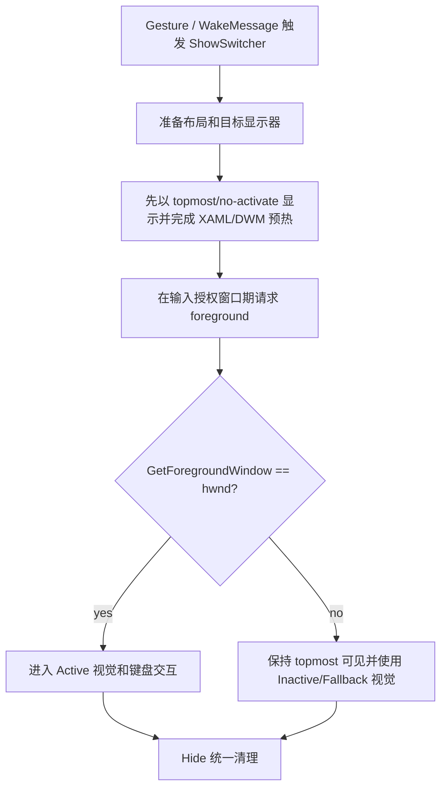
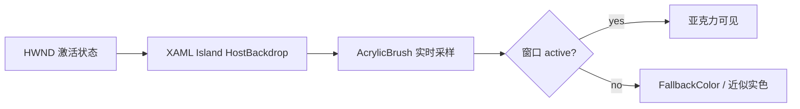
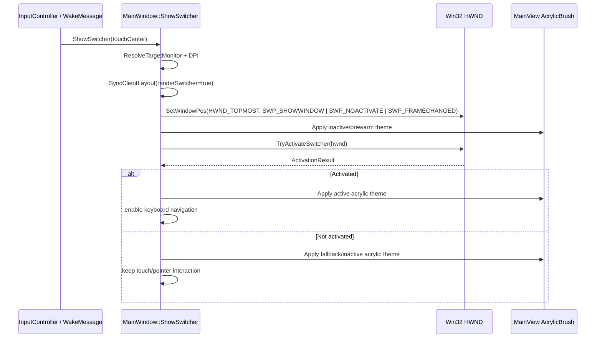
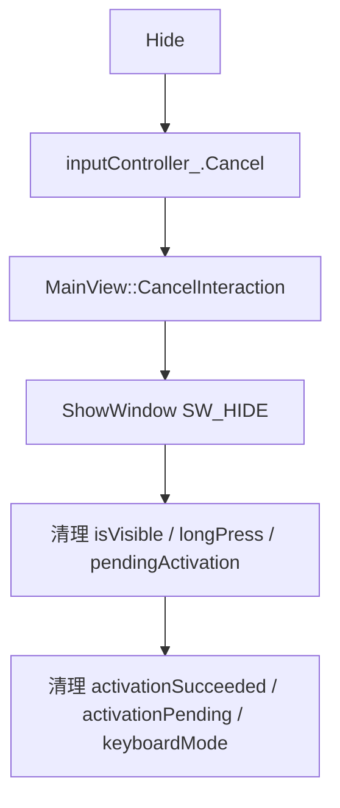

# AppSwitcher Focus and Acrylic Startup Plan

## 结论

当前 `AppSwitcher` 的显示链路把“显示窗口”和“强制前台焦点”绑定在一起：`ShowSwitcher()` 先 `SetWindowPos(... SWP_SHOWWINDOW ...)`，再执行 `ForceForegroundWindow()`，随后刷新 XAML `AcrylicBrush`。这个设计存在两个问题：

1. `SetForegroundWindow` 受 Windows 前台锁规则限制，不能稳定成功。
2. 当前 `AcrylicBrush` 使用 `HostBackdrop`，窗口未激活时容易进入 fallback 外观，因此启动时焦点失败会直接表现为亚克力背景失效。

推荐方案不是继续加大“抢焦点”强度，而是把 Show 拆成四个明确阶段：



最终目标：

- **可见性**由 `SetWindowPos(HWND_TOPMOST | SWP_SHOWWINDOW)` 保证。
- **焦点成功**由 `SetForegroundWindow` 返回值和 `GetForegroundWindow()` 二次校验确认。
- **亚克力状态**由实际激活状态驱动，而不是假设 `ShowWindow` 后一定激活。
- **侵入性 fallback**（`AttachThreadInput`、`SendInput`）改为可控、可观测、可关闭。

## 当前代码路径

### Show 路径

当前入口是 [`MainWindow.cpp:610-655`](../../src/ui/MainWindow.cpp#L610-L655)。主要处理顺序：

| 顺序 | 当前动作 | 代码位置 | 作用 |
| --- | --- | --- | --- |
| 1 | `ResetSelection()` | [`MainWindow.cpp:617`](../../src/ui/MainWindow.cpp#L617) | 清空选中状态 |
| 2 | 解析目标显示器、DPI、窗口矩形 | [`MainWindow.cpp:621-633`](../../src/ui/MainWindow.cpp#L621-L633) | 准备跨屏和 DPI 布局 |
| 3 | `SyncClientLayout(..., true)` | [`MainWindow.cpp:635`](../../src/ui/MainWindow.cpp#L635) | 同步 XAML 容器大小 |
| 4 | `SetWindowPos(HWND_TOPMOST, ..., SWP_SHOWWINDOW | SWP_FRAMECHANGED)` | [`MainWindow.cpp:637-645`](../../src/ui/MainWindow.cpp#L637-L645) | 显示、置顶、调整 frame |
| 5 | `ForceForegroundWindow(hwnd_)` | [`MainWindow.cpp:647`](../../src/ui/MainWindow.cpp#L647) | 尝试强制前台 |
| 6 | `RefreshTheme()` + `ApplyTheme()` | [`MainWindow.cpp:650-652`](../../src/ui/MainWindow.cpp#L650-L652) | 重新创建 XAML brush |

### Hide 路径

当前隐藏入口是 [`MainWindow.cpp:657-670`](../../src/ui/MainWindow.cpp#L657-L670)。顺序是：

| 顺序 | 当前动作 | 代码位置 | 作用 |
| --- | --- | --- | --- |
| 1 | 判断 `hwnd_` 和 `isVisible_` | [`MainWindow.cpp:659-662`](../../src/ui/MainWindow.cpp#L659-L662) | 避免重复隐藏 |
| 2 | `inputController_.Cancel(hwnd_)` | [`MainWindow.cpp:664`](../../src/ui/MainWindow.cpp#L664) | 清理输入状态 |
| 3 | `appSwitcherMainView_.CancelInteraction()` | [`MainWindow.cpp:665`](../../src/ui/MainWindow.cpp#L665) | 清理 AppSwitcher 交互 |
| 4 | `ShowWindow(hwnd_, SW_HIDE)` | [`MainWindow.cpp:666`](../../src/ui/MainWindow.cpp#L666) | 隐藏窗口 |
| 5 | 清理导航状态 | [`MainWindow.cpp:667-669`](../../src/ui/MainWindow.cpp#L667-L669) | 重置内部状态 |

Hide 的主流程基本合理，主要缺少的是对 Show 阶段新增状态的统一清理，例如 `activationPending`、`activationSucceeded`、`fallbackFocusMode` 等。

## 当前焦点获取逻辑的问题

`ForceForegroundWindow()` 位于 [`MainWindow.cpp:43-105`](../../src/ui/MainWindow.cpp#L43-L105)。它包含三层尝试：

| 层级 | 当前逻辑 | 风险 |
| --- | --- | --- |
| 1 | 直接 `SetForegroundWindow()` | 系统可能拒绝，当前只在第一层检查返回值 |
| 2 | `AttachThreadInput()` 后再设置前台 | 未检查 `AttachThreadInput` 返回值，失败后仍继续 `SetActiveWindow` / `SetFocus` |
| 3 | `SendInput()` 模拟 `ALT + F24` 后再设置前台 | 侵入性高，可能污染用户输入状态，也可能被系统或安全软件拦截 |

关键问题不是“少调用了一次 API”，而是缺少一个明确的状态判定：

```text
输入：hwnd_
处理：请求 foreground
判定：GetForegroundWindow() == hwnd_
输出：Active / Inactive 两条路径
```

现在代码在 [`MainWindow.cpp:647-652`](../../src/ui/MainWindow.cpp#L647-L652) 调用 `ForceForegroundWindow()` 后无条件刷新主题，因此 XAML acrylic 的实际状态和窗口激活状态可能不一致。

## Acrylic 失效原因

当前 XAML 容器背景由 `MainView::ApplyTheme()` 每次重新创建：[`MainView.cpp:341-354`](../../src/appswitcher/MainView.cpp#L341-L354)。具体 brush 是 `AcrylicBrush`，并且使用 `AcrylicBackgroundSource::HostBackdrop`：[`MainView.cpp:42-50`](../../src/appswitcher/MainView.cpp#L42-L50)。

DWM 侧同时禁用了系统 backdrop：[`ThemeManager.cpp:122-130`](../../src/ui/ThemeManager.cpp#L122-L130)。窗口 frame 仍通过 `DwmExtendFrameIntoClientArea()` 扩展到客户区：[`ThemeManager.cpp:133-136`](../../src/ui/ThemeManager.cpp#L133-L136)。

因此当前视觉依赖关系是：



这解释了现象：如果启动时窗口没有成为 foreground window，`HostBackdrop` acrylic 可能直接退到 fallback，用户看到的就是“亚克力失效”。

## 推荐完整方案

### 方案分层

| 层级 | 目标 | 改动点 |
| --- | --- | --- |
| L1 显示稳定性 | 确保窗口总能出现 | `SetWindowPos` 负责 topmost + show，不依赖 foreground |
| L2 焦点获取 | 在合法时机争取 foreground | `TryActivateSwitcher()` 返回明确结果 |
| L3 视觉一致性 | Acrylic 按 active/inactive 切换 | `WM_ACTIVATE` 和 `GetForegroundWindow()` 驱动 theme/backdrop |
| L4 输入降级 | 焦点失败仍可使用触摸路径 | 键盘快捷键仅在 active 时启用，pointer/touch 继续可用 |
| L5 可观测性 | 定位失败原因 | DebugLog 记录每一步 Win32 API 结果 |

### Show 新流程



推荐把当前 `ShowSwitcher()` 的后半段重构为：

1. **显示前准备**
   - 保留当前显示器、DPI、`ForwardDpiChangeToChild()`、`SyncClientLayout()` 逻辑。
   - 这部分代码已经集中在 [`MainWindow.cpp:621-635`](../../src/ui/MainWindow.cpp#L621-L635)。

2. **无激活显示窗口**
   - 第一次 `SetWindowPos` 建议增加 `SWP_NOACTIVATE`。
   - 原因：先保证窗口可见和 XAML host 完成布局，避免 `ShowWindow` 隐式激活失败后状态不确定。
   - 当前调用位置是 [`MainWindow.cpp:637-645`](../../src/ui/MainWindow.cpp#L637-L645)。

3. **预热 acrylic**
   - 在第一次显示后立即 `RefreshTheme()` + `ApplyTheme()`。
   - 这是为了让 XAML tree 在窗口可见时拥有有效 host backdrop。
   - 当前 theme 刷新在 [`MainWindow.cpp:650-652`](../../src/ui/MainWindow.cpp#L650-L652)，建议移动到激活尝试前后各有明确分支，而不是只做一次。

4. **请求 foreground**
   - 新增 `TryActivateSwitcher(HWND hwnd)`，返回结构体，例如：

     ```text
     ActivationResult { bool foreground; bool directOk; bool attachOk; bool altFallbackUsed; HWND actualForeground; DWORD lastError; }
     ```

   - 成功判定必须统一为：`GetForegroundWindow() == hwnd`。
   - `SetActiveWindow()` 和 `SetFocus()` 只在当前线程或 attach 成功后调用。

5. **按结果更新视觉和输入模式**
   - 成功：刷新为 active 视觉，允许 `WM_KEYDOWN` 处理键盘导航。
   - 失败：保留 topmost 可见，但使用 inactive/fallback palette，键盘导航不作为主路径。

### ForceForegroundWindow 替换策略

当前 `ForceForegroundWindow()` 建议拆成以下函数：

| 函数 | 职责 |
| --- | --- |
| `IsSwitcherForeground()` | 只判断 `GetForegroundWindow() == hwnd_` |
| `TrySetForegroundDirect()` | 调用 `SetForegroundWindow()` 并二次校验 |
| `TrySetForegroundWithAttach()` | 仅在 foreground thread 存在且 `AttachThreadInput` 成功时执行 |
| `TrySetForegroundWithInputFallback()` | 可配置开关，默认关闭或仅 debug 开启 |
| `ApplyActivationVisualState()` | 根据 active/inactive 应用 theme 和输入模式 |

关键约束：

- 不再使用 `void ForceForegroundWindow()`。焦点请求必须有返回值。
- `AttachThreadInput()` 必须检查返回值，并使用 RAII / scope guard 保证 detach。
- `SendInput()` 不应该是默认路径。它最多作为高级选项：`g_AllowFocusInputFallback`。

### WM_ACTIVATE 驱动最终状态

当前 `WM_ACTIVATE` 只在非 inactive 时刷新主题：[`MainWindow.cpp:244-252`](../../src/ui/MainWindow.cpp#L244-L252)。建议改为完整处理：

| 消息状态 | 推荐行为 |
| --- | --- |
| `WA_ACTIVE` / `WA_CLICKACTIVE` | `activationSucceeded_ = true`，应用 active acrylic palette |
| `WA_INACTIVE` 且 `isVisible_` | `activationSucceeded_ = false`，应用 inactive/fallback palette 或保持 topmost touch mode |
| `WA_INACTIVE` 且隐藏中 | 不重复刷新 theme，只清理状态 |

这样可以避免只在 Show 后判断一次。即使 Windows 延迟激活、DWM composition 变化、foreground 被其他窗口抢走，AppSwitcher 也能恢复正确视觉。

### Acrylic 视觉策略

推荐保留当前 XAML `AcrylicBrush(HostBackdrop)`，但增加 active/inactive 两套 palette：

| 状态 | `AcrylicBrush` 策略 | 目的 |
| --- | --- | --- |
| Active | 使用当前 `containerAcrylicTint` / `TintOpacity` | 正常亚克力视觉 |
| Inactive | 降低透明预期，使用接近 acrylic 的 fallback 色 | 避免用户看到“随机失效” |
| Composition lost | 使用 solid fallback | DWM 关闭或 API 失败时稳定显示 |

当前 palette 字段在 [`ThemeManager.h:14-24`](../../src/ui/ThemeManager.h#L14-L24)，可以在 `AppSwitcherPalette` 中加入 active/inactive 明确字段，或者由 `ThemeManager` 提供 `PaletteForActivationState(bool active)`。

### Hide 新流程

Hide 保留当前逻辑，但需要清理新增激活状态：



当前清理点在 [`MainWindow.cpp:664-669`](../../src/ui/MainWindow.cpp#L664-L669)。新增字段应在这里归零，避免下一次 Show 继承旧焦点状态。

## 验收方式

| 场景 | 操作 | 预期结果 | 验证依据 |
| --- | --- | --- | --- |
| 启动后第一次三指手势 | 桌面空闲状态触发 | AppSwitcher 可见，若 foreground 成功则 acrylic 正常 | DebugLog 中 `foreground=true` |
| 其他窗口正在输入 | 在文本框输入时触发 | AppSwitcher topmost 可见，不破坏当前输入；若焦点失败显示 fallback 视觉 | `foreground=false` 且无卡死 |
| 多显示器不同 DPI | 在副屏触发 | 窗口覆盖触摸所在显示器，XAML 尺寸正确 | `ResolveTargetMonitor` log 和视觉位置 |
| 长按导航 | 长按触发并移动 | active 时键盘/触摸均可；inactive 时触摸路径可继续 | `LongPressMove/End` 正常 |
| Hide 后再次 Show | 反复触发 | 不继承上一次 activation 状态 | 日志中每次重新判定 |
| DWM 变化 | 切换主题或 composition 变化 | theme/backdrop 重新应用，不崩溃 | [`MainWindow.cpp:301-308`](../../src/ui/MainWindow.cpp#L301-L308) |

## 实施计划

| 顺序 | 状态 | 改动阶段 | 改动范围 | 预期行为 | 验收方式 |
| --- | --- | --- | --- | --- | --- |
| 1 | - [ ] | 引入 activation result | `src/ui/MainWindow.cpp`, `src/ui/MainWindow.h` | 焦点请求有结构化返回值和日志 | 编译通过，DebugLog 输出每步结果 |
| 2 | - [ ] | 拆分 Show 显示和激活 | `MainWindow::ShowSwitcher` | 先稳定显示，再请求 foreground | 三指触发时窗口始终可见 |
| 3 | - [ ] | 改造 `ForceForegroundWindow` | `src/ui/MainWindow.cpp` | 检查 `AttachThreadInput`，默认禁用 `SendInput` fallback | 焦点失败不会污染输入状态 |
| 4 | - [ ] | 增加 active/inactive 视觉状态 | `ThemeManager`, `MainView` | foreground 成功和失败都有确定视觉 | acrylic/fallback 状态可复现 |
| 5 | - [ ] | 完整处理 `WM_ACTIVATE` | `MainWindow::HandleMessage` | 激活/失活都更新视觉和输入模式 | Alt-Tab、点击其他窗口后状态正确 |
| 6 | - [ ] | Hide 清理新增状态 | `MainWindow::Hide` | 下次 Show 不继承旧状态 | 反复 Show/Hide 日志一致 |
| 7 | - [ ] | 本地验证 | 构建和手动运行 | 无编译错误，关键场景通过 | build + 手动三指触发 |

## 小结

- 当前根因是：`ShowSwitcher()` 假设 `ForceForegroundWindow()` 能稳定成功，但 Windows 不保证这个行为。
- 亚克力失效是焦点失败的可见后果，因为当前 `AcrylicBrush` 依赖 `HostBackdrop` 和激活状态。
- 正确修复方向是：**显示、激活、视觉状态、输入模式四者解耦**。
- 最小可落地改动是：新增 `TryActivateSwitcher()` 返回值，`ShowSwitcher()` 使用 active/inactive 分支，`WM_ACTIVATE` 同步最终视觉状态。
- 不建议继续默认使用 `SendInput(ALT + F24)` 作为抢焦点手段；它应改成可配置 fallback。