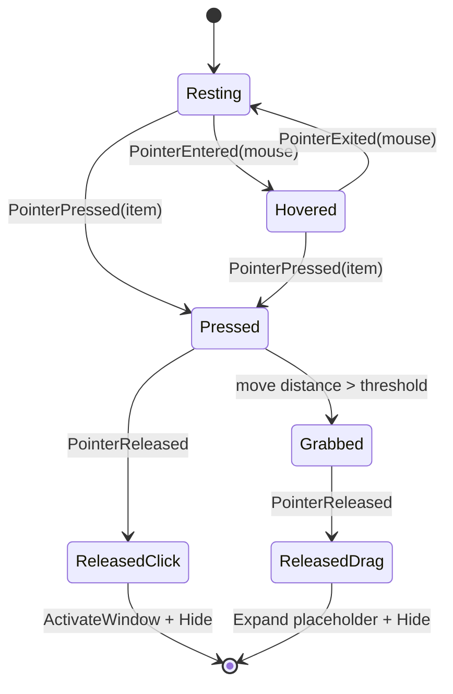

# AppSwitcher Item State Implementation Plan

## 目标

当前 AppSwitcher 已经使用 Win32 主窗口 + XAML Island + `XamlReader::Load` 构建界面。下一阶段把 item 从单一拖动模型改为面向任务切换器的状态机：静止、悬浮、按下、抓取、松开。

## 当前代码入口

- 顶层窗口创建、输入 fallback、`Hide()` 当前实现位于 [AppWindow.cpp:21-424](../../src/ui/AppWindow.cpp#L21-L424)。
- XAML item 加载和 pointer handler 当前位于 [AppSwitcherXamlView.cpp:552-623](../../src/ui/AppSwitcherXamlView.cpp#L552-L623)。
- item 位置和 container 更新位于 [AppSwitcherXamlView.cpp:644-703](../../src/ui/AppSwitcherXamlView.cpp#L644-L703)。
- 当前 palette 只覆盖基础颜色，定义位于 [AppTheme.h:5-22](../../src/ui/AppTheme.h#L5-L22)，明暗主题颜色位于 [AppTheme.cpp:11-51](../../src/ui/AppTheme.cpp#L11-L51)。
- item XAML 模板中 `MainCard`、`TitleBorder`、`CloseButton`、`ContentFrame` 位于 [SwitcherItem.xaml:11-91](../../src/ui/xaml/SwitcherItem.xaml#L11-L91)。

## 状态机

## 实施阶段

| 顺序 | 状态 | 改动阶段 | 改动范围 | 预期行为 | 验收方式 |
| --- | --- | --- | --- | --- | --- |
| 1 | - [ ] | 扩展 palette | `src/ui/AppTheme.h/.cpp` | 增加 title rest/hover/pressed/grabbed、close button normal/hover 颜色 | 明暗主题下 item 颜色符合指定值 |
| 2 | - [ ] | 扩展 item 状态数据 | `src/ui/AppSwitcherXamlView.h/.cpp` | `ItemView` 持有 hover/pressed/grabbed 状态；view 持有 pressed item、press 点、drag 阈值 | 编译通过，状态可复位 |
| 3 | - [ ] | 更新 XAML handler | `src/ui/AppSwitcherXamlView.cpp` | `PointerPressed` 只进入 Pressed，超过阈值才进入 Grabbed | 点击 item 不隐藏其它 item，拖动才隐藏 |
| 4 | - [ ] | 抓取视觉 | `src/ui/AppSwitcherXamlView.cpp` | Grabbed 时隐藏其它 item 和 `AppSwitcherContainer`，active item 缩放并跟手 | 拖动时只剩 active item |
| 5 | - [ ] | 点击激活窗口 | `src/ui/AppSwitcherXamlView.h/.cpp` + `AppWindow.cpp` | ReleasedClick 调用回调，`SetForegroundWindow(hwnd)` 后 `Hide()` | 点击 item 将目标窗口前置且不改窗口状态 |
| 6 | - [ ] | 拖动松开路径 | `src/ui/AppSwitcherXamlView.h/.cpp` + `AppWindow.cpp` | ReleasedDrag 回调传出 HWND 和松开 screen point；当前先前置并 `Hide()`，为后续窗口化展开预留入口 | 松开后 AppSwitcher 消失，目标窗口前置 |
| 7 | - [ ] | 构建验证 | build | 编译通过，启动稳定 | `cmake --build ...`，2 秒启动检查 |

## 窗口操作边界

点击 item：只调用前台切换，不主动 `ShowWindow(SW_RESTORE)`，因此不改变最大化/普通窗口状态。

拖动松开：本轮先接通 `OnItemDragReleased` 回调并以前置 + `Hide()` 作为占位；后续再把该路径替换为 `ExpandWindowAroundPoint(hwnd, releaseScreenPoint)`，由窗口记忆尺寸控制最终窗口化大小。

## 小结

本轮优先稳定 item 状态机和回调边界，不一次性实现窗口化展开算法。这样可以先验证触控点击、拖动隐藏、松开消失、多屏目标窗口前置是否正确，再单独接入窗口 placement。