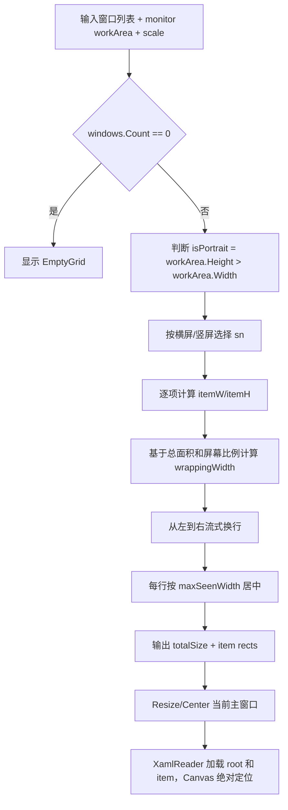
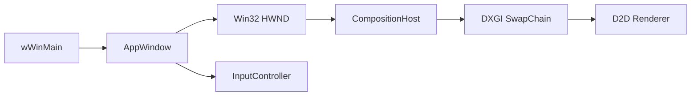
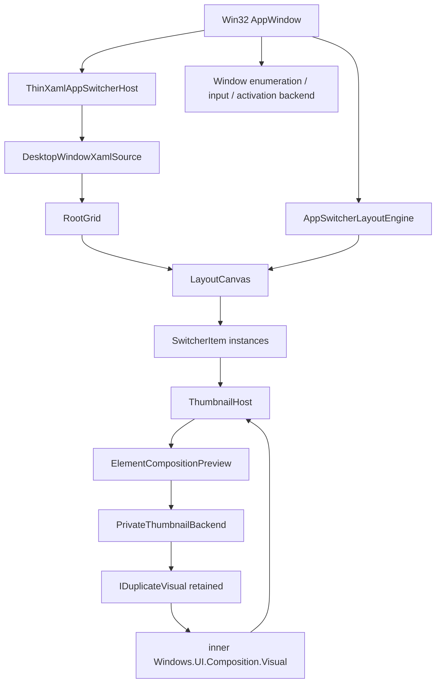

# AppSwitcher XAML 复刻分析

## 结论

当前参考实现的 AppSwitcher 可以拆成三层复刻：

1. **动态 XAML 结构层**：`RootGrid`、`LayoutCanvas`、`FocusBorder`、`EmptyGrid`、单个 `SwitcherItem` 卡片。
2. **C++ 生成逻辑层**：窗口列表输入、横竖屏判断、卡片尺寸计算、流式换行、Canvas 绝对定位、主窗口 Resize/Center。
3. **宿主桥接层**：当前项目是 Win32 + DirectComposition，不是 WinUI 3 应用；如果必须使用 `XamlReader::Load`，需要先引入 WinUI/C++/WinRT 宿主能力，再把 loose XAML 动态挂到当前主窗口。

本次按要求忽略 DWM/DComp 缩略图 API；卡片的缩略图区域只保留 `ContentFrame` 占位。

## 源码依据

| 关注点 | 参考实现位置 | 当前项目位置 | 结论 |
| --- | --- | --- | --- |
| 主界面 XAML 树 | [AppSwitcherWindow.xaml:11-67](../Touch-Rev/Touch-Overlay/AppSwitcher/Views/AppSwitcherWindow.xaml#L11-L67) | 当前无 XAML 宿主 | 需要新增动态 XAML root fragment |
| 单卡片 XAML 树 | [SwitcherItemView.xaml:9-109](../Touch-Rev/Touch-Overlay/AppSwitcher/Views/SwitcherItemView.xaml#L9-L109) | 当前无 XAML 控件 | 可转换为 loose XAML fragment |
| 布局算法 | [SwitcherLayoutEngine.cs:19-147](../Touch-Rev/Touch-Overlay/AppSwitcher/Logic/SwitcherLayoutEngine.cs#L19-L147) | 当前仅按客户区更新渲染目标 [AppWindow.cpp:308-367](src/ui/AppWindow.cpp#L308-L367) | 需要移植为 C++ 纯算法 |
| 主窗口生命周期 | [AppWindow.cpp:41-99](src/ui/AppWindow.cpp#L41-L99)、[AppWindow.cpp:277-298](src/ui/AppWindow.cpp#L277-L298) | Win32 `HWND` 创建后初始化 DComp | WinUI 宿主应在 `OnCreate()` 后初始化 |
| DPI 处理 | [SwitcherLayoutEngine.cs:42-44](../Touch-Rev/Touch-Overlay/AppSwitcher/Logic/SwitcherLayoutEngine.cs#L42-L44)、[AppWindow.cpp:313-332](src/ui/AppWindow.cpp#L313-L332) | 已有 `WM_DPICHANGED` | 复刻逻辑应沿用当前 `dpi_ / 96.0` |
| 构建系统 | [CMakeLists.txt:7-27](CMakeLists.txt#L7-L27)、[CMakeLists.txt:50-66](CMakeLists.txt#L50-L66) | 只链接 Win32/D2D/DComp | 需要补 WinUI/C++/WinRT 依赖 |

## XAML 元素拆解

### 1. AppSwitcher 主界面

参考主界面是一个 `Window`，内部实际内容是 `RootGrid`：

| 元素 | 原始属性 | 复刻方式 | 说明 |
| --- | --- | --- | --- |
| `RootGrid` | `Background="Transparent"`、`IsTabStop="True"`、键盘/Pointer 事件 | loose XAML 保留透明背景和 `IsTabStop`，事件全部删除 | `XamlReader::Load` 不支持 XAML 事件绑定到 code-behind |
| `LayoutCanvas` | `Canvas`，绝对定位容器 | 保留 | 所有 App 卡片通过 `Canvas.Left/Top` 动态设置 |
| `FocusBorder` | `BorderThickness=4`、`CornerRadius=20`、`Canvas.ZIndex=100`、默认隐藏 | 保留 | 用 C++ 根据选中项 layout 设置位置和大小 |
| `FocusBorder.Background` | 使用半透明强调色资源 | 可降级为简单透明色或保留 ThemeResource | 用户要求不实现特殊背景样式，建议简化 |
| `EmptyGrid` | 居中空状态提示，默认隐藏 | 保留或简化 | 当前阶段可用于无窗口数据时展示占位 |

主界面不能直接复制 `<Window x:Class=...>`。动态加载时应改为单 root 的 loose XAML，例如 `Grid` 根节点；`x:Class`、`KeyDown="..."`、`PointerPressed="..."` 等属性必须移除。

### 2. SwitcherItem 卡片

参考卡片是 `UserControl`，内部实际内容是 `RootGrid`：

| 区域 | 元素 | 原始行为 | 复刻方式 |
| --- | --- | --- | --- |
| 卡片根 | `RootGrid` | 圆角、背景、Pointer/Tapped 事件、`CompositeTransform` | 保留 `Grid` 和 `CompositeTransform`，删除事件属性 |
| 行定义 | `RowDefinition 1.8* / 8.2*` | 标题栏占 18%，缩略图占 82% | 必须保留；布局算法依赖此比例 |
| 标题外框 | `TitleBorder` | 顶部圆角、边框 | 可保留，背景样式可简化 |
| 标题列 | `TitleGrid` | `Auto / * / Auto` | 保留，保证图标、标题、关闭按钮自适应 |
| 图标 | `AppIcon`、`DefaultIcon` | 有图标显示图片，否则显示 MDL2 默认图标 | 当前可先显示默认图标；后续再接真实 icon |
| 标题文本 | `TitleText` | 字符裁剪 | 保留；C++ 通过 `FindName` 写入 `Text` |
| 关闭按钮 | `CloseButton` | 高度撑满、宽度随高度变正方形 | loose XAML 里删除 `Click` 和 `SizeChanged`，C++ 手动绑定/设置 |
| 缩略图占位 | `ContentFrame` | 下半部分占位，DWM 目标区域 | 保留为空 Border；后续高级缩略图实现挂这里 |

关键比例来自卡片 XAML 的行定义：[SwitcherItemView.xaml:23-26](../Touch-Rev/Touch-Overlay/AppSwitcher/Views/SwitcherItemView.xaml#L23-L26)。布局算法中标题栏高度也按 `1.8 / 8.2` 推导：[SwitcherLayoutEngine.cs:56-59](../Touch-Rev/Touch-Overlay/AppSwitcher/Logic/SwitcherLayoutEngine.cs#L56-L59)。

## XamlReader::Load 约束

官方 API 形态是 `Microsoft.UI.Xaml.Markup.XamlReader::Load(hstring)`，返回 `IInspectable` 后再 `.as<T>()` 转型。

复刻时必须遵守：

- loose XAML 只能有一个 root element。
- 不使用 `x:Class`。
- 不使用 `Click="..."`、`Tapped="..."`、`PointerMoved="..."` 这类 XAML 事件属性。
- 动态控件通过 `root.FindName(L"TitleText")` 等方式获取。
- 事件在 C++ 中手动绑定。
- 每个卡片实例必须单独调用一次 `XamlReader::Load`，不能把同一个 XAML object tree 挂到多个位置。

## 布局算法复刻

### 输入

```text
windows: List<WindowItem>
workArea: X/Y/Width/Height，物理像素
scale: dpi / 96.0
```

`WindowItem` 至少需要：

| 字段 | 用途 |
| --- | --- |
| `hwnd` | 后续激活、关闭、缩略图绑定 |
| `widthPx / heightPx` | 计算 `aspectRatio` |
| `title` | 写入 `TitleText` |
| `icon` | 当前阶段可选 |

参考数据结构的宽高和比例字段在 [WindowItem.cs:24-48](../Touch-Rev/Touch-Overlay/AppSwitcher/Models/WindowItem.cs#L24-L48)。

### 处理流程



### 横竖屏分支

| 分支 | 条件 | `sn` 选择 | 卡片尺寸核心公式 |
| --- | --- | --- | --- |
| 横屏 | `workArea.Width >= workArea.Height` | `n <= 2: 0.30`；`<=5: 0.24`；`<=10: 0.20`；其他 `0.16` | `thumbH = workArea.Height * sn`；`titleH = thumbH * (1.8 / 8.2)`；`itemH = thumbH + titleH`；`itemW = thumbH * aspect` |
| 竖屏 | `workArea.Height > workArea.Width` | `n <= 2: 0.42`；`<=5: 0.26`；`<=10: 0.20`；其他 `0.16` | 先以 `targetW = workArea.Width * sn` 反推高度；超过 `workArea.Height * 0.5` 时按最大高度回算宽度 |

其他常量：

| 常量 | 值 | 作用 |
| --- | --- | --- |
| `ITEM_GAP_DIP` | `32.0` | 卡片间距 |
| `PADDING_DIP` | `48.0` | 容器内边距 |
| `MIN_ASPECT` | `0.4` | 窗口比例下限 |
| `MAX_ASPECT` | `2.5` | 窗口比例上限 |
| bottom gap | `2.0 * scale` | 卡片底部留白 |

算法来源：[SwitcherLayoutEngine.cs:13-18](../Touch-Rev/Touch-Overlay/AppSwitcher/Logic/SwitcherLayoutEngine.cs#L13-L18)、[SwitcherLayoutEngine.cs:27-90](../Touch-Rev/Touch-Overlay/AppSwitcher/Logic/SwitcherLayoutEngine.cs#L27-L90)、[SwitcherLayoutEngine.cs:93-146](../Touch-Rev/Touch-Overlay/AppSwitcher/Logic/SwitcherLayoutEngine.cs#L93-L146)。

## 当前项目接入点分析

### 当前实际架构



当前主窗口由 Win32 `CreateWindowExW` 创建：[AppWindow.cpp:75-87](src/ui/AppWindow.cpp#L75-L87)。渲染路径是 DirectComposition + DXGI swapchain：[CompositionHost.cpp:13-75](src/graphics/CompositionHost.cpp#L13-L75)。入口只初始化 COM，没有 WinUI/XAML runtime：[main.cpp:6-40](src/main.cpp#L6-L40)。

### 需要新增的模块边界

建议新增模块而不是把 XAML 逻辑塞进 `AppWindow.cpp`：

| 新模块 | 责任 |
| --- | --- |
| `src/ui/AppSwitcherLayoutEngine.{h,cpp}` | C++ 移植 `CalculateLayout`，输入窗口数据和 workArea，输出 totalSize 与 rects |
| `src/ui/DynamicXamlLoader.{h,cpp}` | 读取 loose XAML 文件，调用 `XamlReader::Load`，封装 `FindName` |
| `src/ui/AppSwitcherXamlHost.{h,cpp}` | 在当前 HWND 内创建/管理 XAML 宿主，挂载 root，生成 item，设置 Canvas 定位 |
| `src/ui/xaml/AppSwitcherRoot.xaml` | 从 `AppSwitcherWindow.xaml` 改造后的 root fragment |
| `src/ui/xaml/SwitcherItem.xaml` | 从 `SwitcherItemView.xaml` 改造后的 item fragment |

### 主窗口接入点

| 生命周期 | 当前位置 | 应接入动作 |
| --- | --- | --- |
| 创建 | [AppWindow.cpp:277-298](src/ui/AppWindow.cpp#L277-L298) | 初始化 XAML runtime/host，加载 root XAML |
| Resize | [AppWindow.cpp:308-311](src/ui/AppWindow.cpp#L308-L311) | 同步 XAML host bounds，并根据新客户区重算布局 |
| DPI 改变 | [AppWindow.cpp:313-332](src/ui/AppWindow.cpp#L313-L332) | 更新 `scale = dpi / 96.0`，重算布局 |
| 销毁 | [AppWindow.cpp:300-306](src/ui/AppWindow.cpp#L300-L306) | 释放 XAML host/root 引用 |

## 构建影响

当前 `CMakeLists.txt` 只声明了 Win32/D2D/DComp 源文件和系统库：[CMakeLists.txt:7-27](CMakeLists.txt#L7-L27)、[CMakeLists.txt:50-66](CMakeLists.txt#L50-L66)。使用 `Microsoft.UI.Xaml.Markup.XamlReader` 后，至少会引入以下变化：

- C++/WinRT 头文件与命名空间。
- Windows App SDK / WinUI 3 依赖。
- XAML host 相关库和初始化代码。
- loose XAML 文件复制到输出目录或嵌入资源的构建规则。
- 如果当前仍需支持 MinGW，WinUI 3/C++/WinRT 路线会成为约束；实际应优先按 MSVC 路线处理。

## 不纳入本次复刻的内容

| 内容 | 原因 |
| --- | --- |
| `AppSwitcherMicaWindow` 独立窗口 | 用户要求不实施多窗口；且该文件只是背景窗口 [AppSwitcherMicaWindow.xaml:10-18](../Touch-Rev/Touch-Overlay/AppSwitcher/Views/AppSwitcherMicaWindow.xaml#L10-L18) |
| DWM/DComp 缩略图注册和更新 | 用户要求先忽略；后续会有更高级实现 |
| 真实图标提取 | 可后续接入，当前先保留默认图标占位 |
| 拖拽隔离模式 | 属于多窗口/缩略图/真实窗口移动联动，不属于本次 XAML 配置复刻最小闭环 |
| Mica/特殊背景样式 | 用户明确不需要实现 |

## 最小可验证目标

```text
输入：模拟窗口列表，例如 1/3/6/12 个 WindowItem，分别给出 16:9、4:3、9:16 等比例。
处理：根据当前主窗口客户区或 monitor workArea 计算布局，用 XamlReader 动态加载 root 和 item。
输出：当前主窗口内显示 AppSwitcher 画廊布局；横屏按高度锚定，竖屏按宽度锚定；卡片尺寸、间距、容器大小与参考算法一致。
```

验证点：

- `XamlReader::Load` 可以成功加载 `AppSwitcherRoot.xaml` 和 `SwitcherItem.xaml`。
- 每个 item 都是独立 object tree。
- `TitleText` 可以通过 C++ 写入。
- `Canvas.Left/Top` 与 layout rect 按 `scale` 正确换算。
- 横屏/竖屏切换后 `sn` 分支变化可观察。
- 空列表时 `EmptyGrid` 显示，卡片全部移除。

## 最终方案：Win32 主程序 + 裸 XAML Island，全 AppSwitcher 视觉统一在 XAML 内

综合 private thumbnail PoC、位置同步风险和 WinUI 3 空模板内存基线后，正式路线确定为：

```text
TouchRevGUI.exe / Win32 主程序
  -> ThinXamlAppSwitcherHost
      -> DesktopWindowXamlSource / XAML Island
      -> RootGrid / LayoutCanvas / FocusBorder / EmptyGrid
      -> SwitcherItem XAML 模板对象池
          -> ThumbnailHost
              -> ElementCompositionPreview.SetElementChildVisual(...)
              -> retained IDuplicateVisual inner Visual
```

该路线的核心判断：

| 决策点 | 结论 | 原因 |
| --- | --- | --- |
| 完整 WinUI 3 C++/WinRT App 框架 | 暂不采用 | 空模板内存基线偏高，不适合当前常驻轻量 overlay 目标 |
| 裸调 XAML Island | 采用，但必须工程化封装 | 当前 PoC 已验证 private thumbnail 主链路，且可避免 AppSwitcher 内部跨渲染管线不同步 |
| `XamlReader::Load` | 限制使用 | 只用于 root/item 模板初始化和对象池扩容，禁止进入动画、拖拽、resize 热路径 |
| XAML 是否负责全部 AppSwitcher 视觉 | 是 | 卡片、标题栏、FocusBorder、缩略图容器统一在同一 XAML/WinRT Composition tree 内 |
| 当前 Direct2D/DirectComposition Renderer | 不参与 AppSwitcher 主视觉 | 保留现有实验/背景能力，避免和 XAML 缩略图拼接同一卡片 |
| private thumbnail visual | 按 PoC 主链路集成 | 保持 `IDuplicateVisual` 生命周期，并把 inner `Windows.UI.Composition.Visual` 挂到对应 `ThumbnailHost` |

### 架构边界



### 统一坐标规则

AppSwitcher 的位置、尺寸、动画统一由 XAML 层承载，布局数据只有一个来源：

```text
WindowItem metadata
  -> AppSwitcherLayoutEngine 计算物理像素 rect
  -> 按 scale 转成 DIP
  -> Canvas.SetLeft/Top + Width/Height
  -> ThumbnailHost 内挂接 duplicate visual
```

禁止出现：

```text
D2D/DComp 算一套卡片位置
XAML/WinRT Composition 再算一套缩略图位置
```

### XamlReader 使用规则

| 场景 | 是否允许 | 说明 |
| --- | --- | --- |
| 首次创建 `RootGrid` | 允许 | 低频初始化 |
| 对象池不足时创建 `SwitcherItem` | 允许 | 低频扩容 |
| 更新标题、图标、尺寸、位置 | 禁止重新 Load | 必须复用已有对象并设置属性 |
| FocusBorder 移动动画 | 禁止重新 Load | 用 XAML animation / Storyboard / Composition animation |
| 横竖屏切换 resize/reflow | 禁止全量重建 | 只更新现有 item 的 Canvas 坐标和尺寸 |
| 每帧拖拽/触控移动 | 禁止 | 热路径只改属性或 visual transform |

### 更新后的实施阶段

| 顺序 | 状态 | 改动阶段 | 改动范围 | 预期行为 | 验收方式 |
| --- | --- | --- | --- | --- | --- |
| 1 | - [ ] | PoC 接口收敛 | `poc/private_thumbnail_probe` 逻辑拆分设计 | 明确 `PrivateThumbnailDevice`、`PrivateThumbnailVisual`、`ThinXamlAppSwitcherHost` 边界 | 编译 PoC，确认现有 `--xaml-thumbnail` 路径不回退 |
| 2 | - [ ] | 裸 XAML host 工程化 | `src/ui/ThinXamlAppSwitcherHost.{h,cpp}`、构建系统 | Win32 主窗口按需创建 `DesktopWindowXamlSource`，管理 child HWND、root element、lifetime | 主窗口内显示 XAML root，resize/DPI 后 child HWND 同步 |
| 3 | - [ ] | XAML 模板加载与对象池 | `src/ui/xaml/*.xaml`、`src/ui/AppSwitcherXamlView.{h,cpp}` | `XamlReader::Load` 加载 root/item 模板；item 可复用、隐藏、更新 | 模拟 1/3/6/12 个 item，无缩略图时显示完整卡片 UI |
| 4 | - [ ] | 布局算法移植 | `src/ui/AppSwitcherLayoutEngine.{h,cpp}` | 复刻横竖屏、缩放、换行、行内居中、total size 计算 | 用模拟窗口比例验证横屏/竖屏 rect 输出，并驱动 XAML Canvas 定位 |
| 5 | - [ ] | 全 XAML AppSwitcher 视觉 | `AppSwitcherRoot.xaml`、`SwitcherItem.xaml`、`AppSwitcherXamlView` | 卡片、标题栏、默认图标、关闭按钮、FocusBorder、EmptyGrid 全部由 XAML 渲染 | 禁用当前 D2D AppSwitcher 绘制，视觉仍完整且位置统一 |
| 6 | - [ ] | private thumbnail backend 接入 | `src/graphics/private_thumbnail*` 或 `src/ui/private_thumbnail*` | 每个 `ThumbnailHost` 挂接 retained `IDuplicateVisual` inner `Visual` | 指定 HWND 显示真实缩略图，关闭/刷新不黑屏 |
| 7 | - [ ] | 裁剪与圆角验证 | XAML/WinRT Composition 层 | 对 thumbnail visual 设置 clip/size/offset，验证缩略图在卡片内容框内裁剪 | 缩略图区不溢出卡片圆角，resize 后裁剪仍正确 |
| 8 | - [ ] | 输入与状态接管 | `AppSwitcherXamlView`、`InputController` 集成点 | XAML 处理卡片点击/关闭/选中框动画；Win32 仍负责全局触发和窗口激活 | 鼠标/触摸/键盘路径不分叉，不出现 XAML child HWND 抢焦点导致失控 |
| 9 | - [ ] | 内存与生命周期策略 | `ThinXamlAppSwitcherHost` | XAML host 懒初始化、关闭后复用、长时间空闲可释放 | 记录首次打开成本、复用打开成本、关闭后内存变化 |
| 10 | - [ ] | 替代宿主 PoC | 独立 PoC，不影响主线 | 验证能否不经过 XAML root 直接使用 WinRT Composition desktop target 挂载 duplicate visual | 成功后再评估是否移除 XAML Island |

### 不再推荐的路线

```text
完整 WinUI 3 C++/WinRT App 框架
  -> 当前阶段暂不采用，避免固定内存基线过高

Direct2D/DComp 画卡片 + XAML Island 画缩略图
  -> 不采用，避免同一卡片跨两个视觉树导致位置不同步

每次刷新用 XamlReader 全量重建 UI
  -> 不采用，避免 parse/layout 抖动
```

## 小结

- 正式路线确定为：Win32 主程序 + 工程化裸 XAML Island。
- AppSwitcher 的全部视觉统一放在 XAML Island 内，避免卡片外壳和缩略图跨管线拼接。
- 不接完整 WinUI 3 C++/WinRT App 框架，降低固定内存成本。
- `XamlReader::Load` 只作为低频模板加载器，配合对象池复用，不进入热路径。
- private thumbnail API 继续沿用已验证的 `ElementCompositionPreview -> retained IDuplicateVisual -> inner Visual` 主链路。
- 后续如果独立 PoC 证明可以无 XAML root 挂载 duplicate visual，再评估去掉 XAML Island。