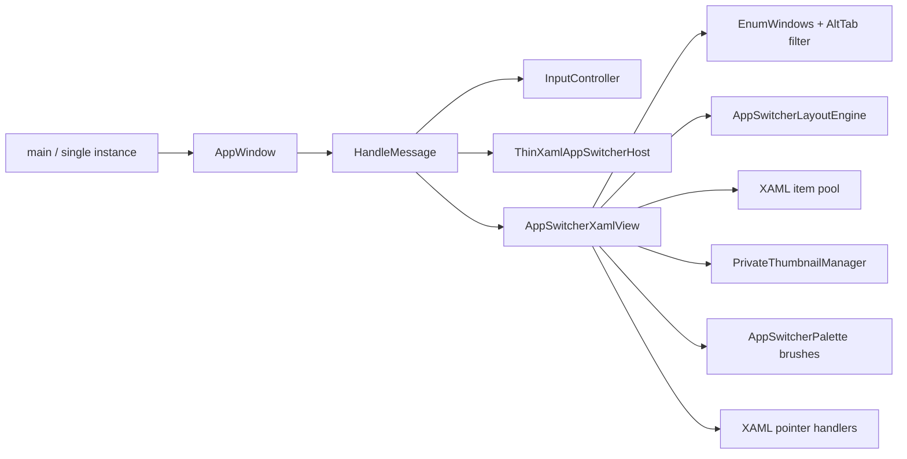
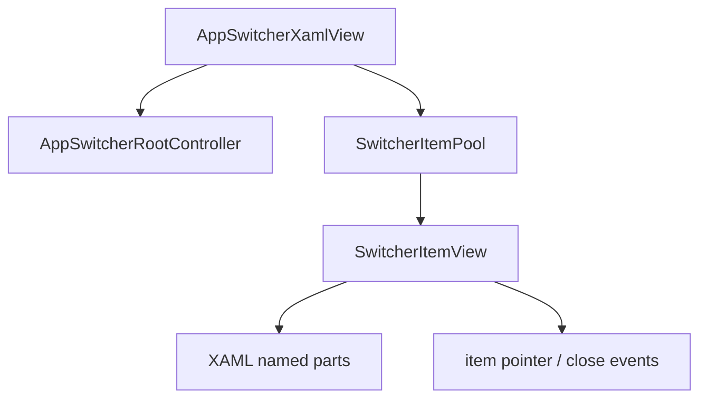
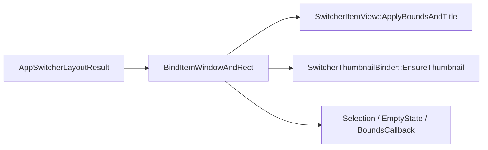
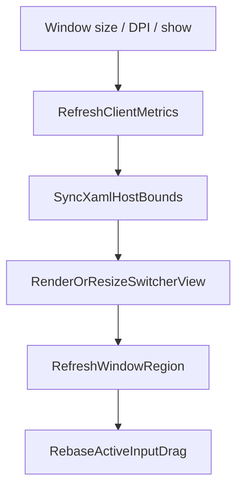
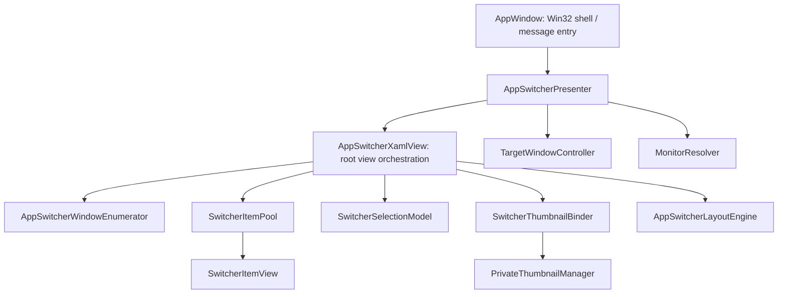

# AppWindow / AppSwitcherXamlView 臃肿点分析

## 输入范围

- `AppSwitcherXamlView.cpp` 当前约 1417 行，核心类声明见 [AppSwitcherXamlView.h:21-131](../../src/ui/AppSwitcherXamlView.h#L21-L131)。
- `AppWindow.cpp` 当前约 693 行，核心类声明见 [AppWindow.h:11-76](../../src/ui/AppWindow.h#L11-L76)。
- 已存在的相邻模块：布局算法位于 [AppSwitcherLayoutEngine.cpp:31-183](../../src/ui/AppSwitcherLayoutEngine.cpp#L31-L183)，XAML host 位于 [ThinXamlAppSwitcherHost.cpp:38-149](../../src/ui/ThinXamlAppSwitcherHost.cpp#L38-L149)，输入抽象入口位于 [InputController.h:11-88](../../src/input/InputController.h#L11-L88)。

## 当前实际执行路径

当前路径是：`AppWindow` 创建 Win32 顶层窗口并处理 `WM_*`，`ShowSwitcher()` 重新解析目标 monitor、同步 DPI/client size，再直接调用 `AppSwitcherXamlView::RenderSample()`；`RenderSample()` 枚举窗口、过滤 dismissed hwnd、写调试日志、调用布局和缩略图绑定，最后更新 XAML 位置。关键链路分别在 [AppWindow.cpp:412-446](../../src/ui/AppWindow.cpp#L412-L446)、[AppSwitcherXamlView.cpp:902-932](../../src/ui/AppSwitcherXamlView.cpp#L902-L932)、[AppSwitcherXamlView.cpp:1234-1389](../../src/ui/AppSwitcherXamlView.cpp#L1234-L1389)。

## 主要结论

| 优先级 | 结论 | 影响 | 证据 |
| --- | --- | --- | --- |
| P0 | `AppSwitcherXamlView` 同时负责窗口枚举、XAML 加载、item 事件、布局绑定、缩略图生命周期、选择导航 | 单文件修改容易牵连无关行为，后续动画/多 monitor/窗口操作都会继续堆到同一类 | [AppSwitcherXamlView.cpp:176-208](../../src/ui/AppSwitcherXamlView.cpp#L176-L208)、[AppSwitcherXamlView.cpp:983-1132](../../src/ui/AppSwitcherXamlView.cpp#L983-L1132)、[AppSwitcherXamlView.cpp:1234-1389](../../src/ui/AppSwitcherXamlView.cpp#L1234-L1389) |
| P0 | monitor 过滤存在“理论路径”和“实际路径”不一致 | `SetTargetMonitor()` 看起来会限制窗口列表，但实际枚举忽略 `HMONITOR` 参数 | `WindowBelongsToMonitor()` 定义在 [AppSwitcherXamlView.cpp:69-107](../../src/ui/AppSwitcherXamlView.cpp#L69-L107)，`EnumerateSwitcherWindows(HWND excludeHwnd, HMONITOR)` 未使用第二参数见 [AppSwitcherXamlView.cpp:176-208](../../src/ui/AppSwitcherXamlView.cpp#L176-L208) |
| P1 | `CreateItem()` 是 XAML named-part 查找、主题初始化、事件注册、Canvas attach 的混合体 | item 模板改动、交互状态改动、容器生命周期改动会互相干扰 | [AppSwitcherXamlView.cpp:983-1132](../../src/ui/AppSwitcherXamlView.cpp#L983-L1132) |
| P1 | `ApplyLayout()` 同时做数据绑定、几何换算、拖拽状态修正、缩略图创建/resize、空状态显示、bounds 回调 | 这是最大热点函数，任何布局/缩略图/交互改动都必须读完整函数 | [AppSwitcherXamlView.cpp:1234-1389](../../src/ui/AppSwitcherXamlView.cpp#L1234-L1389) |
| P1 | `AppWindow::HandleMessage()` 聚合了命令路由、Win32 消息、输入 fallback、XAML 命中判断、生命周期 | 主窗口类不只是窗口壳，而是输入/视图/窗口动作的调度中心 | [AppWindow.cpp:120-297](../../src/ui/AppWindow.cpp#L120-L297) |
| P2 | resize / DPI / show 路径有重复同步逻辑 | 后续增加 host bounds、透明区域或动画状态时容易漏改某一条路径 | [AppWindow.cpp:346-380](../../src/ui/AppWindow.cpp#L346-L380)、[AppWindow.cpp:412-446](../../src/ui/AppWindow.cpp#L412-L446) |
| P2 | 存在明显历史残留或未接线接口 | 增加阅读成本，也会误导后续重构边界 | `AcrylicBrush()` 仅定义见 [AppSwitcherXamlView.cpp:242-258](../../src/ui/AppSwitcherXamlView.cpp#L242-L258)；`VisibleBoundsPx()` / `ContainerBoundsPx()` 暴露但当前未见外部调用，定义见 [AppSwitcherXamlView.cpp:374-392](../../src/ui/AppSwitcherXamlView.cpp#L374-L392) |

## `AppSwitcherXamlView.cpp` 的职责拆解

### 1. Win32 窗口数据源混在 View 内

`AppSwitcherXamlView.cpp` 顶部匿名 namespace 直接实现 Alt-Tab-like 窗口过滤、标题 fallback、窗口 rect 获取和 `EnumWindows` 枚举：[AppSwitcherXamlView.cpp:109-208](../../src/ui/AppSwitcherXamlView.cpp#L109-L208)。这部分是 Win32 数据源逻辑，不依赖 XAML visual tree，不应该由 XAML view 拥有。

当前理论路径：`SetTargetMonitor()` 设置 `targetMonitor_`，`RenderSample()` 把它传给 `EnumerateSwitcherWindows()`：[AppSwitcherXamlView.cpp:399-402](../../src/ui/AppSwitcherXamlView.cpp#L399-L402)、[AppSwitcherXamlView.cpp:914-915](../../src/ui/AppSwitcherXamlView.cpp#L914-L915)。

当前实际路径：`EnumerateSwitcherWindows(HWND excludeHwnd, HMONITOR)` 的第二参数未命名也未使用：[AppSwitcherXamlView.cpp:176-208](../../src/ui/AppSwitcherXamlView.cpp#L176-L208)。因此 `WindowBelongsToMonitor()` 目前是死路径，`targetMonitor_` 对窗口列表没有实际过滤效果。

### 2. XAML root 加载与 item 模板加载混在同一类

Root XAML 加载、named-part 绑定、root pointer miss 处理集中在 [AppSwitcherXamlView.cpp:934-981](../../src/ui/AppSwitcherXamlView.cpp#L934-L981)。Item XAML 加载、named-part 绑定、row weight、theme、pointer event、close button event、Canvas attach 全部集中在 [AppSwitcherXamlView.cpp:983-1132](../../src/ui/AppSwitcherXamlView.cpp#L983-L1132)。

这导致 `AppSwitcherXamlView` 既是 root view，也是 item factory，也是 item controller。更合理的边界是：

### 3. Theme 应用和交互状态绑定耦合

全局 palette 应用在 [AppSwitcherXamlView.cpp:619-654](../../src/ui/AppSwitcherXamlView.cpp#L619-L654)，单 item theme 应用在 [AppSwitcherXamlView.cpp:656-693](../../src/ui/AppSwitcherXamlView.cpp#L656-L693)，hover/pressed/grabbed 的视觉状态应用在 [AppSwitcherXamlView.cpp:716-745](../../src/ui/AppSwitcherXamlView.cpp#L716-L745)。

问题不是代码量本身，而是状态来源和视觉输出没有隔离：`ItemView` 同时保存 XAML controls、`HWND`、layout、thumbnail slot、hover/pressed/grabbed。类声明能看到这些字段全部放在一个结构体内：[AppSwitcherXamlView.h:47-69](../../src/ui/AppSwitcherXamlView.h#L47-L69)。

### 4. Item 交互状态机与 Win32 输入状态机并存

XAML item 内部维护 `xamlPointerPressed_`、`xamlPointerDragging_`、`activeDragItemIndex_`、`pressPointDip_` 等状态，定义在 [AppSwitcherXamlView.h:114-122](../../src/ui/AppSwitcherXamlView.h#L114-L122)，状态迁移实现见 [AppSwitcherXamlView.cpp:747-862](../../src/ui/AppSwitcherXamlView.cpp#L747-L862)。

同时 `AppWindow` 还把 `WM_POINTER*`、`WM_TOUCH`、mouse 消息交给 `InputController`，再把结果写回 `AppSwitcherXamlView::SetDragPosition()`：[AppWindow.cpp:191-280](../../src/ui/AppWindow.cpp#L191-L280)、[AppWindow.cpp:572-578](../../src/ui/AppWindow.cpp#L572-L578)。

这不是立即错误，但边界不清：

- `InputController` 管全局拖拽触发和位置预测。
- `AppSwitcherXamlView` 管 item 内点击、抓取、隐藏其它 item、松开后的激活/拖拽回调。
- `AppWindow` 同时知道两边的 hit-test 和 fallback 关闭策略。

后续如果增加触摸惯性、动画或拖拽到区域放置，容易出现两个状态机都认为自己拥有拖拽生命周期。

### 5. 布局绑定和缩略图生命周期混在 `ApplyLayout()`

`ApplyLayout()` 从布局计算开始，随后逐 item 处理 visible、reset、位置、标题、close button 尺寸、thumbnail host layout、clip、thumbnail slot 创建/resize，最后处理 empty grid 和 bounds callback：[AppSwitcherXamlView.cpp:1234-1389](../../src/ui/AppSwitcherXamlView.cpp#L1234-L1389)。

布局算法本身已经独立在 `AppSwitcherLayoutEngine::Calculate()`：[AppSwitcherLayoutEngine.cpp:31-183](../../src/ui/AppSwitcherLayoutEngine.cpp#L31-L183)。但布局结果绑定仍然过胖。建议把当前函数切成三个层次：

## `AppWindow.cpp` 的职责拆解

### 1. Win32 窗口壳和应用行为混合

`AppWindow::Initialize()` 负责注册窗口类、解析 monitor、创建顶层窗口、显示窗口：[AppWindow.cpp:20-83](../../src/ui/AppWindow.cpp#L20-L83)。`WindowProc()` 负责把 `HWND` 映射回对象：[AppWindow.cpp:101-118](../../src/ui/AppWindow.cpp#L101-L118)。这些属于 Win32 shell。

但同一个类还负责：

- XAML host / view / theme 初始化：[AppWindow.cpp:299-336](../../src/ui/AppWindow.cpp#L299-L336)。
- `WM_*` 输入消息分发和 hit-test fallback：[AppWindow.cpp:181-280](../../src/ui/AppWindow.cpp#L181-L280)。
- 目标窗口激活、关闭、拖拽释放后调整窗口位置：[AppWindow.cpp:483-570](../../src/ui/AppWindow.cpp#L483-L570)。
- 键盘导航到 `AppSwitcherXamlView`：[AppWindow.cpp:580-613](../../src/ui/AppWindow.cpp#L580-L613)。
- monitor 解析与 fallback monitor info：[AppWindow.cpp:615-650](../../src/ui/AppWindow.cpp#L615-L650)。

因此 `AppWindow` 现在是“Win32 壳 + presenter + input bridge + target window action service”。

### 2. `HandleMessage()` 是第二个核心热点

`HandleMessage()` 当前覆盖 wake message、create、paint、size、dpi、theme、DWM、keyboard、raw input、pointer、touch、mouse、cancel、destroy：[AppWindow.cpp:120-297](../../src/ui/AppWindow.cpp#L120-L297)。

建议保留 `switch`，但把复杂分支下沉为短函数，例如：

| 当前分支 | 建议下沉函数 | 依据 |
| --- | --- | --- |
| `WM_TOUCH` | `HandleTouchMessage()` | touch hit-test、`CloseTouchInputHandle()`、`InputController::OnTouch()` 聚合在 [AppWindow.cpp:221-253](../../src/ui/AppWindow.cpp#L221-L253) |
| `WM_POINTERDOWN` | `HandlePointerDownMessage()` | hit-test fallback + input controller 调用在 [AppWindow.cpp:191-207](../../src/ui/AppWindow.cpp#L191-L207) |
| `WM_LBUTTONDOWN` | `HandleMouseDownMessage()` | mouse hit-test fallback + input controller 调用在 [AppWindow.cpp:255-271](../../src/ui/AppWindow.cpp#L255-L271) |
| wake message | `HandleActivationCommand()` | 命令分发表在 [AppWindow.cpp:120-139](../../src/ui/AppWindow.cpp#L120-L139) |

### 3. Show / Resize / DPI 路径重复同步

`OnSize()`、`OnDpiChanged()`、`ShowSwitcher()` 都在做类似操作：更新 `coordinates_`，resize `xamlHost_`，resize/render `appSwitcherXamlView_`，更新透明区域，重定位 active drag。对应代码位于 [AppWindow.cpp:346-380](../../src/ui/AppWindow.cpp#L346-L380)、[AppWindow.cpp:412-446](../../src/ui/AppWindow.cpp#L412-L446)。

可收敛为两个明确步骤：

这样后续修改透明区域、host bounds、DPI scale，不需要同时改三处。

### 4. 目标窗口操作应从 `AppWindow` 抽出

`ActivateWindow()`、`CloseWindow()`、`ExpandWindowAroundPoint()` 不依赖 XAML host，也不依赖 `AppWindow` 大部分状态，只有 `ExpandWindowAroundPoint()` 使用 `targetWorkAreaPx_` 作为 fallback：[AppWindow.cpp:483-570](../../src/ui/AppWindow.cpp#L483-L570)。

建议拆成 `WindowActionService` 或 `TargetWindowController`：

- `Activate(HWND)`
- `RequestClose(HWND)`
- `ExpandAroundPoint(HWND, POINT, RECT fallbackWorkArea)`

这样 `AppWindow` 只负责把 `AppSwitcherXamlView` 的回调转交给服务，当前回调注册位于 [AppWindow.cpp:312-326](../../src/ui/AppWindow.cpp#L312-L326)。

## 建议重构目标边界

### 文件级拆分建议

| 新模块 | 放置位置 | 迁移内容 | 收益 |
| --- | --- | --- | --- |
| `AppSwitcherWindowEnumerator.{h,cpp}` | `src/ui/` 或 `src/window/` | `GetWindowDisplayTitle()`、`TryGetSwitcherWindowRect()`、`IsAltTabLikeWindow()`、`EnumerateSwitcherWindows()`、monitor filter | 让 view 不直接拥有 Win32 枚举策略；同时修正 `targetMonitor_` 未生效问题 |
| `SwitcherItemView.{h,cpp}` | `src/ui/` | `ItemView` XAML parts、`ApplyItemTheme()`、`ApplyItemInteractionState()`、row weight、bounds/title/visibility 更新 | `CreateItem()` 变成 factory 调用，item visual 逻辑可单独维护 |
| `SwitcherItemInteractionController` 或内嵌在 `SwitcherItemView` | `src/ui/` | pointer entered/exited/pressed/moved/released/canceled handler 注册 | item 交互状态从 root view 主类剥离 |
| `SwitcherThumbnailBinder.{h,cpp}` | `src/ui/` 或 `src/thumbnail/` | `ShouldRecreateThumbnail()`、`ClearItemThumbnail()`、thumbnail create/resize 逻辑 | `ApplyLayout()` 不再直接管理 private thumbnail slot 细节 |
| `SwitcherSelectionModel.{h,cpp}` | `src/ui/` | `EnsureSelectedIndex()`、`MoveSelection*()` 的纯索引/几何选择逻辑 | 键盘导航可单元测试，减少 XAML 控件依赖 |
| `TargetWindowController.{h,cpp}` | `src/window/` 或 `src/ui/` | `ActivateWindow()`、`CloseWindow()`、`ExpandWindowAroundPoint()` | `AppWindow` 不再承担目标窗口操作细节 |
| `MonitorResolver.{h,cpp}` | `src/window/` 或 `src/ui/` | `ResolveTargetMonitor()`、`LoadMonitorInfo()` | `ShowSwitcher()` 更短，也便于多 monitor 规则调整 |

## 推荐实施顺序

| 顺序 | 阶段 | 改动范围 | 行为变化 | 验收方式 |
| --- | --- | --- | --- | --- |
| 1 | 提取窗口枚举 | `AppSwitcherWindowEnumerator` + `AppSwitcherXamlView::RenderSample()` 调用点 | 行为应保持一致；若同时启用 monitor filter，需要明确作为 bugfix 验收 | 编译；多 monitor 下确认只显示目标 monitor 的窗口 |
| 2 | 提取 target window 操作 | `TargetWindowController` + `AppWindow` 回调 | 行为不变 | 点击激活、关闭按钮、拖拽释放窗口展开路径均可用 |
| 3 | 收敛 AppWindow size/DPI/show 同步 | `AppWindow` 私有 helper | 行为不变 | resize、DPI 变化、show/hide 后 XAML 尺寸正确 |
| 4 | 提取 `SwitcherItemView` | `AppSwitcherXamlView` item 创建和 theme/visual 状态 | 行为不变 | item hover/pressed/grabbed、close button hover、选中框均可用 |
| 5 | 提取 thumbnail binder | `ApplyLayout()` 和 thumbnail slot 管理 | 行为不变 | 缩略图创建、resize、hwnd 切换清理正确 |
| 6 | 提取 selection model | keyboard navigation | 行为不变 | Tab/Shift+Tab/方向键/Enter/Space 均可用 |

## 风险点

1. `CreateItem()` 的事件 lambda 捕获 `itemIndex`，当前依赖“items 只 append，不 erase、不 reorder”的隐含约束：[AppSwitcherXamlView.cpp:1003-1122](../../src/ui/AppSwitcherXamlView.cpp#L1003-L1122)。拆 item pool 时必须保留稳定 index，或改为事件回调携带 item id 后由 pool 解析。
2. XAML event token 当前没有显式保存和 revoke；现状依赖 XAML 对象生命周期整体释放。拆成独立类后，如果 item 被复用或提前释放，需要明确事件解绑策略。
3. `AppSwitcherXamlView::ResetItem()` 会清理 thumbnail 并复位视觉状态：[AppSwitcherXamlView.cpp:889-900](../../src/ui/AppSwitcherXamlView.cpp#L889-L900)。拆 thumbnail binder 时不能遗漏 hwnd 切换和 hidden item 的清理路径。
4. `InputController` 与 XAML item pointer handler 都有拖拽概念。重构时不要先改行为；先移动代码，再讨论统一状态机。

## 小结

- 当前最臃肿的不是单纯行数，而是两个类都跨越了过多生命周期边界。
- `AppSwitcherXamlView` 应缩到“XAML root view + item pool 编排”，把窗口枚举、item visual、thumbnail 绑定、selection 算法拆出去。
- `AppWindow` 应缩到“Win32 shell + 高层 presenter 调用”，把目标窗口操作、monitor 解析、复杂输入分支和重复 size/DPI 同步下沉。
- 最先值得做的是窗口枚举提取，因为它同时降低耦合并暴露一个当前实际 bug：`targetMonitor_` 没有过滤窗口列表。