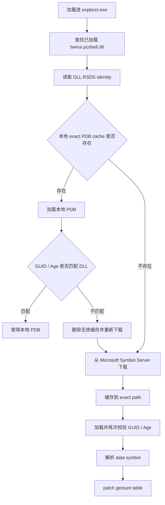
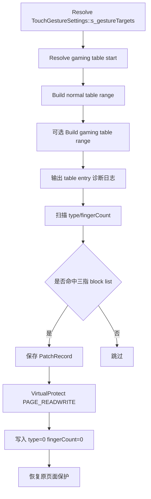

# Current PDB Gesture Table Hook

## 结论

当前 `TouchRevBlockerHook.dll` 的实际屏蔽方式是 **PDB data symbol 驱动的 `twinui.pcshell.dll` gesture table patch**。

实际执行路径只保留一条：

```text
DllMain
  -> InstallHooks
      -> InstallTwinuiGestureTablePatch
          -> 解析 TouchGestureSettings::s_gestureTargets
          -> 解析 TouchGestureSettings::s_gestureTargetsForGamingFullScreenExperience
          -> patch 三指表项
```

已删除的路径：

```text
User32 broad fallback hooks        disabled
TouchGestureProcessor code hook    disabled
Detours runtime hook path          not linked into TouchRevBlockerHook
```

源码入口见 [hooks.cpp:15-43](../../blocker/hookdll/hooks.cpp#L15-L43)。构建目标只编译 `twinui_gesture_table_patch.cpp`，不再编译旧的 `gesture_blocker.cpp` / `twinui_gesture_hooks.cpp`，见 [CMakeLists.txt:95-103](../../blocker/CMakeLists.txt#L95-L103)。

## 当前实际屏蔽范围

`TouchGestureTargetEntry` 当前按 24 字节结构处理：

- `type`
- `fingerCount`
- `target GUID`

结构约束见 [twinui_gesture_table_patch.cpp:30-37](../../blocker/hookdll/twinui_gesture_table_patch.cpp#L30-L37)。

只 patch 三个三指目标，见 [twinui_gesture_table_patch.cpp:45-49](../../blocker/hookdll/twinui_gesture_table_patch.cpp#L45-L49)：

| `type` | `fingerCount` | 含义                                        | 当前处理 |
| -------- | --------------- | ------------------------------------------- | -------- |
| `1`    | `3`           | three-finger pointer-down / long press 路径 | patch    |
| `2`    | `3`           | three-finger horizontal swipe               | patch    |
| `4`    | `3`           | three-finger vertical swipe                 | patch    |

四指不 patch：

| `type` | `fingerCount` | 含义                                             | 当前处理     |
| -------- | --------------- | ------------------------------------------------ | ------------ |
| `1`    | `4`           | four-finger pointer-down 路径                    | pass-through |
| `2`    | `4`           | four-finger horizontal swipe                     | pass-through |
| `4`    | `4`           | four-finger vertical swipe / Show Desktop 状态机 | pass-through |

因此四指下滑隐藏所有窗口、四指上滑撤销 Show Desktop 的 Shell 内部状态机不再被窗口消息兜底或 code hook 干扰。

## PDB 跨版本适配流程

当前 PDB 解析链路在 `dbghelp_symbol_provider.cpp` 内完成。



关键点：

1. 从系统 DLL 的 CodeView RSDS debug directory 读取 `pdbName + GUID + Age`，见 [dbghelp_symbol_provider.cpp:342-400](../../blocker/hookdll/dbghelp_symbol_provider.cpp#L342-L400)。
2. exact cache path 使用 `pdbName / GUID+Age / pdbName` 组织，见 [dbghelp_symbol_provider.cpp:565-575](../../blocker/hookdll/dbghelp_symbol_provider.cpp#L565-L575)。
3. 本地 cache 命中后会立即加载并校验 loaded PDB 的 `GUID / Age`，见 [dbghelp_symbol_provider.cpp:479-529](../../blocker/hookdll/dbghelp_symbol_provider.cpp#L479-L529) 和 [dbghelp_symbol_provider.cpp:839-861](../../blocker/hookdll/dbghelp_symbol_provider.cpp#L839-L861)。
4. 若本地 cache 缺失，或 cache 文件存在但校验失败，会通过 WinHTTP 从 Microsoft Symbol Server 下载，见 [dbghelp_symbol_provider.cpp:592-768](../../blocker/hookdll/dbghelp_symbol_provider.cpp#L592-L768) 和 [dbghelp_symbol_provider.cpp:863-964](../../blocker/hookdll/dbghelp_symbol_provider.cpp#L863-L964)。
5. 解析 data symbol 时允许非 executable address，避免把 data symbol 当 code hook 地址拒绝，见 [direct_hook_resolver.cpp:276-280](../../blocker/hookdll/direct_hook_resolver.cpp#L276-L280) 和 [direct_hook_resolver.cpp:342-381](../../blocker/hookdll/direct_hook_resolver.cpp#L342-L381)。

## 本地缓存与系统版本差异判断

PDB 缓存路径不是按文件名单独复用，而是按系统 DLL 的 RSDS identity 精确分桶：

```text
%LOCALAPPDATA%\Touch-Rev\symbol\<pdbName>\<GUIDAge>\<pdbName>
```

条件分支：

| 条件                                 | 判断依据                                               | 行为                         | 关键日志                                                             |
| ------------------------------------ | ------------------------------------------------------ | ---------------------------- | -------------------------------------------------------------------- |
| 系统 DLL 版本未变，本地 PDB 正确     | exact path 存在，loaded PDB`GUID / Age` 匹配 DLL     | 直接使用本地 PDB             | `PDB_CACHE_MATCH`、`PDB_EXACT_LOAD_MATCH`                        |
| 系统 DLL 版本变化                    | DLL RSDS`GUID / Age` 变化，exact path 自然变为新路径 | 触发 cache miss 并下载新 PDB | `PDB_CACHE_MISS action=download`、`PDB_DOWNLOAD_OK`              |
| 本地 exact path 文件损坏或内容不匹配 | loaded PDB`GUID / Age` 不匹配 DLL                    | 删除本地文件，重新下载并缓存 | `PDB_EXACT_LOAD_MISMATCH`、`PDB_CACHE_INVALID action=redownload` |
| Microsoft Symbol Server 下载失败     | HTTP / WinHTTP / status code 失败                      | 放弃 patch，返回失败         | `PDB_DOWNLOAD_FAILED`、`READY_FAILED`                            |

## Gesture table patch 流程



表区间构造、entry 日志、patch 和 restore 分别见：

- symbol 名和模块名：[twinui_gesture_table_patch.cpp:21-28](../../blocker/hookdll/twinui_gesture_table_patch.cpp#L21-L28)
- table range 构造：[twinui_gesture_table_patch.cpp:100-150](../../blocker/hookdll/twinui_gesture_table_patch.cpp#L100-L150)
- entry 诊断日志：[twinui_gesture_table_patch.cpp:152-166](../../blocker/hookdll/twinui_gesture_table_patch.cpp#L152-L166)
- 写入与页面保护：[twinui_gesture_table_patch.cpp:168-196](../../blocker/hookdll/twinui_gesture_table_patch.cpp#L168-L196)
- patch 记录和写入：[twinui_gesture_table_patch.cpp:198-224](../../blocker/hookdll/twinui_gesture_table_patch.cpp#L198-L224)
- 安装流程：[twinui_gesture_table_patch.cpp:269-337](../../blocker/hookdll/twinui_gesture_table_patch.cpp#L269-L337)
- 卸载恢复：[twinui_gesture_table_patch.cpp:339-363](../../blocker/hookdll/twinui_gesture_table_patch.cpp#L339-L363)

## 可验证日志

成功路径应至少包含：

```text
PDB_IDENTITY_DLL
PDB_CACHE_MATCH 或 PDB_CACHE_MISS
PDB_EXACT_LOAD_MATCH
DBGHELP_SYMBOL_HIT api=TouchGestureSettings::s_gestureTargets
TWINUI_GESTURE_TABLE_RANGE table=s_gestureTargets
TWINUI_GESTURE_TABLE_ENTRY ... fingerCount=3 ... blocked=1
TWINUI_GESTURE_TABLE_PATCHED ... oldFingerCount=3
TWINUI_GESTURE_TABLE_PATCH_INSTALLED patchCount=3
READY
```

失败判据：

```text
TWINUI_GESTURE_TABLE_PATCH_SKIPPED reason=primary-symbol-resolve-failed
TWINUI_GESTURE_TABLE_PATCH_INSTALL_FAILED
READY_FAILED
```

如果出现以上失败日志，说明 PDB 已加载但 data symbol 没解析到，或者 DLL / PDB identity 校验没有通过。

## 理论路径与当前实际路径

| 项目                                               | 理论上可行                     | 当前实际启用 |
| -------------------------------------------------- | ------------------------------ | ------------ |
| PDB data symbol table patch                        | 是                             | 是           |
| `TouchGestureProcessor::StartSwipe` Detours hook | 是                             | 否           |
| User32 message fallback                            | 是                             | 否           |
| `ShowWindow` / `SetWindowPos` fallback         | 是                             | 否           |
| foreground commit blocker                          | 是                             | 否           |
| 四指 vertical swipe patch                          | 可做但会破坏 Show Desktop undo | 否           |

## 小结

- 当前 hook 方式是 `twinui.pcshell.dll` PDB data symbol table patch。
- 跨版本适配依赖 DLL 自带 RSDS identity，不依赖硬编码 RVA。
- 本地 PDB cache 按 `pdbName + GUID + Age` 精确分桶；系统 DLL 更新后会自然切换到新 cache path。
- 本地 cache 存在但 loaded PDB 与 DLL 不匹配时，会删除并重新从 Microsoft Symbol Server 下载。
- 只修改三指表项，四指路径保持 Shell 原生行为。
