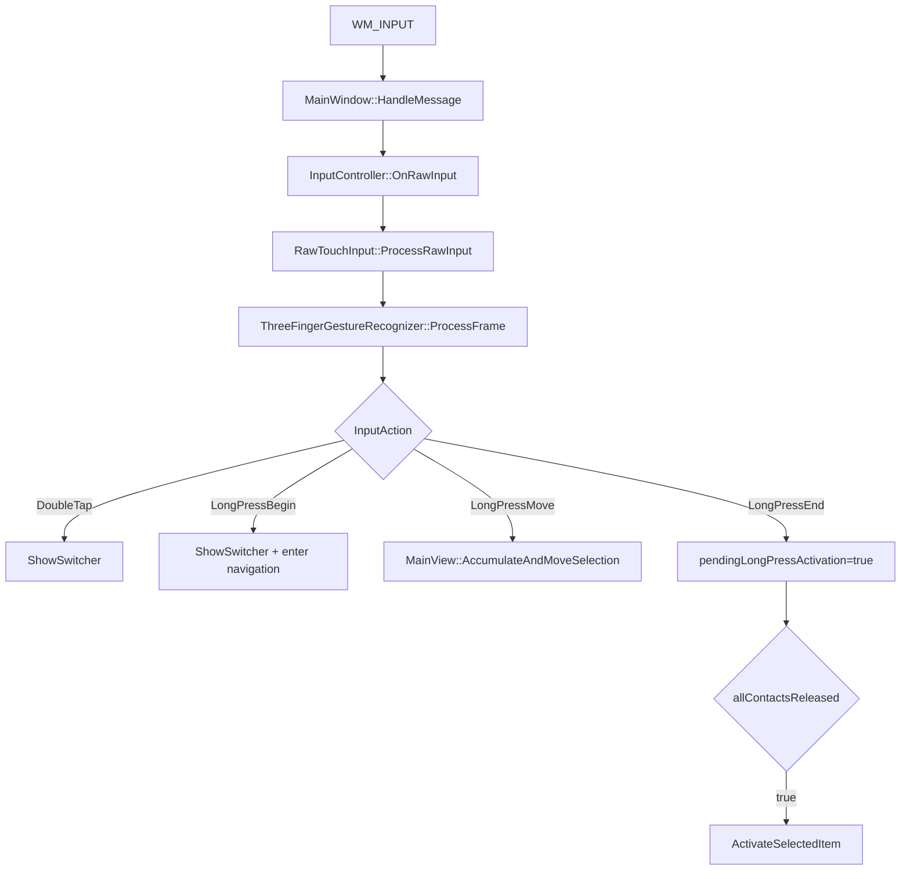
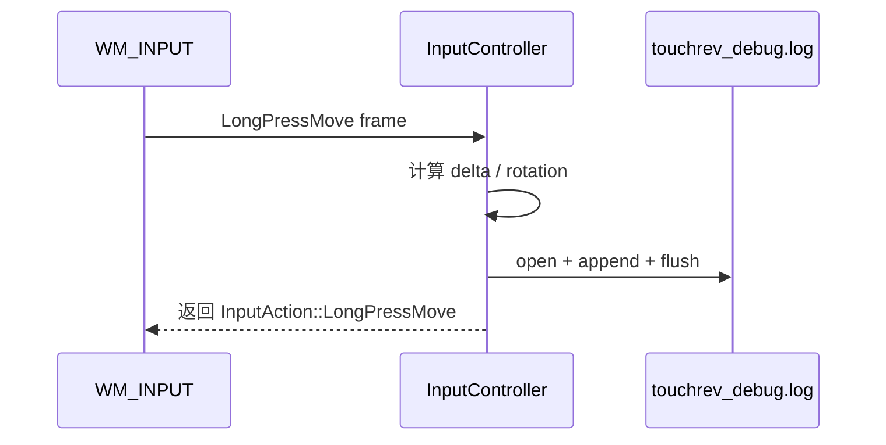
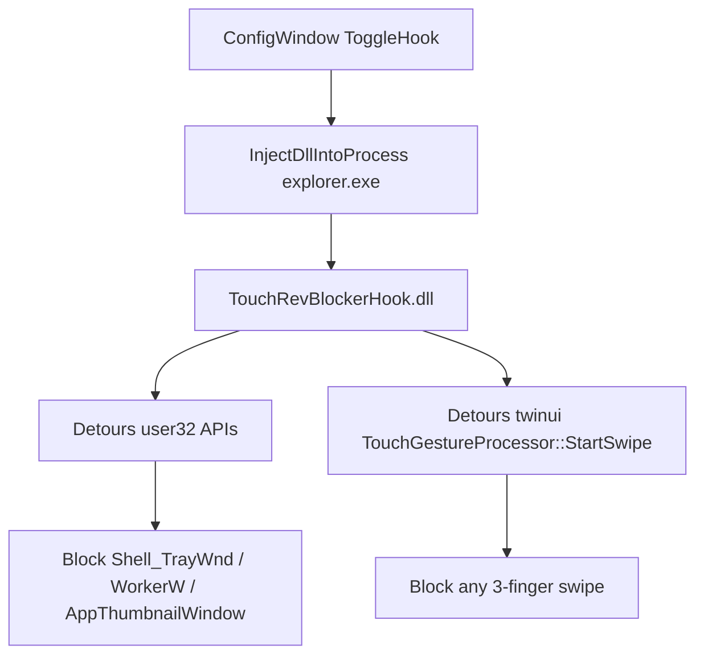

# Gesture System Lag Root Cause Analysis

## 输入与范围

- 输入现象：当前三指手势系统“混乱且卡顿”。
- 排查方式：只读代码审计，未做运行时 ETW/Profiler 采样。
- 范围：主程序 raw input 手势链路、AppSwitcher UI 链路、可选 blocker/hook 链路。
- 当前配置实际路径：根 CMake 默认 `TOUCHREV_BUILD_BLOCKER=OFF`，所以默认构建只包含主程序 raw input 手势链路；如果显式打开 blocker，则会额外启用 explorer 注入与 Detours hook 链路。[CMakeLists.txt:7](CMakeLists.txt#L7)、[CMakeLists.txt:147-158](CMakeLists.txt#L147-L158)

## 总结结论

| 优先级 | 类型 | 根因 | 直接表现 | 证据 |
| --- | --- | --- | --- | --- |
| P0 | 卡顿 | `LongPressMove` 高频路径同步写 `touchrev_debug.log` | 三指长按移动时掉帧、粘滞 | [InputController.cpp:111-118](src/input/InputController.cpp#L111-L118)、[InputController.cpp:370-374](src/input/InputController.cpp#L370-L374) |
| P0 | 卡顿 | `LongPressMove` 每帧查询显示旋转，走 `GetMonitorInfoW` / `EnumDisplaySettingsW` | 移动中每个 raw input frame 都可能阻塞 UI thread | [InputController.cpp:48-75](src/input/InputController.cpp#L48-L75)、[InputController.cpp:347-368](src/input/InputController.cpp#L347-L368) |
| P0 | 混乱 | `Tick()` 实现存在，但主程序没有定时调用 | 静止长按不稳定，可能需要抖一下才触发 | [ThreeFingerGestureRecognizer.cpp:149-181](src/input/gesture/ThreeFingerGestureRecognizer.cpp#L149-L181)、[RawTouchInputViewer.cpp:123-137](src/tools/RawTouchInputViewer.cpp#L123-L137)、[MainWindow.cpp:238-287](src/ui/MainWindow.cpp#L238-L287) |
| P1 | 混乱 | 抬手激活依赖 `contactCount == 0` 的特殊 frame | 松手后偶发不激活或延迟激活 | [InputController.cpp:320-324](src/input/InputController.cpp#L320-L324)、[MainWindow.cpp:279-285](src/ui/MainWindow.cpp#L279-L285)、[RawTouchInput.cpp:199-214](src/input/raw/RawTouchInput.cpp#L199-L214) |
| P1 | 混乱 | 状态机要求“恰好 3 个 contact + ID 不变 + 同手判定不过界” | contact 抖动、误多报、ID 重排会导致状态反复重置 | [ThreeFingerGestureRecognizer.cpp:28-87](src/input/gesture/ThreeFingerGestureRecognizer.cpp#L28-L87)、[ThreeFingerGestureRecognizer.cpp:319-341](src/input/gesture/ThreeFingerGestureRecognizer.cpp#L319-L341) |
| P1 | 卡顿 | `LongPressBegin` 在 `WM_INPUT` 内同步打开 AppSwitcher，并同步枚举窗口、布局、缩略图、图标 | 识别成功瞬间首帧明显卡一下 | [MainWindow.cpp:253-261](src/ui/MainWindow.cpp#L253-L261)、[MainWindow.cpp:566-610](src/ui/MainWindow.cpp#L566-L610)、[MainView.cpp:504-534](src/appswitcher/MainView.cpp#L504-L534)、[CardView.cpp:543-597](src/appswitcher/CardView.cpp#L543-L597) |
| P2 | 混乱 | 手势 delta 累积器在卡顿后可能一次跳多格，且撞边失败也会消耗累积量 | 选择框跳跃、吞步、边界处手感不一致 | [MainView.cpp:882-938](src/appswitcher/MainView.cpp#L882-L938)、[MainView.cpp:254-280](src/appswitcher/MainView.cpp#L254-L280) |
| P2 | 卡顿/混乱 | raw input 每包堆分配、HID 深解析，并且 active contact 状态跨 device 全局共享 | 高频输入放大延迟；多设备时 contact 可能互相污染 | [RawTouchInput.cpp:82-117](src/input/raw/RawTouchInput.cpp#L82-L117)、[RawTouchInput.h:104-110](src/input/raw/RawTouchInput.h#L104-L110) |
| 条件触发 | 卡顿/系统干扰 | blocker 开启后，在 explorer 内 hook 范围过宽且 hook 日志同步写文件 | explorer 手势路径、前台切换、缩略图窗口可能被 6 秒窗口误伤 | [hooks.cpp:278-308](src/blocker/hookdll/hooks.cpp#L278-L308)、[gesture_blocker.cpp:53-89](src/blocker/hookdll/gesture_blocker.cpp#L53-L89)、[log.cpp:90-107](src/blocker/common/log.cpp#L90-L107) |

## 当前实际执行路径

关键点：`WM_POINTER` / `WM_TOUCH` 在当前主程序里主要用于 AppSwitcher 自身拖拽，不是三指手势识别主路径。三指识别主路径只在 `WM_INPUT` 分支进入。[MainWindow.cpp:238-351](src/ui/MainWindow.cpp#L238-L351)、[InputController.cpp:320-390](src/input/InputController.cpp#L320-L390)

## 根因细分

### 1. 高频手势移动路径存在同步文件 I/O

`LogToFile()` 每次调用都会打开 `touchrev_debug.log`、追加写入、用 `std::endl` 刷新。这个函数在 `LongPressMove` 中每次移动 frame 都调用。[InputController.cpp:111-118](src/input/InputController.cpp#L111-L118)、[InputController.cpp:342-374](src/input/InputController.cpp#L342-L374)

处理流程：

影响：

- 高频移动时，UI thread 被文件系统调用打断。
- 一旦 I/O 抖动，下一帧 `delta` 会变大，后续选择累积器可能一次跳多格。
- 这是当前最明确、最容易验证的卡顿源。

### 2. 每次 `LongPressMove` 都重新查询显示旋转

`GetDisplayRotationFromTouchFrame()` 会根据触摸中心找 monitor，然后调用 `RotationFromMonitor()`；后者会调用 `GetMonitorInfoW()` 和 `EnumDisplaySettingsW()`。[InputController.cpp:48-75](src/input/InputController.cpp#L48-L75)、[InputController.cpp:77-109](src/input/InputController.cpp#L77-L109)

当前 `LongPressMove` 每帧都调用这条路径，再根据旋转修正 delta。[InputController.cpp:347-368](src/input/InputController.cpp#L347-L368)

影响：

- 显示配置查询不应放在高频输入路径。
- 多显示器、旋转屏、驱动响应慢时会放大卡顿。
- 该值在一次手势期间通常不会变化，应该在 `LongPressBegin` 缓存，而不是每帧查。

### 3. 长按状态机缺少主程序定时推进

`ThreeFingerGestureRecognizer` 已经实现 `Tick()`，能在没有新 raw input frame 时把 `Candidate` 推进到 `LongPressActive`。[ThreeFingerGestureRecognizer.cpp:149-181](src/input/gesture/ThreeFingerGestureRecognizer.cpp#L149-L181)

但正式主程序只在 `WM_INPUT` 到来时调用 `ProcessFrame()`；没有看到 `Tick()` 被 `MainWindow` 定时调用。[MainWindow.cpp:238-287](src/ui/MainWindow.cpp#L238-L287)、[InputController.cpp:320-390](src/input/InputController.cpp#L320-L390)

对比：开发工具 `RawTouchInputViewer` 在 `WM_CREATE` 中设置定时器，并在 `WM_TIMER` 中调用 `gestureRecognizer_.Tick()`。[RawTouchInputViewer.cpp:123-137](src/tools/RawTouchInputViewer.cpp#L123-L137)

影响：

- 三指按住不动时，如果硬件不持续上报 frame，`400ms` 到了也不会立即进入长按。
- 用户会感到“有时按住没反应，有时轻微抖一下才触发”。
- viewer 与正式 app 的手势行为不一致。

### 4. 抬手激活依赖过窄的 release 条件

主程序把 `allContactsReleased` 定义为 `frame.frameSync && frame.contactCount == 0`。[InputController.cpp:320-324](src/input/InputController.cpp#L320-L324)

`LongPressEnd` 只会设置 `pendingLongPressActivation_`，真正激活还要等 `allContactsReleased` 为真。[MainWindow.cpp:270-285](src/ui/MainWindow.cpp#L270-L285)

问题点：`RawTouchInput` 只有在 HID 报告 `contactCount == 0` 且 `remainingContacts == 0` 时才直接产出 `BuildReleaseAllFrame()`。[RawTouchInput.cpp:199-214](src/input/raw/RawTouchInput.cpp#L199-L214)、[RawTouchInput.cpp:520-547](src/input/raw/RawTouchInput.cpp#L520-L547)

而普通 `BuildFrame()` 也可能包含 `Released` 点，但此时 `contactCount` 不一定是 0。[RawTouchInput.cpp:445-518](src/input/raw/RawTouchInput.cpp#L445-L518)

影响：

- 设备如果只发 release 点、不额外发 0-contact frame，则 UI 已经结束 long press，但不会激活选中项。
- 这会造成“松手没反应”“松手后晚一拍”的混乱感。

### 5. 状态机对触点数量和 ID 过于刚性

当前识别器只接受恰好 3 个 active contact。[ThreeFingerGestureRecognizer.cpp:319-328](src/input/gesture/ThreeFingerGestureRecognizer.cpp#L319-L328)

任意一个条件失败都会重置或结束：

- 不再恰好 3 指：`Candidate` 结束为 tap，`LongPressActive` 直接结束。[ThreeFingerGestureRecognizer.cpp:28-48](src/input/gesture/ThreeFingerGestureRecognizer.cpp#L28-L48)
- `sameHand` 为 false：状态回到 `Idle`，长按会结束。[ThreeFingerGestureRecognizer.cpp:50-67](src/input/gesture/ThreeFingerGestureRecognizer.cpp#L50-L67)
- contact ID 集合变化：重新进入 `Candidate`。[ThreeFingerGestureRecognizer.cpp:79-87](src/input/gesture/ThreeFingerGestureRecognizer.cpp#L79-L87)

`sameHand` 目前只用最大距离阈值 `600.0`，没有迟滞，也没有使用已经计算出的 `spreadRatio`。[ThreeFingerGestureRecognizer.cpp:10-18](src/input/gesture/ThreeFingerGestureRecognizer.cpp#L10-L18)、[ThreeFingerGestureRecognizer.cpp:235-250](src/input/gesture/ThreeFingerGestureRecognizer.cpp#L235-L250)

影响：

- 触摸板常见的误多报、contact ID 重排、坐标抖动都会打断状态。
- 临界距离附近会在 same-hand / not-same-hand 之间抖动。
- 表现为导航突然结束、长按识别忽有忽无。

### 6. `ShowSwitcher()` 在 `WM_INPUT` 内同步执行重 UI 工作

`LongPressBegin` 分支直接调用 `ShowSwitcher()`，且仍在 `WM_INPUT` 消息处理中。[MainWindow.cpp:253-261](src/ui/MainWindow.cpp#L253-L261)

`ShowSwitcher()` 同步执行：

- reset selection、解析目标 monitor、设置窗口位置、转发 DPI 消息。[MainWindow.cpp:566-603](src/ui/MainWindow.cpp#L566-L603)
- `SyncClientLayout(..., true)` 触发 `RenderSample()`。[MainWindow.cpp:536-548](src/ui/MainWindow.cpp#L536-L548)
- `RenderSample()` 同步枚举窗口并应用布局。[MainView.cpp:504-534](src/appswitcher/MainView.cpp#L504-L534)
- `ApplyLayout()` 遍历卡片并调用 `CardView::UpdateState()`。[MainView.cpp:803-880](src/appswitcher/MainView.cpp#L803-L880)
- `CardView::UpdateState()` 会确保缩略图。[CardView.cpp:615-647](src/appswitcher/CardView.cpp#L615-L647)
- `EnsureThumbnail()` 里会 `UpdateLayout()`，必要时创建 private thumbnail。[CardView.cpp:543-597](src/appswitcher/CardView.cpp#L543-L597)
- 图标加载中有多个最多 100ms 的 `SendMessageTimeoutW()` 调用。[CardView.cpp:649-733](src/appswitcher/CardView.cpp#L649-L733)
- private thumbnail 创建涉及 COM / Composition visual 构建。[PrivateThumbnailManager.cpp:60-186](src/thumbnail/PrivateThumbnailManager.cpp#L60-L186)

影响：

- 长按识别成功的同一帧承担了输入处理、窗口枚举、XAML layout、缩略图、图标提取。
- 可切换窗口越多，首次弹出越容易卡。
- 这会反过来让后续 raw input 堆积，造成 delta 放大和选择跳跃。

### 7. 选择累积器对卡顿后的大 delta 不友好

长按导航把每帧 delta 交给 `AccumulateAndMoveSelection()`。[MainWindow.cpp:263-268](src/ui/MainWindow.cpp#L263-L268)

该函数把 delta 累加到 `gestureAccX_` / `gestureAccY_`，超过阈值后按 `int(acc / threshold)` 一次移动多步，再用 `fmod` 保留余量。[MainView.cpp:882-938](src/appswitcher/MainView.cpp#L882-L938)

同时，`MoveSelection(..., allowWrap=false)` 在撞边或找不到下一个 item 时返回 false。[MainView.cpp:254-280](src/appswitcher/MainView.cpp#L254-L280)

影响：

- 前面任意卡顿都会让某一帧 delta 变大，导致一次跨多张卡。
- 撞边失败时，当前代码仍会消耗累积量，用户会感觉“划了但没动”。
- 这是混乱感的放大器，不是最初的卡顿源。

### 8. raw input 状态跨 device 全局共享

`RawTouchInput` 同时注册 touchscreen 和 touchpad，并使用 `DeviceContext` 区分设备。[RawTouchInput.cpp:50-64](src/input/raw/RawTouchInput.cpp#L50-L64)、[RawTouchInput.cpp:119-161](src/input/raw/RawTouchInput.cpp#L119-L161)

但实际 active contact 状态是类级全局数组，不在 `DeviceContext` 内。[RawTouchInput.h:104-110](src/input/raw/RawTouchInput.h#L104-L110)

`BuildFrame()` 虽然接收单个 `DeviceContext`，却遍历全局 `activeFingerIds_` / `activeFingers_`。[RawTouchInput.cpp:445-518](src/input/raw/RawTouchInput.cpp#L445-L518)

影响：

- 同时存在触摸屏和触摸板，或同一硬件暴露多个 raw input device 时，一个设备的 release/sync 可能影响另一个设备的 active contact。
- 这会造成 contact 数量、ID、release 时机异常，进一步打断三指状态机。

## 可选 blocker/hook 路径的问题

该部分只有在 `TOUCHREV_BUILD_BLOCKER=ON` 并且用户打开 Hook 时生效。默认 CMake 是关闭的。[CMakeLists.txt:7](CMakeLists.txt#L7)

### blocker 卡顿点

- 配置窗口 toggle 直接在 UI 回调里执行注入/卸载。[ConfigWindow.cpp:358-472](src/ui/ConfigWindow.cpp#L358-L472)
- 远程线程等待最长 30 秒。[inject.cpp:155-181](src/blocker/injector/inject.cpp#L155-L181)
- explorer 内 hook 了 `SendMessageW`、`PostMessageW`、`SendMessageCallbackW`、`ShowWindow`、`SetWindowPos`、`SetForegroundWindow`、`BringWindowToTop`、`SwitchToThisWindow`。[hooks.cpp:278-308](src/blocker/hookdll/hooks.cpp#L278-L308)
- hook 日志每条都会同步 `CreateFileW` / `WriteFile` / `CloseHandle`。[log.cpp:90-107](src/blocker/common/log.cpp#L90-L107)、[log.cpp:133-160](src/blocker/common/log.cpp#L133-L160)
- `twinui::TouchGestureProcessor::StartSwipe` hook 无论是否拦截都会写 TRACE 日志。[twinui_gesture_hooks.cpp:72-101](src/blocker/hookdll/twinui_gesture_hooks.cpp#L72-L101)
- PDB 缺失时会尝试从 Microsoft symbol server 下载。[dbghelp_symbol_provider.cpp:554-730](src/blocker/hookdll/dbghelp_symbol_provider.cpp#L554-L730)

### blocker 混乱点

- `IsAnyThreeFingerSwipe()` 只判断 `fingerCount == 3` 和 delta 有效，不区分方向，因此任何三指 swipe 都会被截断。[twinui_gesture_hooks.cpp:43-70](src/blocker/hookdll/twinui_gesture_hooks.cpp#L43-L70)
- 主程序只接管 double tap 与 long press，没有实现三指 swipe 替代动作。[InputController.cpp:329-388](src/input/InputController.cpp#L329-L388)
- block 窗口默认持续 6000ms，并会拦截非 shell routing window 的 foreground commit。[constants.h:7-12](src/blocker/common/constants.h#L7-L12)、[gesture_blocker.cpp:53-89](src/blocker/hookdll/gesture_blocker.cpp#L53-L89)

影响：

- 开启 blocker 后，用户的 Windows 三指 swipe 被系统路径截断，但 TouchRev 主程序没有接管相同 swipe 语义。
- 6 秒 foreground/block window 可能误伤 explorer 里的后续窗口切换动作。
- 如果同时遇到主程序长按链路卡顿，整体体验会像“系统手势被干掉，自家手势又慢”。

## 可验证依据与建议验证顺序

1. 禁用 `InputController::LogToFile()` 的实际写盘，观察长按移动是否立刻变顺。
2. 把显示旋转查询从 `LongPressMove` 移到 `LongPressBegin` 缓存，观察移动中卡顿是否下降。
3. 在主程序接入和 viewer 一致的定时 `Tick()`，验证静止三指长按是否稳定。
4. 打印 release frame 的 `contactCount/frameSync/points.state`，确认设备是否发出 0-contact frame。
5. 暂时跳过 thumbnail/icon 创建，只保留空卡片布局，验证首开卡顿占比。
6. 若 blocker 开启，先用 `TOUCHREV_BUILD_BLOCKER=OFF` 或关闭 Hook 对照，确认 explorer hook 是否参与卡顿。
7. 使用 ETW 或 Visual Studio Profiler 采样 UI thread，重点看文件 I/O、`EnumDisplaySettingsW`、`SendMessageTimeoutW`、thumbnail COM 调用。

## 小结

当前问题不是单一 bug，而是三类问题叠加：

1. 高频输入路径做了不该做的同步工作：写文件、查显示配置。
2. 手势状态机缺少定时推进和容错：静止长按、release、contact 抖动都容易失败。
3. UI 展示链路太重：首次 `ShowSwitcher()` 把枚举窗口、XAML layout、图标、缩略图全部压在 `WM_INPUT` 同一线程。

优先修复顺序建议为：先移除/降级高频日志与旋转查询，再接入 `Tick()`，然后放宽 release/三指状态容错，最后拆分 AppSwitcher 首帧渲染与 thumbnail/icon 懒加载。