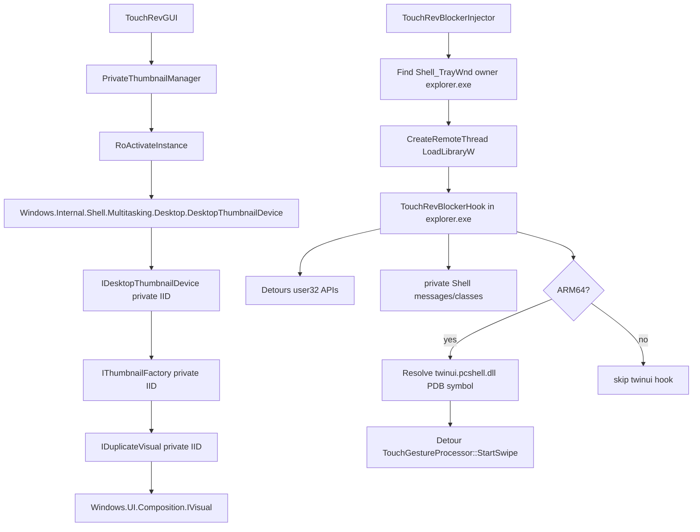

# Private API Compatibility Assessment

## 评估范围

- `src/thumbnail/`：使用 `Windows.Internal.Shell.Multitasking.Desktop.DesktopThumbnailDevice` 和私有 ABI 创建窗口缩略图。
- `src/blocker/`：向 `explorer.exe` 注入 DLL，使用 Detours 拦截消息、窗口激活 API，并在 ARM64 上按 PDB 符号 Hook `twinui.pcshell.dll` 内部函数。

## 结论

| 模块 | 私有依赖等级 | x64 兼容性 | ARM64 兼容性 | 跨 Windows 版本风险 | 主要失效模式 |
| --- | --- | --- | --- | --- | --- |
| `src/thumbnail` | 高 | 中 | 中 | 高 | 内部 RuntimeClass / IID / vtable / 属性布局变化导致 `RoActivateInstance`、`QueryInterface` 或 `CreateThumbnailVisual` 失败 |
| `src/blocker` 通用 Hook | 中高 | 中 | 中 | 中高 | Shell 窗口类、私有消息编号、Explorer 行为变化导致拦截规则失效 |
| `src/blocker` ARM64 `twinui.pcshell` Hook | 极高 | 不启用 | 低 | 极高 | PDB 不可取、符号名变化、内部签名/参数布局变化、模块未加载、CFG/CET/代码签名策略导致 Hook 失败 |
| 注入/卸载链路 | 中 | 中 | 中 | 中 | 架构不匹配、权限/完整性级别、Explorer 多进程/重启、远程线程策略导致失败 |

**总体判断**：当前实现更接近“按当前系统构建定制”的私有 Shell 集成，不是稳定的 Windows SDK 兼容层。建议把它作为可选能力：启动时探测、失败时降级、按 build/arch 记录兼容矩阵，不要假设 Windows 10/11 所有版本或 x64/ARM64 行为一致。

## 私有依赖拓扑

## `src/thumbnail` 兼容性

### 当前处理流程

1. `PrivateThumbnailManager::EnsureDevice` 用内部 RuntimeClass 字符串激活对象：[PrivateThumbnailManager.cpp:38-49](../../src/thumbnail/PrivateThumbnailManager.cpp#L38-L49)。
2. 激活后对硬编码 IID 做 `QueryInterface`：[PrivateThumbnailManager.cpp:55-57](../../src/thumbnail/PrivateThumbnailManager.cpp#L55-L57)。IID 和 RuntimeClass 定义在 [PrivateThumbnailInterfaces.h:12-34](../../src/thumbnail/PrivateThumbnailInterfaces.h#L12-L34)。
3. 对目标 `HWND` 创建私有 `IThumbnailFactory`：[PrivateThumbnailManager.cpp:88-104](../../src/thumbnail/PrivateThumbnailManager.cpp#L88-L104)。
4. 传入 `Windows.UI.Composition.Compositor` ABI、`FoundationSize` 和自定义 `ThumbnailProperties` 调用 `CreateThumbnailVisual`：[PrivateThumbnailManager.cpp:122-133](../../src/thumbnail/PrivateThumbnailManager.cpp#L122-L133)。
5. 再从私有 `IDuplicateVisual` 取出内部 `IVisual`，挂到 XAML host：[PrivateThumbnailManager.cpp:140-177](../../src/thumbnail/PrivateThumbnailManager.cpp#L140-L177)。

### 风险点

| 风险点 | 依据 | 兼容性影响 |
| --- | --- | --- |
| RuntimeClass 是 `Windows.Internal.*` | [PrivateThumbnailInterfaces.h:33-34](../../src/thumbnail/PrivateThumbnailInterfaces.h#L33-L34) | 不承诺存在；Feature Update 可重命名、移除或调整激活权限 |
| IID 全部硬编码 | [PrivateThumbnailInterfaces.h:12-31](../../src/thumbnail/PrivateThumbnailInterfaces.h#L12-L31) | IID 变化会直接 `E_NOINTERFACE`；同名类也可能暴露不同接口版本 |
| vtable 手写 ABI | [PrivateThumbnailInterfaces.h:56-85](../../src/thumbnail/PrivateThumbnailInterfaces.h#L56-L85) | 方法顺序/参数类型变化会导致错误调用；严重时进程崩溃 |
| `ThumbnailProperties` 字段语义未知 | [PrivateThumbnailInterfaces.h:50-54](../../src/thumbnail/PrivateThumbnailInterfaces.h#L50-L54)、[PrivateThumbnailManager.cpp:122-123](../../src/thumbnail/PrivateThumbnailManager.cpp#L122-L123) | `value8 = 0x101` 可能是 build 相关 flag；错误 flag 可导致黑图、空 visual 或资源泄漏 |
| `FoundationRect/FoundationSize` 自定义结构 | [PrivateThumbnailInterfaces.h:36-48](../../src/thumbnail/PrivateThumbnailInterfaces.h#L36-L48) | ABI 若改为 WinRT 标准结构或字段对齐变化，参数解释会错 |
| 绑定 XAML/Composition ABI | [PrivateThumbnailManager.cpp:114-177](../../src/thumbnail/PrivateThumbnailManager.cpp#L114-L177) | XAML Islands / CompositionVisualSurface 行为跨系统版本和 DPI 场景存在差异 |

### 架构判断

- x64 与 ARM64：该模块没有显式 `#if` 区分，理论上只要私有 WinRT 类和 ABI 一致即可运行。
- 实际风险不来自指令集，而来自 **ABI 布局与 Shell 私有组件版本**。ARM64 机器通常系统 build 更新节奏更集中，触发接口变化的概率不低于 x64。
- 当前失败路径基本是返回空 slot 或 `lastError`，例如 `EnsureDevice` 失败直接返回 [PrivateThumbnailManager.cpp:82-86](../../src/thumbnail/PrivateThumbnailManager.cpp#L82-L86)，比 blocker 的进程内 Hook 安全。

### 建议兼容策略

- 启动时做 capability probe：记录 `RoActivateInstance`、3 个 `QueryInterface`、`CreateThumbnailVisual` 的 HRESULT 和 OS build。
- 禁止把该路径作为唯一缩略图路径；需要 fallback，例如静态图标/标题卡片。
- 给 `ThumbnailProperties` 增加 build 白名单：未知 build 默认不开启私有 thumbnail，而不是盲调。
- 文档化已验证 build + arch + DPI 组合，失败时让 UI 降级。

## `src/blocker` 兼容性

### 当前处理流程

1. Injector 定位 `Shell_TrayWnd` 并确认其宿主是 `explorer.exe`：[process_find.cpp:96-170](../../src/blocker/injector/process_find.cpp#L96-L170)。
2. Injector 要求自身、DLL、目标 Explorer 都是同一 native 架构：[main.cpp:192-221](../../src/blocker/injector/main.cpp#L192-L221)。
3. 注入通过 `VirtualAllocEx` + `WriteProcessMemory` + 远程 `LoadLibraryW` 完成：[inject.cpp:214-283](../../src/blocker/injector/inject.cpp#L214-L283)。
4. DLL 在 `DllMain` 创建线程安装 Hook，避免在 loader lock 内直接执行复杂逻辑：[dllmain.cpp:32-41](../../src/blocker/hookdll/dllmain.cpp#L32-L41)。
5. 通用 Hook 用 Detours 拦截 `SendMessageW`、`PostMessageW`、`SendMessageCallbackW`、`ShowWindow`、`SetWindowPos`、`SetForegroundWindow`、`BringWindowToTop`、可选 `SwitchToThisWindow`：[hooks.cpp:252-347](../../src/blocker/hookdll/hooks.cpp#L252-L347)。
6. 判定逻辑依赖 Shell 窗口类名和私有消息编号：[constants.h:7-16](../../src/blocker/common/constants.h#L7-L16)、[gesture_blocker.cpp:15-51](../../src/blocker/hookdll/gesture_blocker.cpp#L15-L51)。
7. ARM64 额外按 PDB 符号解析并 Hook `twinui.pcshell.dll` 的 `TouchGestureProcessor::StartSwipe`：[twinui_gesture_hooks.cpp:17-35](../../src/blocker/hookdll/twinui_gesture_hooks.cpp#L17-L35)、[twinui_gesture_hooks.cpp:132-203](../../src/blocker/hookdll/twinui_gesture_hooks.cpp#L132-L203)。

### 通用 Hook 风险点

| 风险点 | 依据 | 兼容性影响 |
| --- | --- | --- |
| 私有消息编号固定 | [constants.h:7-11](../../src/blocker/common/constants.h#L7-L11) | `0xC029`、`0x05C6`、`0x0579` 可能随 Shell 实现变化；误拦截或漏拦截 |
| Shell 窗口类固定 | [constants.h:14-16](../../src/blocker/common/constants.h#L14-L16) | Explorer 拆分、多进程 Shell、XAML Shell Host 变化会导致定位错误 |
| 拦截 foreground API 并伪造成功 | [hooks.cpp:173-206](../../src/blocker/hookdll/hooks.cpp#L173-L206) | 调用方认为成功但状态未变，可能引出 Shell 状态机不一致 |
| `SwitchToThisWindow` 可选 export | [hooks.cpp:55-68](../../src/blocker/hookdll/hooks.cpp#L55-L68) | 该 API 本身不适合长期依赖；缺失时只降级，不是硬失败 |
| 注入 Explorer | [inject.cpp:214-283](../../src/blocker/injector/inject.cpp#L214-L283) | 权限、完整性级别、企业安全策略、Explorer 重启都会影响稳定性 |
| Detours 修改进程内代码 | [hooks.cpp:261-321](../../src/blocker/hookdll/hooks.cpp#L261-L321) | CFG/CET、安全产品、系统 DLL 热补丁都可能影响 attach/commit |

### ARM64 `twinui.pcshell` Hook 风险点

| 风险点 | 依据 | 兼容性影响 |
| --- | --- | --- |
| 仅 ARM64 编译启用 | [twinui_gesture_hooks.cpp:17-18](../../src/blocker/hookdll/twinui_gesture_hooks.cpp#L17-L18)、[twinui_gesture_hooks.cpp:132-209](../../src/blocker/hookdll/twinui_gesture_hooks.cpp#L132-L209) | x64 没有该补偿路径；两种架构功能不等价 |
| 依赖内部符号名 | [twinui_gesture_hooks.cpp:19-22](../../src/blocker/hookdll/twinui_gesture_hooks.cpp#L19-L22) | PDB 符号名变更、内联、LTCG 重排都会失效 |
| 参数布局手写 | [twinui_gesture_hooks.cpp:23-34](../../src/blocker/hookdll/twinui_gesture_hooks.cpp#L23-L34) | `TouchGesturePointView` 只有两个 float；真实结构扩展或调用约定变化会误读 |
| PDB 下载路径固定到 Microsoft symbol server | [dbghelp_symbol_provider.cpp:27-29](../../src/blocker/hookdll/dbghelp_symbol_provider.cpp#L27-L29)、[dbghelp_symbol_provider.cpp:554-730](../../src/blocker/hookdll/dbghelp_symbol_provider.cpp#L554-L730) | 离线、代理、符号缺失、受限网络会导致 Hook 安装失败 |
| 模糊符号匹配 | [dbghelp_symbol_provider.cpp:312-331](../../src/blocker/hookdll/dbghelp_symbol_provider.cpp#L312-L331)、[dbghelp_symbol_provider.cpp:1001-1053](../../src/blocker/hookdll/dbghelp_symbol_provider.cpp#L1001-L1053) | 枚举匹配若误中同名/近似名，可能 Hook 错函数；当前有单匹配保护但仍依赖名称唯一性 |
| 失败后继续通用 Hook | [hooks.cpp:343-346](../../src/blocker/hookdll/hooks.cpp#L343-L346) | 日志显示失败但产品表现会“部分可用”，需要 UI 明确状态 |

### 架构判断

- **x64**：只走消息/API Hook。兼容性取决于 Explorer 是否继续用这些窗口类和消息路由。没有 `twinui.pcshell` 内部函数 Hook，风险较低，但覆盖面也可能不足。
- **ARM64**：除通用 Hook 外，还 Hook `twinui.pcshell.dll` 内部函数。覆盖面更强，但对 PDB、符号、函数签名、Detours ARM64 指令重写依赖很重，整体兼容性最低。
- **ARM64EC / x64 on ARM**：当前显式只接受 native ARM64 或 native x64：[CMakeLists.txt:24-27](../../src/blocker/CMakeLists.txt#L24-L27)、[main.cpp:11-13](../../src/blocker/injector/main.cpp#L11-L13)。Injector 也要求目标 Explorer native machine 与当前构建一致：[process_find.cpp:70-93](../../src/blocker/injector/process_find.cpp#L70-L93)。因此 ARM64EC/仿真混合场景不在当前支持面内。

## Windows 版本风险分层

| 依赖项 | 版本稳定性 | 原因 |
| --- | --- | --- |
| `RoActivateInstance` 本身 | 高 | 公共 WinRT 激活机制，调用机制稳定 |
| `Windows.Internal.Shell.*` 类 | 低 | 内部类，不承诺存在或 ABI 稳定 |
| 私有 IID/vtable | 很低 | 没有 SDK 契约，接口版本变化不可预警 |
| `Shell_TrayWnd` / `WorkerW` / `AppThumbnailWindow` | 中低 | 长期存在但 Shell 组件可重构 |
| 私有消息 `0x05C6/0x0579/0xC029` | 低 | 消息语义来自逆向观察，可能随 build 变化 |
| user32 exported API Detours | 中 | API 存在稳定，但进程内 patch 受安全策略影响 |
| `twinui.pcshell.dll` PDB 符号 | 很低 | 内部实现符号，无功能契约 |
| 远程 `LoadLibraryW` 注入 | 中 | 经典方式，但受权限、安全策略和目标进程模型影响 |

## 建议的兼容性门禁

### 运行时探测

- Thumbnail：记录以下探测点并暴露到诊断 UI/日志：
  - RuntimeClass 激活是否成功。
  - `kIDesktopThumbnailDevice`、`kIThumbnailFactory`、`kIDuplicateVisual` 的 `QueryInterface` 是否成功。
  - `CreateThumbnailVisual` 返回值。
- Blocker：记录以下状态：
  - 目标 Explorer PID、arch、image path。
  - 注入成功/失败原因。
  - 每个 Detours attach 结果。
  - ARM64 PDB identity、PDB cache hit/miss、symbol RVA、module path。

### Build 白名单

建议把能力拆成独立开关：

| Capability | 默认策略 |
| --- | --- |
| `privateThumbnail` | 未验证 build 默认关闭，可通过实验开关开启 |
| `messageGestureBlocker` | 可默认开启，但失败只影响 blocker，不影响主 UI |
| `foregroundCommitBlocker` | 建议保守开启，误拦截风险高时可单独关闭 |
| `arm64TwinuiStartSwipeHook` | 仅在已验证 OS build + PDB identity + RVA 匹配时开启 |

### 自动降级

- `thumbnail` 失败：显示应用图标、标题和窗口边框，不阻塞 app switcher 主流程。
- `blocker` 注入失败：主程序继续运行，但显示“系统手势未拦截”。
- ARM64 `twinui` Hook 失败：继续通用 Hook，同时日志必须区分“完全防护”和“部分防护”。

## 验证矩阵

| 维度 | 必测项 |
| --- | --- |
| OS | Windows 10 22H2、Windows 11 23H2、Windows 11 24H2、当前 Insider/Canary |
| Arch | x64 native、ARM64 native；ARM64 上额外验证 x64 build 不应误注入 |
| Explorer 状态 | 初次登录、Explorer 重启后、任务栏自动隐藏、多显示器、多桌面 |
| DPI | 100%、150%、混合 DPI 多屏 |
| 网络 | PDB cache hit、PDB cache miss + 可联网、离线/代理失败 |
| 权限 | 普通用户、管理员启动、不同完整性级别 |
| 安全策略 | Core Isolation / Memory Integrity 开启，常见 EDR 环境 |

## 小结

- `src/thumbnail` 的主要风险是私有 WinRT ABI；跨架构不是核心问题，跨 Windows build 才是核心问题。
- `src/blocker` 的主要风险是 Explorer 注入 + Shell 私有消息 + ARM64 内部函数 Hook；ARM64 路径明显比 x64 更脆弱。
- 当前代码已有不少失败日志和架构检查，但缺少“能力级降级”和“已验证 build 白名单”。
- 如果目标是给用户长期使用，建议优先补：运行时 probe、能力开关、build/arch 兼容矩阵、失败 UI 提示。