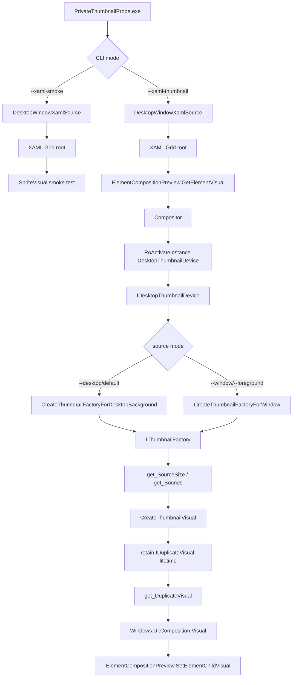
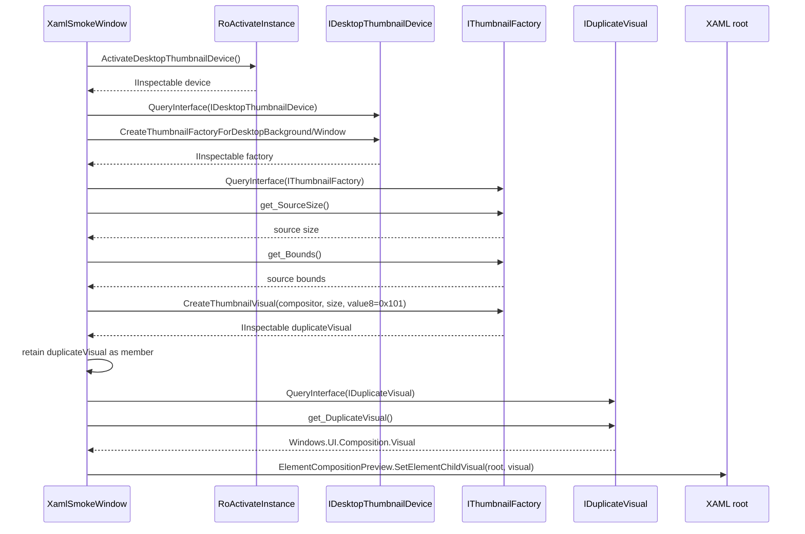

# PrivateThumbnailProbe 接口文档

日期：2026-06-17  
适用范围：`poc/private_thumbnail_probe` 独立 PoC  
状态：当前机器已验证 `DesktopThumbnailDevice -> IThumbnailFactory -> IDuplicateVisual -> XAML root` 主链路部分可显示真实内容；关键条件是保持 `IDuplicateVisual` 生命周期，且当前仍需继续确认裁剪、刷新和跨 build 行为。

## 1. 接口边界

`PrivateThumbnailProbe` 是独立验证程序，不挂接根目录 `CMakeLists.txt`，也不修改 `TouchRevGUI` target；该边界在 PoC README 中明确说明：[README.md:1-3](../../poc/private_thumbnail_probe/README.md#L1-L3)。程序不会注入 Explorer，也不会附加到现有主项目：[README.md:20-20](../../poc/private_thumbnail_probe/README.md#L20-L20)。

接口分为四层：

| 层级 | 对外/内部 | 职责 | 源码依据 |
| --- | --- | --- | --- |
| 构建接口 | 对外 | 生成 `PrivateThumbnailProbe.exe` | [CMakeLists.txt:1-11](../../poc/private_thumbnail_probe/CMakeLists.txt#L1-L11) |
| CLI 接口 | 对外 | 选择 desktop/window/foreground/XAML probe 模式 | [main.cpp:479-504](../../poc/private_thumbnail_probe/src/main.cpp#L479-L504) |
| 私有 ABI 接口 | 内部 | 声明 `IDesktopThumbnailDevice`、`IThumbnailFactory`、`IDuplicateVisual` | [main.cpp:35-131](../../poc/private_thumbnail_probe/src/main.cpp#L35-L131) |
| XAML/Composition 接口 | 内部 | 创建 XAML Island，挂接 Composition visual | [main.cpp:712-768](../../poc/private_thumbnail_probe/src/main.cpp#L712-L768) |
| Thumbnail visual 接口 | 内部 | 调用私有 factory，取出可挂接的 inner `Visual` | [main.cpp:771-906](../../poc/private_thumbnail_probe/src/main.cpp#L771-L906) |

当前接口文档只描述已验证路径，不把未解析字段当成稳定 API。

## 2. 当前配置实际执行路径

当前已验证链路为：[README.md:9-18](../../poc/private_thumbnail_probe/README.md#L9-L18)。



### 条件分支

| 条件 | 处理 | 输出 |
| --- | --- | --- |
| `--xaml-smoke` | 创建 `DesktopWindowXamlSource`，挂接普通 `SpriteVisual` | 验证 XAML Island 和 Composition 基础链路 |
| `--xaml-thumbnail` | 创建 XAML host 后继续调用私有 thumbnail ABI | 验证私有 thumbnail visual 可嵌入 XAML root |
| `--desktop` 或默认 | 使用 primary work area rect 创建 desktop background factory | `DesktopBackgroundThumbnailFactory` |
| `--window <hwnd>` | 直接把 HWND-like 值传入 `CreateThumbnailFactoryForWindow` | `WindowThumbnailFactory` 或失败 HRESULT |
| `--foreground [--delay ms]` | 可选 sleep 后调用 `GetForegroundWindow()` | foreground HWND 对应的 `WindowThumbnailFactory` |

源码中的模式枚举和选项结构见 [main.cpp:460-477](../../poc/private_thumbnail_probe/src/main.cpp#L460-L477)，参数解析见 [main.cpp:507-582](../../poc/private_thumbnail_probe/src/main.cpp#L507-L582)。

## 3. 构建接口

### 输入

- CMake 3.24+
- Ninja 或兼容生成器
- Windows SDK `10.0.26100.0` 的 `cppwinrt` include 路径；CMake 会在该路径存在时加入 include 目录：[CMakeLists.txt:22-27](../../poc/private_thumbnail_probe/CMakeLists.txt#L22-L27)。

### 处理

`CMakeLists.txt` 定义一个独立 executable target：`PrivateThumbnailProbe`。输入源文件包括：

| 输入文件 | 用途 | 源码依据 |
| --- | --- | --- |
| `src/main.cpp` | Win32/WinRT/XAML/私有 ABI 主实现 | [CMakeLists.txt:5-9](../../poc/private_thumbnail_probe/CMakeLists.txt#L5-L9) |
| `app.rc` | 嵌入 manifest resource | [app.rc:1-2](../../poc/private_thumbnail_probe/app.rc#L1-L2) |
| `app.manifest` | 声明 XAML Island 所需兼容性和 DPI awareness | [app.manifest:1-16](../../poc/private_thumbnail_probe/app.manifest#L1-L16) |

### 输出

生成：

```text
poc/private_thumbnail_probe/build/ninja-debug/PrivateThumbnailProbe.exe
```

构建命令记录在 README：[README.md:22-27](../../poc/private_thumbnail_probe/README.md#L22-L27)。

## 4. CLI 接口

### Usage

CLI usage 由 `PrintUsage()` 输出：[main.cpp:479-504](../../poc/private_thumbnail_probe/src/main.cpp#L479-L504)。

| 参数 | 输入 | 处理 | 输出/行为 | 源码依据 |
| --- | --- | --- | --- | --- |
| `--desktop` | 无 | 设置 `ProbeMode::DesktopBackground` | 创建 desktop background factory | [main.cpp:518-522](../../poc/private_thumbnail_probe/src/main.cpp#L518-L522) |
| `--window <hwnd>` | 十六进制/十进制 HWND-like 值 | 设置 `ProbeMode::Window` 和 `options.hwnd` | 调用 `CreateThumbnailFactoryForWindow` | [main.cpp:538-547](../../poc/private_thumbnail_probe/src/main.cpp#L538-L547) |
| `--foreground` | 无 | 设置 `ProbeMode::ForegroundWindow` | 延迟后或立即取 foreground HWND | [main.cpp:523-527](../../poc/private_thumbnail_probe/src/main.cpp#L523-L527) |
| `--xaml-smoke` | 无 | 设置 `ProbeMode::XamlSmoke` | 创建 XAML Island 并挂接普通 `SpriteVisual` | [main.cpp:528-532](../../poc/private_thumbnail_probe/src/main.cpp#L528-L532) |
| `--xaml-thumbnail` | 无 | 设置 `options.xamlThumbnail = true` | 创建 XAML host，并尝试挂接 thumbnail visual | [main.cpp:533-537](../../poc/private_thumbnail_probe/src/main.cpp#L533-L537) |
| `--delay <ms>` | 毫秒数 | 设置 `options.delayMs` | 取 foreground HWND 前 sleep | [main.cpp:548-556](../../poc/private_thumbnail_probe/src/main.cpp#L548-L556) |
| `--auto-close <ms>` | 毫秒数 | 设置 `options.autoCloseMs` | XAML 窗口自动关闭 | [main.cpp:557-565](../../poc/private_thumbnail_probe/src/main.cpp#L557-L565) |
| `--thumb-scale <n>` | `0.25` 到 `4.0` 的浮点数 | 设置 `options.thumbScale` | 放大 `CreateThumbnailVisual` backing size，不改变 XAML 显示尺寸 | [main.cpp:581-592](../../poc/private_thumbnail_probe/src/main.cpp#L581-L592) |
| `--slots <n>` | 0 到 64 | 设置 vtable dump slot 数量 | 输出 factory vtable 前 N 项 | [main.cpp:594-605](../../poc/private_thumbnail_probe/src/main.cpp#L594-L605) |
| `--help` / `-h` | 无 | 打印 usage 后退出 | exit 0 | [main.cpp:513-517](../../poc/private_thumbnail_probe/src/main.cpp#L513-L517) |

### Exit code

非 XAML factory 创建路径的 usage 文本声明：`0` 表示 activation、factory creation、`IThumbnailFactory` QI 成功；`1` 表示其中任一步失败：[main.cpp:501-503](../../poc/private_thumbnail_probe/src/main.cpp#L501-L503)。实际 `wmain()` 在失败 HRESULT 后返回 `1`，成功路径返回 `0`：[main.cpp:1069-1121](../../poc/private_thumbnail_probe/src/main.cpp#L1069-L1121)。

## 5. COM / WinRT 初始化接口

| 模式 | 初始化 | 原因 | 源码依据 |
| --- | --- | --- | --- |
| `--xaml-smoke` 或 `--xaml-thumbnail` | `RoInitialize(RO_INIT_SINGLETHREADED)` | XAML UI 线程路径需要单线程 apartment 语义 | [main.cpp:1051-1060](../../poc/private_thumbnail_probe/src/main.cpp#L1051-L1060) |
| 非 XAML factory probe | `RoInitialize(RO_INIT_MULTITHREADED)` | 只验证 activation/factory/QI，不创建 XAML UI | [main.cpp:1062-1067](../../poc/private_thumbnail_probe/src/main.cpp#L1062-L1067) |

`app.manifest` 中的 `maxversiontested` 是 XAML Island 初始化的必要运行条件之一：[app.manifest:4-8](../../poc/private_thumbnail_probe/app.manifest#L4-L8)。

## 6. 私有 ABI 接口

### 6.1 GUID 和 runtime class

| 名称 | 用途 | 源码依据 |
| --- | --- | --- |
| `kIDesktopWindowXamlSourceNative` | 从 `DesktopWindowXamlSource` QI native host 接口 | [main.cpp:35-40](../../poc/private_thumbnail_probe/src/main.cpp#L35-L40) |
| `kIDesktopThumbnailDevice` | QI `IDesktopThumbnailDevice` | [main.cpp:42-47](../../poc/private_thumbnail_probe/src/main.cpp#L42-L47) |
| `kIDesktopThumbnailDevice2` | QI `IDesktopThumbnailDevice2` | [main.cpp:49-54](../../poc/private_thumbnail_probe/src/main.cpp#L49-L54) |
| `kIThumbnailFactory` | QI `IThumbnailFactory` / `IThumbnailFactoryVisual` | [main.cpp:56-61](../../poc/private_thumbnail_probe/src/main.cpp#L56-L61) |
| `kIDuplicateVisual` | QI `IDuplicateVisualProbe` | [main.cpp:63-68](../../poc/private_thumbnail_probe/src/main.cpp#L63-L68) |
| `DesktopThumbnailDevice` runtime class | `RoActivateInstance` 输入 class name | [main.cpp:70-71](../../poc/private_thumbnail_probe/src/main.cpp#L70-L71) |

### 6.2 数据结构

| 类型 | 字段 | 用途 | 源码依据 |
| --- | --- | --- | --- |
| `FoundationRect` | `X/Y/Width/Height` | desktop background factory 的区域输入 | [main.cpp:73-79](../../poc/private_thumbnail_probe/src/main.cpp#L73-L79) |
| `FoundationSize` | `Width/Height` | `CreateThumbnailVisual` 的输出 visual 目标尺寸 | [main.cpp:81-85](../../poc/private_thumbnail_probe/src/main.cpp#L81-L85) |
| `ThumbnailProperties` | `value0/value8` | 私有 thumbnail visual 创建参数；当前验证 `value8=0x101` 可切换基础 flags 并跳过 `DwmpQueryThumbnailType` fallback 分支 | [main.cpp:87-91](../../poc/private_thumbnail_probe/src/main.cpp#L87-L91), [main.cpp:846-852](../../poc/private_thumbnail_probe/src/main.cpp#L846-L852) |

### 6.3 `IDesktopThumbnailDevice`

| 方法 | 输入 | 输出 | 当前使用情况 | 源码依据 |
| --- | --- | --- | --- | --- |
| `CreateThumbnailFactoryForWindow(void* thumbnailWindow, IInspectable** factory)` | HWND-like 指针 | `WindowThumbnailFactory` inspectable | `--window` / `--foreground` 路径使用 | [main.cpp:93-102](../../poc/private_thumbnail_probe/src/main.cpp#L93-L102) |
| `CreateThumbnailFactoryForDesktopBackground(FoundationRect rect, IInspectable** factory)` | desktop rect | `DesktopBackgroundThumbnailFactory` inspectable | 默认 / `--desktop` 路径使用 | [main.cpp:93-102](../../poc/private_thumbnail_probe/src/main.cpp#L93-L102) |

工厂创建分支在 `CreateFactory()` 中实现：[main.cpp:993-1031](../../poc/private_thumbnail_probe/src/main.cpp#L993-L1031)。

### 6.4 `IDesktopThumbnailDevice2`

| 方法 | 输入 | 输出 | 当前使用情况 | 源码依据 |
| --- | --- | --- | --- | --- |
| `CreateThumbnailFactoryForSnappedWindows(...)` | window id 数组、rect | factory inspectable | 当前只 QI 验证，不进入主显示链路 | [main.cpp:104-111](../../poc/private_thumbnail_probe/src/main.cpp#L104-L111) |

`wmain()` 中会 QI `IDesktopThumbnailDevice2` 并打印 HRESULT，但不把它作为主链路门禁：[main.cpp:1093-1096](../../poc/private_thumbnail_probe/src/main.cpp#L1093-L1096)。

### 6.5 `IThumbnailFactoryVisual`

当前 build 的关键 vtable 记录来自 README：[README.md:86-99](../../poc/private_thumbnail_probe/README.md#L86-L99)。

| vtable offset | 方法 | 输入 | 输出 | 当前状态 | 源码依据 |
| --- | --- | --- | --- | --- | --- |
| `+0x30` | `get_SourceSize(FoundationSize* size)` | 无 | 源窗口尺寸 | 已验证可用，用于预热/刷新 factory source 状态 | [main.cpp:113-122](../../poc/private_thumbnail_probe/src/main.cpp#L113-L122), [main.cpp:820-826](../../poc/private_thumbnail_probe/src/main.cpp#L820-L826) |
| `+0x38` | `get_Bounds(FoundationRect* bounds)` | 无 | 源窗口 bounds | 已验证可用，用于确认 HWND 对应的可捕获区域 | [main.cpp:113-122](../../poc/private_thumbnail_probe/src/main.cpp#L113-L122), [main.cpp:828-834](../../poc/private_thumbnail_probe/src/main.cpp#L828-L834) |
| `+0x40` | `CreateThumbnailVisual(IUnknown* compositor, FoundationSize size, ThumbnailProperties properties, IInspectable** duplicateVisual)` | `Compositor` ABI、目标尺寸、properties | `IDuplicateVisual` inspectable | 已验证可用；返回对象必须保持生命周期 | [main.cpp:118-122](../../poc/private_thumbnail_probe/src/main.cpp#L118-L122), [main.cpp:850-864](../../poc/private_thumbnail_probe/src/main.cpp#L850-L864) |

当前调用点先读取 `SourceSize` 和 `Bounds`，再用 XAML host 客户区计算显示尺寸；传给 `CreateThumbnailVisual` 的 backing size 使用 `displaySize * dpiScale * thumbScale`，显示尺寸仍由 `Resize()` 控制，因此可以提高创建清晰度而不放大 XAML 布局：[main.cpp:852-886](../../poc/private_thumbnail_probe/src/main.cpp#L852-L886)。

### 6.6 `IDuplicateVisualProbe`

| vtable offset | 方法 | 输入 | 输出 | 当前状态 | 源码依据 |
| --- | --- | --- | --- | --- | --- |
| `+0x30` | `get_DuplicateVisual(IInspectable** visual)` | 无 | `Windows.UI.Composition.Visual` inspectable | 主路径使用 | [main.cpp:125-130](../../poc/private_thumbnail_probe/src/main.cpp#L125-L130) |
| `+0x38` | `UnknownSlot38()` | 未知 | 未知 | 不调用 | [main.cpp:125-130](../../poc/private_thumbnail_probe/src/main.cpp#L125-L130) |
| `+0x40` | `get_DuplicateVisualSurfaceBrush(IInspectable** brush)` | 无 | surface brush inspectable | fallback 探测 | [main.cpp:879-887](../../poc/private_thumbnail_probe/src/main.cpp#L879-L887) |
| `+0x48` | `get_Kind(std::int32_t* kind)` | out int32 | kind 值 | 当前返回 `E_NOTIMPL`，不作为失败条件 | [main.cpp:846-852](../../poc/private_thumbnail_probe/src/main.cpp#L846-L852) |

主显示路径是 `IDuplicateVisual::get_DuplicateVisual()`，不是直接把 `CreateThumbnailVisual` 返回对象当作 `IVisual`。`AttachThumbnailVisual()` 会先 QI `IDuplicateVisual`，再取 inner visual，再 QI `Windows.UI.Composition.IVisual`，最后挂到 XAML root：[main.cpp:871-940](../../poc/private_thumbnail_probe/src/main.cpp#L871-L940)。

重要生命周期约束：`CreateThumbnailVisual` 返回的 `IDuplicateVisual` 不能只作为局部变量存在。当前 PoC 已把它保存为窗口成员 `m_duplicateVisual`，否则函数返回后对象释放，DWM thumbnail handle / thumbnail data 生命周期会被截断，表现为 XAML root 内黑屏或只显示背景色：[main.cpp:850-864](../../poc/private_thumbnail_probe/src/main.cpp#L850-L864), [main.cpp:1008-1013](../../poc/private_thumbnail_probe/src/main.cpp#L1008-L1013)。

## 7. XAML Island 接口

### 7.1 `InitializeXamlIsland()`

输入：已创建的 Win32 host window `m_hwnd`。  
处理：

1. 调用 `WindowsXamlManager::InitializeForCurrentThread()`。
2. 创建 `DesktopWindowXamlSource`。
3. 通过 `kIDesktopWindowXamlSourceNative` QI native source。
4. `AttachToWindow(m_hwnd)`。
5. 读取 XAML child HWND。
6. 创建 `Grid root`，设置背景并作为 XAML source content。

源码依据：[main.cpp:712-748](../../poc/private_thumbnail_probe/src/main.cpp#L712-L748)。

输出：

- `m_xamlManager`
- `m_xamlSource`
- `m_xamlHwnd`
- `m_root`

### 7.2 `AttachSmokeVisual()`

输入：`m_root`。  
处理：通过 `ElementCompositionPreview::GetElementVisual(m_root)` 取得 root visual，再取 `Compositor`，创建蓝色 `SpriteVisual` 并挂接。  
输出：`m_compositor`、`m_smokeVisual`，以及已挂接到 XAML root 的普通 visual。  
源码依据：[main.cpp:750-768](../../poc/private_thumbnail_probe/src/main.cpp#L750-L768)。

## 8. Thumbnail visual 创建接口

### 8.1 `ActivateDesktopThumbnailDevice()`

输入：无。  
处理：用 runtime class name 构造 `HSTRING`，调用 `RoActivateInstance`。  
输出：`IInspectable*` device。  
源码依据：[main.cpp:948-957](../../poc/private_thumbnail_probe/src/main.cpp#L948-L957)。

### 8.2 `QueryDevice()` / `QueryDevice2()`

输入：device inspectable。  
处理：分别 QI 到 `IDesktopThumbnailDevice` 和 `IDesktopThumbnailDevice2`。  
输出：typed private interface pointer。  
源码依据：[main.cpp:959-981](../../poc/private_thumbnail_probe/src/main.cpp#L959-L981)。

### 8.3 `QueryThumbnailFactory()`

输入：factory inspectable。  
处理：QI 到 `kIThumbnailFactory`。  
输出：typed factory inspectable。  
源码依据：[main.cpp:983-991](../../poc/private_thumbnail_probe/src/main.cpp#L983-L991)。

### 8.4 `CreateFactory()`

输入：`Options`、`IDesktopThumbnailDevice*`。  
处理：

- `ProbeMode::DesktopBackground`：取 primary work area rect，然后调用 `CreateThumbnailFactoryForDesktopBackground`。
- `ProbeMode::ForegroundWindow`：可选 `Sleep(delayMs)`，再调用 `GetForegroundWindow()`。
- `ProbeMode::Window` / foreground 后续：校验 HWND 后调用 `CreateThumbnailFactoryForWindow`。

源码依据：[main.cpp:993-1031](../../poc/private_thumbnail_probe/src/main.cpp#L993-L1031)。

输出：factory inspectable。

### 8.5 `AttachThumbnailVisual()`

输入：已初始化的 XAML root 和 compositor。  
处理流程：



关键处理点：

| 步骤 | 行为 | 失败处理 | 源码依据 |
| --- | --- | --- | --- |
| activation | `RoActivateInstance(DesktopThumbnailDevice)` | HRESULT 失败则返回 | [main.cpp:778-784](../../poc/private_thumbnail_probe/src/main.cpp#L778-L784) |
| QI device | QI `IDesktopThumbnailDevice` | HRESULT 失败则返回 | [main.cpp:786-792](../../poc/private_thumbnail_probe/src/main.cpp#L786-L792) |
| 创建 factory | 按 source mode 调用 `CreateFactory()` | HRESULT 失败则返回 | [main.cpp:794-806](../../poc/private_thumbnail_probe/src/main.cpp#L794-L806) |
| QI factory | QI `IThumbnailFactory` visual ABI | HRESULT 失败则返回 | [main.cpp:810-816](../../poc/private_thumbnail_probe/src/main.cpp#L810-L816) |
| source 预热 | `get_SourceSize()` / `get_Bounds()` | 失败不立即终止，但会打印 HRESULT | [main.cpp:820-834](../../poc/private_thumbnail_probe/src/main.cpp#L820-L834) |
| 创建尺寸 | 用 XAML host 客户区减去 inset 计算目标 `FoundationSize` | 最小为 `1x1` | [main.cpp:836-844](../../poc/private_thumbnail_probe/src/main.cpp#L836-L844) |
| properties | 设置 `ThumbnailProperties.value8 = 0x101` | 切换 DWM thumbnail flags 并跳过 type fallback 分支 | [main.cpp:846-848](../../poc/private_thumbnail_probe/src/main.cpp#L846-L848) |
| 创建 duplicate visual | `CreateThumbnailVisual(compositor, size, properties)` | HRESULT 失败或 null out 则返回 | [main.cpp:850-864](../../poc/private_thumbnail_probe/src/main.cpp#L850-L864) |
| 生命周期保持 | 把返回对象保存到 `m_duplicateVisual` 成员 | 避免局部对象释放导致画面消失/黑屏 | [main.cpp:850-864](../../poc/private_thumbnail_probe/src/main.cpp#L850-L864), [main.cpp:1008-1013](../../poc/private_thumbnail_probe/src/main.cpp#L1008-L1013) |
| QI duplicate visual | QI `IDuplicateVisual` | 成功后走 inner visual 路径 | [main.cpp:871-873](../../poc/private_thumbnail_probe/src/main.cpp#L871-L873) |
| 取 inner visual | `get_DuplicateVisual()` | 成功后 QI `IVisual` | [main.cpp:917-940](../../poc/private_thumbnail_probe/src/main.cpp#L917-L940) |
| 挂接 XAML | `SetElementChildVisual(m_root, thumbnailVisual)` | 成功后保存 `m_thumbnailVisual` 并调用 `Resize()` | [main.cpp:930-940](../../poc/private_thumbnail_probe/src/main.cpp#L930-L940) |
| direct QI fallback | 直接 QI `IVisual` | 失败则打印 warning | [main.cpp:948-965](../../poc/private_thumbnail_probe/src/main.cpp#L948-L965) |

## 9. 验证接口

README 记录当前机器已确认结果：[README.md:73-84](../../poc/private_thumbnail_probe/README.md#L73-L84)。

| 验证项 | 命令 | 预期输出 |
| --- | --- | --- |
| factory 创建端 | `PrivateThumbnailProbe.exe` | activation、factory creation、`IThumbnailFactory` QI 成功 |
| 指定 HWND factory | `PrivateThumbnailProbe.exe --window 0x00123456` | 对有效 HWND 返回 `WindowThumbnailFactory` |
| foreground factory | `PrivateThumbnailProbe.exe --foreground --delay 3000` | 延迟后取 foreground HWND 并创建 factory |
| XAML smoke | `PrivateThumbnailProbe.exe --xaml-smoke` | `DesktopWindowXamlSource` attached，`SpriteVisual` attached |
| desktop thumbnail 嵌入 | `PrivateThumbnailProbe.exe --xaml-thumbnail --auto-close 1000` | inner `IVisual` attached to XAML root |
| foreground thumbnail 嵌入 | `PrivateThumbnailProbe.exe --xaml-thumbnail --foreground --delay 1000` | foreground window thumbnail visual attached |

README 中的运行命令见 [README.md:29-71](../../poc/private_thumbnail_probe/README.md#L29-L71)。

### 9.1 2026-06-17 部分成功记录

本轮验证目标是显示当前打开的 Chrome 窗口真实缩略图。最初状态是：`CreateThumbnailFactoryForWindow`、`CreateThumbnailVisual`、`get_DuplicateVisual` 和 `SetElementChildVisual` 都返回成功，但 PoC 窗口只显示黑色/背景色。

已确认的修正条件：

| 条件 | 处理 | 依据 |
| --- | --- | --- |
| source 状态 | 在 `CreateThumbnailVisual` 前调用 `get_SourceSize()` 和 `get_Bounds()` | [main.cpp:820-834](../../poc/private_thumbnail_probe/src/main.cpp#L820-L834) |
| flags/properties | 设置 `ThumbnailProperties.value8 = 0x101` | [main.cpp:846-848](../../poc/private_thumbnail_probe/src/main.cpp#L846-L848) |
| 返回对象生命周期 | 将 `CreateThumbnailVisual` 返回的 `IDuplicateVisual` 保存为 `m_duplicateVisual` 成员，而不是局部变量 | [main.cpp:850-864](../../poc/private_thumbnail_probe/src/main.cpp#L850-L864), [main.cpp:1008-1013](../../poc/private_thumbnail_probe/src/main.cpp#L1008-L1013) |
| visual 布局 | `Resize()` 同步设置 `m_thumbnailVisual` / `m_thumbnailBrushVisual` 的 `Offset` 和 `Size` | [main.cpp:968-1000](../../poc/private_thumbnail_probe/src/main.cpp#L968-L1000) |

最新 Chrome 截图验证保存为：[chrome_thumbnail_probe_capture_keep_duplicate.png](chrome_thumbnail_probe_capture_keep_duplicate.png)。该次截图统计为 `avgRgb=(246.7,246,246.2)`、`nonDarkRatio=100%`，说明已不再是黑屏或根背景色；用户侧观察为“部分成功”。

当前仍不能把它记为完整完成，原因是：截图证明画面内容已进入 PoC 窗口，但还需要继续验证源内容对应关系、裁剪区域、resize 后刷新、遮挡/跨屏/多窗口时的稳定性。

## 10. 理论路径与当前实际路径

### 理论路径

理论上可以继续扩展：

- 使用 `IDesktopThumbnailDevice2::CreateThumbnailFactoryForSnappedWindows` 支持 snapped windows。
- 使用 `get_DuplicateVisualSurfaceBrush` 走 brush 路径。
- 解析 `ThumbnailProperties` 控制更多 presentation 属性。
- 接入 source update / kind change 事件。

这些路径目前只保留 ABI 或探测位，未作为已验证主路径。

### 当前实际路径

当前实际路径固定为：

```text
DesktopThumbnailDevice
  -> IDesktopThumbnailDevice
  -> CreateThumbnailFactoryForDesktopBackground 或 CreateThumbnailFactoryForWindow
  -> IThumbnailFactory +0x30 get_SourceSize
  -> IThumbnailFactory +0x38 get_Bounds
  -> ThumbnailProperties.value8 = 0x101
  -> IThumbnailFactory +0x40 CreateThumbnailVisual
  -> retain IDuplicateVisual as window member
  -> IDuplicateVisual +0x30 get_DuplicateVisual
  -> Windows.UI.Composition.Visual
  -> ElementCompositionPreview.SetElementChildVisual
  -> Resize sets visual Offset/Size
```

可验证依据：当前 PoC 的 factory 预热和创建调用 [main.cpp:820-864](../../poc/private_thumbnail_probe/src/main.cpp#L820-L864)，`IDuplicateVisual` 到 inner visual 的挂接路径 [main.cpp:871-940](../../poc/private_thumbnail_probe/src/main.cpp#L871-L940)，以及生命周期成员保存 [main.cpp:1008-1013](../../poc/private_thumbnail_probe/src/main.cpp#L1008-L1013)。

## 11. 集成到主项目前的接口要求

若后续迁移到 `TouchRevGUI`，建议把 PoC 收敛成以下内部接口，而不是直接把 `main.cpp` 整体搬入主项目：

| 建议接口 | 输入 | 输出 | 依赖 |
| --- | --- | --- | --- |
| `PrivateThumbnailDevice::Activate()` | 无 | device inspectable / HRESULT | `RoActivateInstance` |
| `PrivateThumbnailDevice::CreateFactoryForDesktop(rect)` | `FoundationRect` | factory inspectable / HRESULT | `IDesktopThumbnailDevice` |
| `PrivateThumbnailDevice::CreateFactoryForWindow(hwnd)` | `HWND` | factory inspectable / HRESULT | `IDesktopThumbnailDevice` |
| `PrivateThumbnailVisual::Create(factory, compositor, size, properties)` | factory、`Compositor`、size、properties | `Windows.UI.Composition.Visual` + retained `IDuplicateVisual` / HRESULT | `IThumbnailFactory`、`IDuplicateVisual` |
| `XamlCompositionHost::SetChildVisual(element, visual)` | XAML element、Composition visual | success / HRESULT | `ElementCompositionPreview` |

迁移前必须把 `IDuplicateVisual` 作为 thumbnail 对象生命周期的一部分保存，不能只返回 inner `Visual`。当前 PoC 已补 `Resize()` 同步更新 visual 尺寸，但仍需继续处理 `ThumbnailProperties` 完整语义、source update 事件、clip 和跨 build ABI 兼容：[main.cpp:968-1000](../../poc/private_thumbnail_probe/src/main.cpp#L968-L1000)。

## 12. 小结

- 当前 PoC 的对外接口是 CLI；内部接口是私有 WinRT/COM ABI + XAML/Composition host。
- 当前部分成功路径不是单纯 `CreateThumbnailVisual -> get_DuplicateVisual -> SetElementChildVisual`；必须先调用 `get_SourceSize/get_Bounds`，设置 `ThumbnailProperties.value8 = 0x101`，并保持 `IDuplicateVisual` 生命周期。
- `IDuplicateVisual` 返回对象不能直接当作 `IVisual` 使用；当前实际显示路径仍必须经过 `get_DuplicateVisual()` 返回的 inner `Windows.UI.Composition.Visual`。
- 接入主项目之前，优先把 PoC 的私有 ABI、XAML host、thumbnail visual 创建逻辑拆成独立封装；封装返回值必须同时携带 retained `IDuplicateVisual` 和可挂接 `Visual`。
