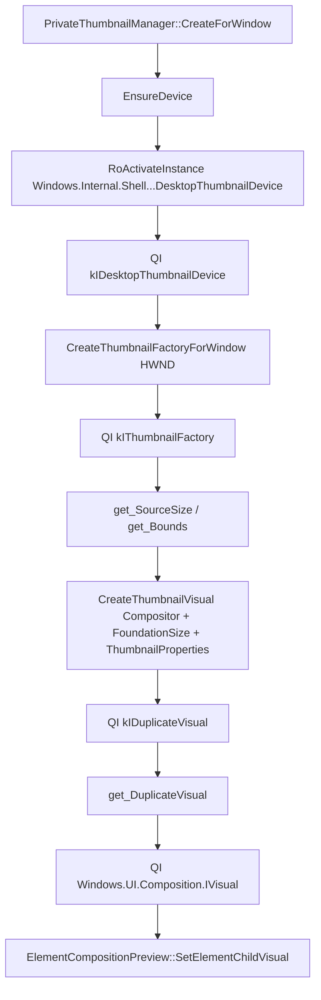
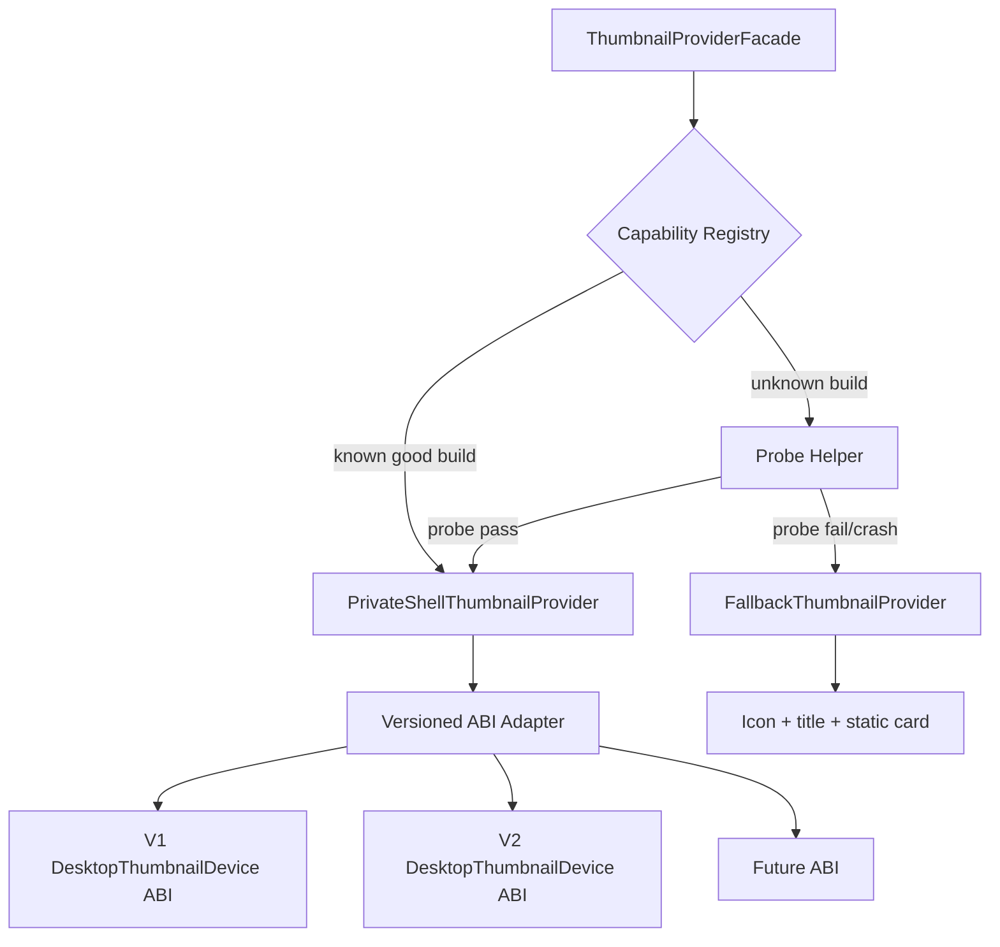
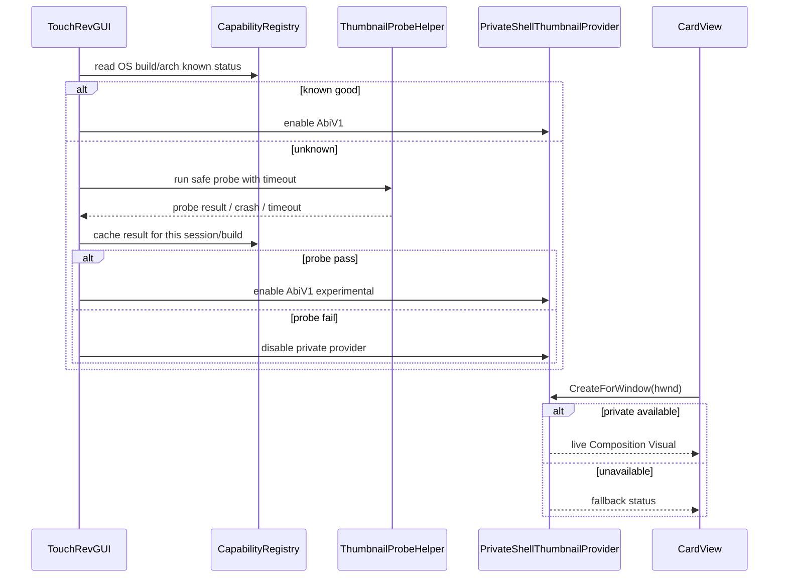

# Private Thumbnail Interface Versioning Strategy

## 背景

`src/blocker` 的 ARM64/x64 Hook 可以通过 PDB 下载、符号解析和 Detours 定位内部函数；`src/thumbnail` 的私有缩略图接口不具备同等可维护性。原因是当前路径依赖私有 WinRT RuntimeClass、硬编码 IID、手写 COM vtable 和未知属性结构，PDB 只能帮助定位 native 符号，不能自动证明 COM 接口 ABI 仍然兼容。

当前缩略图创建链路：



源码入口：

- 私有 RuntimeClass / IID / ABI 声明：[PrivateThumbnailInterfaces.h:12-85](../../src/thumbnail/PrivateThumbnailInterfaces.h#L12-L85)
- RuntimeClass 激活与 `IDesktopThumbnailDevice` 查询：[PrivateThumbnailManager.cpp:38-57](../../src/thumbnail/PrivateThumbnailManager.cpp#L38-L57)
- `HWND` 到私有 factory：[PrivateThumbnailManager.cpp:88-104](../../src/thumbnail/PrivateThumbnailManager.cpp#L88-L104)
- `CreateThumbnailVisual` 调用：[PrivateThumbnailManager.cpp:122-133](../../src/thumbnail/PrivateThumbnailManager.cpp#L122-L133)
- `IDuplicateVisual` 到 `IVisual`：[PrivateThumbnailManager.cpp:140-177](../../src/thumbnail/PrivateThumbnailManager.cpp#L140-L177)
- UI 侧失败后只对单张卡片设置 `thumbnailFailed`：[CardView.cpp:371-401](../../src/appswitcher/CardView.cpp#L371-L401)

## 结论

推荐采用 **版本化 ABI adapter + 运行时 capability probe + build 白名单 + UI fallback**。不要试图像 `twinui.pcshell` Hook 一样“自动从 PDB 反推出接口”。

原因：

| 项目 | PDB Hook | 私有 WinRT/COM 缩略图接口 |
| --- | --- | --- |
| 可定位对象 | native 函数符号和 RVA | COM object、IID、vtable slot、结构体布局 |
| PDB 能提供的信息 | 函数地址、符号名、模块 identity | 通常不能稳定给出 WinRT RuntimeClass 对外 ABI 契约 |
| 运行失败形态 | attach 失败可降级 | vtable/结构体错位可能直接错误调用或崩溃 |
| 可维护策略 | PDB identity + RVA + arch | OS build + IID set + ABI adapter 版本 + probe 结果 |

## 推荐架构



### 1. 把当前接口封装成 `PrivateThumbnailAbiV1`

当前 `PrivateThumbnailInterfaces.h` 直接暴露硬编码接口和结构体：[PrivateThumbnailInterfaces.h:36-85](../../src/thumbnail/PrivateThumbnailInterfaces.h#L36-L85)。建议把它视为 **V1 adapter**，不要让 UI 直接依赖这些类型。

建议拆分：

| 层级 | 职责 |
| --- | --- |
| `IThumbnailProvider` | UI 只调用稳定抽象：`CreateForWindow`、`Resize`、`Clear` |
| `PrivateShellThumbnailProvider` | 选择具体 ABI adapter，记录 capability 状态 |
| `PrivateThumbnailAbiV1` | 当前硬编码 IID/vtable/`ThumbnailProperties` 实现 |
| `FallbackThumbnailProvider` | 私有路径不可用时显示图标/标题/占位图 |

这样后续发现新 build 的 IID 或 vtable 改动时，只新增 `PrivateThumbnailAbiV2`，而不是在当前函数里堆 `if build >= ...`。

### 2. 运行时 probe 分阶段，不要一次性进入完整创建路径

当前 `EnsureDevice` 只验证 RuntimeClass 激活和一个 IID：[PrivateThumbnailManager.cpp:38-57](../../src/thumbnail/PrivateThumbnailManager.cpp#L38-L57)。建议扩展为分阶段 probe：

| 阶段 | 检查项 | 输出 |
| --- | --- | --- |
| RuntimeClass probe | `RoActivateInstance(kDesktopThumbnailDeviceClass)` | class 是否存在、HRESULT |
| Inspectable probe | `IInspectable::GetRuntimeClassName`、`IInspectable::GetIids` | 实际 RuntimeClass、暴露 IID 列表 |
| Device QI probe | `QueryInterface(kIDesktopThumbnailDevice)` | V1 device ABI 是否存在 |
| Factory probe | 对一个真实但低风险 `HWND` 调 `CreateThumbnailFactoryForWindow` | factory 是否可创建 |
| Factory IID probe | `factoryInspectable->GetIids`、`QI(kIThumbnailFactory)` | factory ABI 是否匹配 |
| Metadata probe | `get_SourceSize`、`get_Bounds` | slot 顺序是否至少可读 |
| Visual probe | `CreateThumbnailVisual` + `QI(kIDuplicateVisual)` + `QI(IVisual)` | 完整链路是否可用 |

probe 输出建议包含：

- `RtlGetVersion` / `GetVersionEx` 等 OS build 信息。
- RuntimeClass string。
- 每个对象的 IID 列表。
- 每个 HRESULT。
- `ThumbnailProperties` 版本号或 adapter 名称。
- 是否通过完整 visual 创建。

### 3. 对未知 build 默认禁用完整私有路径

当前代码只要 `EnsureDevice()` 成功就继续完整调用：[PrivateThumbnailManager.cpp:82-91](../../src/thumbnail/PrivateThumbnailManager.cpp#L82-L91)。这对未知系统版本偏激进。

建议维护 capability registry：

```text
OS build + arch + adapter id + IID set + probe result -> capability
```

策略：

| build 状态 | 默认行为 |
| --- | --- |
| 已验证 known-good | 启用私有 thumbnail |
| 已验证 known-bad | 直接 fallback |
| 未知 build | 默认 fallback；允许 developer/experimental 开关触发 probe |
| probe crash 或超时 | 标记 bad，当前会话禁用私有 thumbnail |

这比“所有系统都尝试一次完整私有 ABI”更安全。

### 4. 用独立 helper 做危险 probe

最危险的是 vtable slot 或结构体布局变化。`QueryInterface` 失败是安全失败，但如果 `QI` 成功而接口方法顺序/参数语义变了，调用 `CreateThumbnailVisual` 可能污染当前进程或崩溃。当前完整调用发生在主 UI 进程：[PrivateThumbnailManager.cpp:128-177](../../src/thumbnail/PrivateThumbnailManager.cpp#L128-L177)。

建议增加一个 probe helper：

```text
TouchRevThumbnailProbe.exe
  input: target hwnd / adapter id / timeout
  output: JSON capability result
  crash: 主进程记录 probe-crashed，禁用私有 thumbnail
```

注意：helper 不能直接把 `Composition::Visual` 交给主进程，但可以验证：

- RuntimeClass 是否存在。
- IID 是否存在。
- factory 是否可创建。
- source size/bounds 是否能读。
- `CreateThumbnailVisual` 是否返回成功。
- `IDuplicateVisual` 是否存在。

主进程只在 helper 通过后再启用当前 adapter。

### 5. `ThumbnailProperties` 必须版本化

当前 `ThumbnailProperties` 只有两个未知字段：[PrivateThumbnailInterfaces.h:50-54](../../src/thumbnail/PrivateThumbnailInterfaces.h#L50-L54)，调用时固定 `value8 = 0x101`：[PrivateThumbnailManager.cpp:122-124](../../src/thumbnail/PrivateThumbnailManager.cpp#L122-L124)。这应视为 ABI 的一部分。

建议：

```text
PrivateThumbnailAbiV1
  properties.size = sizeof(ThumbnailPropertiesV1)
  properties.value8 = 0x101

PrivateThumbnailAbiV2
  properties = different layout / flags
```

即使当前结构体没有 `size` 字段，也要在 adapter 层记录：

- adapter id：`DesktopThumbnailDeviceAbiV1`
- struct size：`16` 或实际 `sizeof`
- flag：`0x101`
- 适用 build 范围

### 6. UI fallback 要从“单卡失败”提升为“provider capability”

当前 `CardView::EnsureThumbnail` 在单个卡片失败后设置 `thumbnailFailed`，避免该卡片重复创建：[CardView.cpp:371-401](../../src/appswitcher/CardView.cpp#L371-L401)。这对单窗口失败足够，但对系统级 ABI 不兼容不够。

建议增加全局 provider 状态：

| 状态 | UI 行为 |
| --- | --- |
| `Available` | 正常创建 live thumbnail |
| `UnavailableRuntimeClass` | 所有卡片走 fallback |
| `UnavailableInterfaceMismatch` | 所有卡片走 fallback，并记录 IID mismatch |
| `UnavailableProbeFailed` | 所有卡片走 fallback |
| `DisabledByPolicy` | 所有卡片走 fallback |

这样不会出现每张卡片都各自尝试一次私有接口。

## 具体维护流程



## 不建议的方案

| 方案 | 不建议原因 |
| --- | --- |
| 每次启动都直接调用完整私有链路 | 未知 build 上 vtable/结构体错位会影响主进程稳定性 |
| 用 PDB 自动推导 COM vtable | 私有 WinRT/COM 契约不等价于 native 符号；PDB 信息不稳定且无法证明调用语义 |
| 在 `PrivateThumbnailManager.cpp` 里按 build 写大量 `if` | 后续难维护，容易把不同 ABI 的结构体和 IID 混在一起 |
| 失败后每个 card 重试 | 系统级不兼容会放大日志和性能成本 |
| 只依赖 `QueryInterface` 成功 | IID 存在只能证明接口被暴露，不能证明方法语义和参数布局仍满足当前假设 |

## 建议落地顺序

| 顺序 | 改动 | 收益 |
| --- | --- | --- |
| 1 | 增加 `ThumbnailProvider` 抽象和 `FallbackThumbnailProvider` | UI 与私有 ABI 解耦 |
| 2 | 把当前实现移动为 `PrivateThumbnailAbiV1` | 后续可新增 V2/V3 |
| 3 | 增加 `CapabilityProbe`，记录 RuntimeClass/IID/HRESULT | 快速定位跨版本失败点 |
| 4 | 增加全局 provider 状态，失败后全局降级 | 避免每张卡重复碰私有接口 |
| 5 | 增加 OS build/arch/session cache | 未知或失败 build 默认安全 |
| 6 | 可选增加 helper 进程做危险 probe | 防止主 UI 被未知 ABI 拖崩 |

## 小结

- 这个接口不适合做“自动 PDB 维护”；它需要 **版本化 ABI adapter**。
- 当前硬编码 IID/vtable/`ThumbnailProperties` 应收敛到 `PrivateThumbnailAbiV1`。
- 跨版本核心不是“找到函数地址”，而是“证明 RuntimeClass、IID、vtable slot、参数结构体、返回对象类型都仍兼容”。
- 推荐默认路径：已验证 build 启用；未知 build 先 probe；失败或 crash 直接 fallback。
