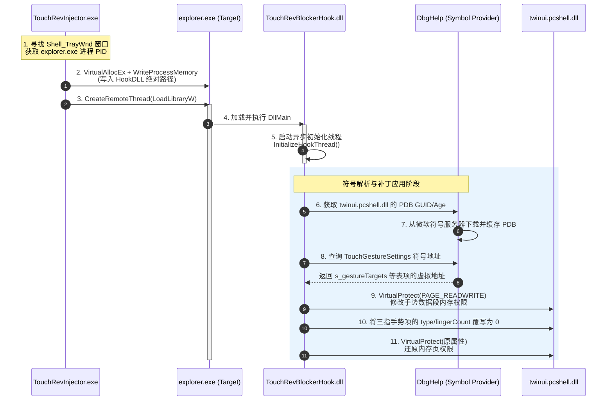

# Touch-Rev Blocker Hook 机制分析报告

本报告对当前 `blocker`（位于 [blocker](file:///d:/source/repos/Touch-Rev-GUI/blocker) 目录）的 Hook 机制进行了详细的分析。

当前 `blocker` 并不采用传统的 API Inline Hook 或 IAT Hook，而是采用了 **基于符号解析的数据段表项补丁 (Gesture Table Patching)**，配合 **标准远程线程注入** 的方式来实现对系统级三指手势的拦截与屏蔽。

---

## 1. 整体架构与流程

以下是 Blocker 从注入到应用补丁的整体时序和模块协作关系：



---

## 2. 注入阶段 (Injector)

注入器 [TouchRevInjector.exe](file:///d:/source/repos/Touch-Rev-GUI/blocker/injector) 负责将 Hook DLL 注入到 Windows 的外壳程序 `explorer.exe` 中：

1. **定位目标进程**：
   在 [process_find.cpp](file:///d:/source/repos/Touch-Rev-GUI/blocker/injector/process_find.cpp) 中，通过查找类名为 `Shell_TrayWnd` 的窗口句柄来获取拥有该句柄的进程 ID（即系统托盘/任务栏所在的 `explorer.exe`）。
2. **远程内存分配**：
   在 [inject.cpp](file:///d:/source/repos/Touch-Rev-GUI/blocker/injector/inject.cpp) 的 [InjectDllIntoProcess](file:///d:/source/repos/Touch-Rev-GUI/blocker/injector/inject.cpp#L199) 中使用 `VirtualAllocEx` 在目标进程中分配内存，并将 `TouchRevBlockerHook.dll` 的绝对路径通过 `WriteProcessMemory` 写入目标进程。
3. **启动远程线程**：
   计算目标进程中 `kernel32.dll!LoadLibraryW` 的绝对地址（通过本地偏移加上目标进程中 `kernel32.dll` 的加载基址），然后使用 `CreateRemoteThread` 触发目标进程加载 Hook DLL。

---

## 3. 符号解析阶段 (DbgHelp Symbol Provider)

当 Hook DLL [TouchRevBlockerHook.dll](file:///d:/source/repos/Touch-Rev-GUI/blocker/hookdll) 被加载后，它不会像传统 Hook 那样去修改函数指令的前几个字节（Inline Hook），而是选择**直接修改 `twinui.pcshell.dll` 的内部手势映射表数据**。为了定位这块无导出的数据区，它实现了一套动态符号解析机制：

1. **提取 PDB 信息**：
   在 [dbghelp_symbol_provider.cpp](file:///d:/source/repos/Touch-Rev-GUI/blocker/hookdll/dbghelp_symbol_provider.cpp) 中，解析已经加载的 `twinui.pcshell.dll` 的 PE 头（特别是 `IMAGE_DIRECTORY_ENTRY_DEBUG`），提取出对应 PDB 文件的 **GUID**、**Age** 和 **文件名**。
2. **缓存与符号服务器配置**：
   在本地创建符号缓存目录 `%LOCALAPPDATA%\Touch-Rev\symbol`。配置微软官方符号服务器（`https://msdl.microsoft.com/download/symbols`）作为符号下载源。
3. **DbgHelp 解析地址**：
   通过 Windows 系统的 `dbghelp.dll` 加载 PDB 文件并解析出以下两个关键符号的相对虚拟地址（RVA）：
   - `TouchGestureSettings::s_gestureTargets`（标准手势表起始地址）
   - `TouchGestureSettings::s_gestureTargetsForGamingFullScreenExperience`（全屏游戏手势表起始地址）
   - `HotkeyHandler::MoreSnapZonesHotkeyMaps::Default`（用于辅助计算全屏游戏手势表的大小）

### 3.1 PDB 缓存校验与自动修复机制（最新更新）

为了提升在复杂系统环境和网络状况下的鲁棒性，近期的代码更新中对 PDB 缓存的加载链条引入了严格的**身份校验与自愈机制**：

1. **多重属性校验 (`VerifyLoadedPdbIdentityWithEvent`)**：
   引入了专用的身份核对逻辑，通过 Windows 结构体 `IMAGEHLP_MODULEW64` 深度查询实际载入 PDB 模块的 `GUID`、`Age`、`LoadedPdbName` 以及 `SymType` 等指标。不仅核对文件名，更严格要求 GUID 与 Age 必须同 `twinui.pcshell.dll` 的 RSDS Identity 完全匹配。
2. **拒绝加载与安全卸载 (`LoadAndVerifyExactPdb`)**：
   在加载任何 PDB 符号后立即进行深度校验。一旦发现任何参数不匹配，立刻调用 `UnloadModuleSymbols` 对其进行卸载，并抛出 `PDB_EXACT_LOAD_REJECTED` 异常日志。
3. **失效缓存自愈 (`DeleteFileW` + `action=download`)**：
   当本地缓存路径下虽然存在 PDB 文件，但因文件损坏、写一半中断等导致校验失败（`PDB_EXACT_LOAD_MISMATCH`）时，代码现在会**主动调用 `DeleteFileW` 将无效的本地缓存文件物理删除**，记录 `PDB_CACHE_INVALID action=redownload` 日志，并自动**向下落入（Fallthrough）重新下载分支**，重新向微软符号服务器发起 HTTP 请求拉取干净的 PDB 文件，实现真正的无人值守自愈。

---

## 4. 手势表补丁阶段 (Gesture Table Patching)

系统（Windows 10/11 的 Shell 模块）通过读取 `twinui.pcshell.dll` 内定义的手势表来判断是否拦截、处理特定数量手指的手势动作。

在 [twinui_gesture_table_patch.cpp](file:///d:/source/repos/Touch-Rev-GUI/blocker/hookdll/twinui_gesture_table_patch.cpp) 中，手势表项的数据结构如下：

```cpp
struct TouchGestureTargetEntry {
    int type;          // 手势类型（例如：1 表示按下，2 表示水平滑动，4 表示垂直滑动）
    int fingerCount;   // 触发此手势所需的手指数量
    GUID target;       // 对应的处理程序/目标组件 GUID
};
```

### 补丁执行过程：
1. **构建内存范围**：
   通过上述解析出的符号确定 `s_gestureTargets` 和 `s_gestureTargetsForGamingFullScreenExperience` 两个数组在内存中的物理区间。
2. **匹配屏蔽手势**：
   遍历这两个数组中的 `TouchGestureTargetEntry`。当检测到需要屏蔽的系统手势时（当前代码中硬编码了 3 个屏蔽项）：
   - `{1, 3}`：三指按下 (`three-finger-pointer-down`)
   - `{2, 3}`：三指水平滑动 (`three-finger-horizontal-swipe`)
   - `{4, 3}`：三指垂直滑动 (`three-finger-vertical-swipe`)
3. **写入补丁**：
   使用 `VirtualProtect` 临时将对应的内存页属性修改为 `PAGE_READWRITE`，然后将该 Entry 的 `type` 和 `fingerCount` **全部改写为 0**（从而使其在系统手势匹配引擎中失效，无法匹配任何输入），最后将内存页还原为原有的保护属性。
4. **备份以供还原**：
   所有的修改都会记录到全局的 `g_patchRecords` 数组中。在卸载 Hook (`UninstallHooks`) 时，会按相反的顺序依次写回原本的数据，安全且无残留。

> [!NOTE]
> 曾经尝试过的基于 API 指令覆写的 Hook 方法（定义在 [twinui_gesture_hooks.cpp](file:///d:/source/repos/Touch-Rev-GUI/blocker/hookdll/twinui_gesture_hooks.cpp) 中）目前已被置为**禁用状态**（`reason=pdb-gesture-table-only`），仅输出日志。现在的版本完全依赖于修改手势数据表这一种机制。

---

## 5. 这种 Hook 方式的优缺点分析

| 维度 | 特点与优势 | 潜在挑战与局限性 |
| :--- | :--- | :--- |
| **稳定性 & 安全性** | 非常高。仅修改静态数据段的数据结构，不涉及指令集的重写（无指令对齐问题），极难导致 `explorer.exe` 崩溃。 | 数据结构定义（例如 `TouchGestureTargetEntry`）如果随 Windows 版本更新发生改变，可能会失效。 |
| **卸载友好** | 极佳。只需要将备份的 Original 表项原样写回即可，不需要恢复函数头部的 Jump 指令，也不用担心卸载时的竞态条件。 | 卸载同样依赖正确的内存属性还原。 |
| **PDB 依赖** | - | 首次运行或 Windows 系统更新后需要联网从微软服务器下载 PDB 符号。如果在无网环境下使用，解析可能会失败（不过本地有缓存目录可以缓解这一问题）。 |
