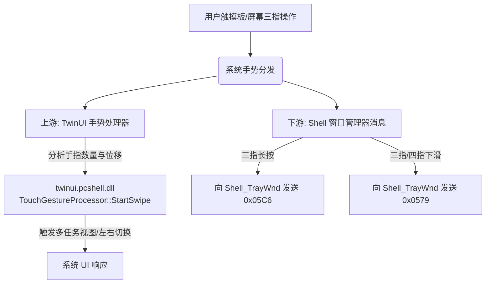

# 屏蔽三指所有手势的技术实现方案

本篇文档详细介绍了在 Windows 系统下，如何通过注入挂钩（Hook）技术屏蔽三指的所有手势（包括**三指长按、三指上滑、三指下滑、三指左右滑**）。

---

## 1. Windows 三指手势的底层原理与链路

在 Windows 10/11 系统中，触摸板或触摸屏的三指手势主要通过以下两条路径影响系统行为：



### 手势特征汇总
基于逆向工程与运行时日志，三指手势触发时会产生以下特征信号：

| 手势类型 | 触发源与特征 | 目标窗口/模块 | 涉及的消息或函数 |
| :--- | :--- | :--- | :--- |
| **三指长按** | 窗口消息 | `Shell_TrayWnd` | 消息 `0x05C6` |
| **三指上滑** | 手势位移 (`deltaY < 0`) | `twinui.pcshell.dll` | `TouchGestureProcessor::StartSwipe` (finger=3) |
| **三指下滑** | 窗口消息与手势位移 (`deltaY > 0`) | `Shell_TrayWnd`<br/>`twinui.pcshell.dll` | 消息 `0x0579` (wParam=3)<br/>`TouchGestureProcessor::StartSwipe` (finger=3) |
| **三指左右滑** | 手势位移 (`deltaX` 变化) | `twinui.pcshell.dll` | `TouchGestureProcessor::StartSwipe` (finger=3) |

要实现“屏蔽所有三指手势”，最佳策略是**“上游手势处理器拦截 + 下游窗口消息过滤”**的双重拦截方案。

---

## 2. 具体实现方案

### 2.1 方案一：上游手势处理器拦截（全面屏蔽滑动类手势）

这是最彻底、最优雅的方式。通过挂钩 `twinui.pcshell.dll` 的 `TouchGestureProcessor::StartSwipe`，我们可以在系统识别出滑动动作并分发给具体功能（如多任务视图、虚拟桌面切换）之前将其拦截。

#### 核心修改逻辑
原本的拦截条件 `IsThreeFingerSwipeUp` 仅限定了 `deltaY < 0.0f`（即限制在上滑）。若要屏蔽三指的所有滑动（上、下、左、右），只需去除方向判断，**只要检测到指头数量为 3，即直接阻断**。

##### 修改示例：
在 `twinui_gesture_hooks.cpp` 中，修改手势过滤函数：

```cpp
bool IsAnyThreeFingerSwipe(int fingerCount,
                           float deltaX,
                           float deltaY,
                           int* dx,
                           int* dy) {
    if (dx) *dx = 0;
    if (dy) *dy = 0;

    // 1. 判断是否为三指操作，并且坐标值有效
    if (fingerCount != 3 || !std::isfinite(deltaX) || !std::isfinite(deltaY)) {
        return false;
    }

    if (dx) *dx = static_cast<int>(deltaX);
    if (dy) *dy = static_cast<int>(deltaY);

    // 2. 不做任何方向限制，只要是三指，直接返回 true 进行屏蔽
    return true; 
}
```

并在 `TouchGestureProcessorStartSwipe_Hook` 中引用该判定：

```cpp
void WINAPI TouchGestureProcessorStartSwipe_Hook(
    void* self,
    unsigned int fingerCount,
    const TouchGesturePointView* point) {
    
    int dx = 0, dy = 0;
    // 判定是否属于任意三指滑动
    bool shouldBlock = point && IsAnyThreeFingerSwipe(static_cast<int>(fingerCount), 
                                                      point->deltaX, 
                                                      point->deltaY, &dx, &dy);

    if (!g_inTwinuiHook && shouldBlock) {
        g_inTwinuiHook = true;
        
        // 启动阻断窗口（防止下游残留窗口跳出）
        StartThreeFingerSwipeUpBlockWindow(); 
        
        LogMessage(L"hookdll", LogLevel::Info,
                   L"event=BLOCKED api=twinui::TouchGestureProcessor::StartSwipe reason=any-three-finger-swipe");
        
        g_inTwinuiHook = false;
        return; // 直接返回，不调用原始函数，阻断手势
    }

    // 非三指手势，放行
    if (TouchGestureProcessorStartSwipe_Original) {
        TouchGestureProcessorStartSwipe_Original(self, fingerCount, point);
    }
}
```

---

### 2.2 方案二：下游窗口消息拦截（屏蔽长按与下滑动作消息）

由于并非所有平台或系统版本都能成功加载符号并挂钩 `twinui.pcshell.dll` 的 `StartSwipe`（例如在非 ARM64 架构、或没有相应 PDB 符号的情况），我们需要在下游的窗口消息钩子中对三指消息进行防御。

#### 1. 定义消息常量
在 `common/constants.h` 中，加入三指下滑的消息常数定义：

```cpp
// 三指/四指下滑分发给任务栏窗口管理器的消息 ID
inline constexpr UINT kShellTrayWindowManagerMessage = 0x0579; 
```

#### 2. 实现消息屏蔽判定
在 `gesture_blocker.cpp` 中，实现对三指下滑（`0x0579` 且 `wParam == 3`）以及三指长按（`0x05C6`）的拦截。

##### 修改示例：
在 `gesture_blocker.cpp` 中修改或新增判定逻辑：

```cpp
// 判定是否是三指长按信号
bool ShouldBlockThreeFingerLongPressSignal(HWND hwnd, UINT msg) {
    return msg == kShellTrayThreeFingerLongPressMessage &&
           WindowClassEquals(hwnd, kClassShellTrayWnd);
}

// 判定是否是三指下滑信号
bool ShouldBlockThreeFingerSwipeDownSignal(HWND hwnd, UINT msg, WPARAM wParam) {
    // 0x0579 且 wParam == 3 代表三指下滑
    return msg == kShellTrayWindowManagerMessage && 
           wParam == 3 &&
           WindowClassEquals(hwnd, kClassShellTrayWnd);
}
```

修改主入口 `ShouldBlockMessage`：

```cpp
bool ShouldBlockMessage(HWND hwnd,
                        UINT msg,
                        WPARAM wParam,
                        LPARAM lParam,
                        PCWSTR* reason) {
    if (reason) {
        *reason = L"";
    }

    // 1. 屏蔽三指长按
    if (ShouldBlockThreeFingerLongPressSignal(hwnd, msg)) {
        if (reason) {
            *reason = L"Shell_TrayWnd 0x05C6 three-finger long-press";
        }
        return true;
    }

    // 2. 屏蔽三指下滑
    if (ShouldBlockThreeFingerSwipeDownSignal(hwnd, msg, wParam)) {
        if (reason) {
            *reason = L"Shell_TrayWnd 0x0579 wParam=3 three-finger swipe-down";
        }
        return true;
    }

    // 3. 屏蔽 WorkerW 路由和 AppThumbnail 行为 (原有逻辑)
    if (ShouldBlockWorkerRoutingToAppThumbnail(hwnd, msg, wParam, lParam)) {
        if (reason) {
            *reason = L"WorkerW 0xC029 -> AppThumbnailWindow";
        }
        return true;
    }
    if (ShouldBlockDirectAppThumbnailWindow(hwnd)) {
        if (reason) {
            *reason = L"active block window -> AppThumbnailWindow";
        }
        return true;
    }

    return false;
}
```

在拦截到三指下滑消息后，也需要同步激活 Follow-Up Blockers 机制（即启动短期防护窗口，阻止因消息残留导致的窗口显示）：

```cpp
void ActivateFollowUpBlockers(HWND hwnd,
                              UINT msg,
                              WPARAM wParam,
                              LPARAM /*lParam*/,
                              PCWSTR reason) {
    if (ShouldBlockThreeFingerLongPressSignal(hwnd, msg) || 
        ShouldBlockThreeFingerSwipeDownSignal(hwnd, msg, wParam)) {
        StartRecentTaskSwitcherBlockWindow(reason);
    }
}
```

---

## 3. 总结与集成建议

通过合并实施以上两套方案，可以达到对三指手势的完美屏蔽：
- **三指滑动（上/下/左/右）**：通过 **方案一** 在最上游的触摸数据处理阶段就直接丢弃。
- **三指长按** 与 **遗漏的下滑消息**：通过 **方案二** 在消息路由层（`SendMessageW`/`PostMessageW` 钩子）进行二次拦截。
- **动态阻断窗口**：利用 `StartRecentTaskSwitcherBlockWindow` 临时屏蔽机制，过滤因手势中断或系统微小延迟产生的前台切换，确保屏蔽体验平滑、无闪烁。
