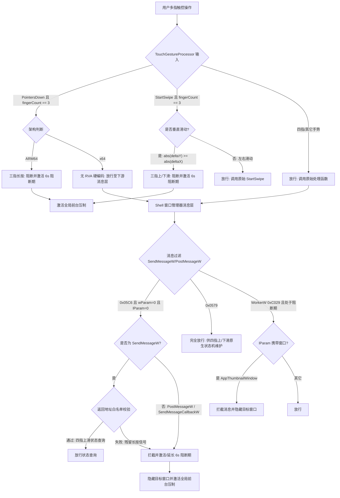

# 屏蔽三指所有手势的技术实现方案

本篇文档详细介绍了在 Windows 系统下，通过注入挂钩（Hook）技术屏蔽三指手势（包括**三指长按、三指上滑、三指下滑**）同时放行四指手势的底层原理、详细代码逻辑与多架构兼容方案。

---

## 1. 系统手势的底层分发链路

在 Windows 10/11 中，触摸板或触摸屏触发的手势在 `src/blocker` 拦截模块中，通过“上游 TwinUI 手势分发挂钩 + 下游 Shell 窗口消息过滤”相结合的复合架构来实现阻断。

其分发与拦截链路如下图所示：



### 手势特征与处理策略对照表

| 手势/动作 | 触发源与特征 | 主拦截挂钩点 | 后续保护与残留压制机制 | 拦截结果 |
| :--- | :--- | :--- | :--- | :--- |
| **三指长按** | 触摸按下阶段 | `TouchGestureProcessor::PointersDown` (仅限 ARM64) | 1. 下游 `0x05C6` 残留信号拦截<br/>2. 激活 6 秒阻断期压制 `AppThumbnailWindow`<br/>3. 全局非 Shell 窗口前台抢占屏蔽 | 完美屏蔽，不显示 recent task switcher |
| **三指上滑** | 垂直滑动位移 (`abs(deltaY) >= abs(deltaX)`) | `TouchGestureProcessor::StartSwipe` (ARM64 / x64) | 1. 激活 6 秒阻断期<br/>2. API Hook 强行隐藏 `AppThumbnailWindow` | 屏蔽，不进入多任务视图/窗口管理器 |
| **三指下滑** | 垂直滑动位移 (`abs(deltaY) >= abs(deltaX)`) | `TouchGestureProcessor::StartSwipe` (ARM64 / x64) | 同上，激活 6 秒阻断期并隐藏残留窗口 | 屏蔽，不触发系统下滑显示桌面动作 |
| **三指左右滑** | 水平滑动位移 (`abs(deltaY) < abs(deltaX)`) | 无（不满足垂直判定） | 无 | 完全放行，正常触发虚拟桌面/程序切换 |
| **四指下滑** | 窗口消息分发 | 不命中三指条件 (放行) | `0x0579 / wParam=3` 消息不拦截 | 放行，系统正常显示桌面并保留窗口状态 |
| **四指上滑** | 窗口消息与状态查询 | 不命中三指条件 (放行) | `0x05C6` 送往 `Shell_TrayWnd` 的状态查询通过白名单放行，`0x0579 / wParam=2` 不拦截 | 放行，正常恢复窗口或进入多任务视图 |

---

## 2. 核心模块与代码逻辑还原

### 2.1 上游 TwinUI 消息拦截 (`twinui_gesture_hooks.cpp`)

挂钩 `twinui.pcshell.dll` 来在最上游屏蔽三指的滑动和长按。为保证重入安全，相关 hook 引入了 `thread_local bool g_inTwinuiHook` 标记。

#### 1. 三指滑动拦截 (`StartSwipe`)
当系统调用 `TouchGestureProcessor::StartSwipe(self, fingerCount, point)` 时，Hook 检测是否为三指垂直滑动：
- 手指数必须精确等于 `3`。
- 位移坐标 deltaX / deltaY 为有限数（`std::isfinite`）。
- 满足垂直位移特征（`abs(deltaY) >= abs(deltaX)`）。

若满足上述三指垂直滑动判定：
1. 激活阻断期（调用 `StartThreeFingerSwipeUpBlockWindow()`）。
2. 直接返回，不调用原始的 `TouchGestureProcessor::StartSwipe`，从而在上游截断滑动信号。

##### 代码逻辑：
```cpp
bool IsThreeFingerVerticalSwipe(int fingerCount, float deltaX, float deltaY, int* dx, int* dy) {
    if (dx) *dx = 0;
    if (dy) *dy = 0;

    if (fingerCount != 3 || !std::isfinite(deltaX) || !std::isfinite(deltaY)) {
        return false;
    }

    if (dx) *dx = static_cast<int>(deltaX);
    if (dy) *dy = static_cast<int>(deltaY);

    return std::abs(deltaY) >= std::abs(deltaX);
}

void WINAPI TouchGestureProcessorStartSwipe_Hook(void* self, unsigned int fingerCount, const TouchGesturePointView* point) {
    int dx = 0, dy = 0;
    bool shouldBlock = point && IsThreeFingerVerticalSwipe(static_cast<int>(fingerCount), point->deltaX, point->deltaY, &dx, &dy);
    
    // TRACE 日志记录
    LogMessage(L"hookdll", LogLevel::Info, L"event=TRACE api=twinui::TouchGestureProcessor::StartSwipe fingerCount=%u dx=%d dy=%d block=%d", fingerCount, dx, dy, shouldBlock ? 1 : 0);

    if (!g_inTwinuiHook && shouldBlock) {
        g_inTwinuiHook = true;
        StartThreeFingerSwipeUpBlockWindow(); // 启动 6 秒阻断窗口
        LogMessage(L"hookdll", LogLevel::Info, L"event=BLOCKED api=twinui::TouchGestureProcessor::StartSwipe fingerCount=%u dx=%d dy=%d reason=three-finger-vertical-swipe", fingerCount, dx, dy);
        g_inTwinuiHook = false;
        return;
    }

    if (TouchGestureProcessorStartSwipe_Original) {
        TouchGestureProcessorStartSwipe_Original(self, fingerCount, point);
    }
}
```

#### 2. 三指长按拦截 (`PointersDown`) - 架构差异化处理
长按手势在产生滑动偏移前会调用 `TouchGestureProcessor::PointersDown(self, fingerCount)`。
由于该函数无法通过通用的符号数据库查找，因此我们针对 **ARM64** 架构进行了专有的硬编码偏移（RVA）挂钩：
- Plain 路径 RVA: `0x535310`
- Hybrid 路径 RVA: `0xC0A8A8`
*(注：在 x64 架构下，此挂钩不执行安装，依靠下游消息层拦截作为兜底策略)*

若检测到 `fingerCount == 3`，则直接阻断并开启 6 秒阻断期。

##### 代码逻辑：
```cpp
#if defined(TOUCHREV_ARCH_ARM64)
void WINAPI TouchGestureProcessorPointersDownPlain_Hook(void* self, unsigned int fingerCount) {
    if (!g_inTwinuiHook && ShouldBlockThreeFingerPointerDown(fingerCount)) {
        g_inTwinuiHook = true;
        BlockThreeFingerPointerDown(fingerCount, L"twinui::TouchGestureProcessor::PointersDown/plain");
        g_inTwinuiHook = false;
        return;
    }
    if (TouchGestureProcessorPointersDownPlain_Original) {
        TouchGestureProcessorPointersDownPlain_Original(self, fingerCount);
    }
}
#endif
```

---

### 2.2 下游窗口消息过滤与白名单防误伤机制 (`hooks.cpp` & `gesture_blocker.cpp`)

为了过滤残留的三指长按信号并放行四指上滑的状态查询，Hook 模块拦截了 `SendMessageW`、`PostMessageW` 和 `SendMessageCallbackW`，并在 `0x05C6` 消息中引入了精准的白名单校验。

#### 1. 精准的 API 差异化处理与白名单过滤
当消息为 `0x05C6` 时，白名单校验必须满足以下全部条件才予以放行：
1. **调用 API 限制**：必须是通过 `SendMessageW` 发送。如果是 `PostMessageW` 或 `SendMessageCallbackW`，则直接**不予放行**（`allowShellMultitaskingStateQuery` 在调用中直接传入 `false`）。
2. **消息参数限制**：`msg == 0x05C6` 且 `wParam == 0` 且 `lParam == 0`。
3. **窗口类限制**：目标窗口类必须是 `"Shell_TrayWnd"`。
4. **返回地址白名单校验**：
   通过检查当前调用栈的返回地址（Return Address）是否落入 `GetMultitaskingViewState` 函数内来验证是否是系统四指手势的状态查询。有两种定位手段：
   - **动态符号定位**：解析 `MultitaskingViewGestureHandler::GetMultitaskingViewState` 符号。若成功，则判断返回地址是否落在函数起始点后的 `0x200` 字节（即 `kMultitaskingViewStateQueryMaxBytes`）范围内。
   - **RVA 静态回落（Fallback）**：计算返回地址相对于 `twinui.pcshell.dll` 的偏移。判断是否等于硬编码的已知偏移（Plain: `0x16192C`，Hybrid: `0xA9E6F4`）。

满足以上所有条件的 `0x05C6` 消息被视为合法的四指状态查询，予以放行；否则被判定为三指长按残留信号，消息被拦截且拦截时会激活阻断期。

##### 核心判定逻辑：
```cpp
bool IsReturnAddressInMultitaskingViewStateQuery(void* returnAddress) {
    if (!returnAddress) return false;

    void* functionAddress = ResolveMultitaskingViewStateQueryAddress();
    if (functionAddress) {
        std::uintptr_t start = reinterpret_cast<std::uintptr_t>(functionAddress);
        std::uintptr_t current = reinterpret_cast<std::uintptr_t>(returnAddress);
        if (current >= start && current < start + 0x200) {
            return true;
        }
    }
    return IsReturnAddressAtKnownMultitaskingStateQueryCallsite(returnAddress);
}

bool ShouldAllowShellMultitaskingStateQuery(HWND hwnd, UINT msg, WPARAM wParam, LPARAM lParam, void* returnAddress) {
    return msg == kShellTrayThreeFingerLongPressMessage && wParam == 0 && lParam == 0 &&
           WindowClassEquals(hwnd, kClassShellTrayWnd) &&
           IsReturnAddressInMultitaskingViewStateQuery(returnAddress);
}
```

#### 2. WorkerW 消息路由拦截 (`0xC029`)
在三指拦截的阻断期内，如果拦截到 `WorkerW`（类名为 `"WorkerW"`）窗口转发手势路由消息（`msg == 0xC029` 且 `wParam` 为 `0x35` (Begin) 或 `0x36` (End)）：
- 检查 `lParam` 携带的窗口句柄是否是 `AppThumbnailWindow`。如果是，则代表该消息正试图拉起或控制 Recent Task Switcher。
- Hook 会拦截该消息，并立即调用 `HideMessageWindows` 对该窗口进行物理隐藏。

#### 3. 0x0579 动作消息放行
当前策略**不拦截**对 `"Shell_TrayWnd"` 发送的 `0x0579` 消息：
- `wParam == 3` (四指下滑显示桌面) 与 `wParam == 2` (四指上滑恢复) 均会完整放行，从而不破坏四指在系统层面维护的窗口折叠状态机。

---

### 2.3 后续保护：阻断期与窗口压制机制

当三指手势触发后，由于可能存在系统异步调用或已送达下游的部分残留，界面可能会发生一瞬间的闪烁或短暂弹出空白的 Recent Task Switcher 窗口。Hook 层引入了**阻断期**与**全局窗口压制**来彻底消除这些视觉残留。

#### 1. 阻断期生命周期
- 阻断状态由全局原子变量 `g_recentTaskSwitcherBlockUntilTick` 控制。
- 每次拦截到上游三指手势（`StartSwipe` / `PointersDown`）或下游残留信号时，会通过 `StartRecentTaskSwitcherBlockWindow()` 写入（或顺延）一段长达 **6000毫秒 (6秒)** 的阻断时间窗（对应 `kDefaultBlockDurationMs`）。

#### 2. AppThumbnailWindow 强行隐藏
Hook 了 `ShowWindow` 和 `SetWindowPos` API：
- 在 6 秒阻断期内，如果检测到被操作的窗口类名为 `"AppThumbnailWindow"`：
  - 强制修改其显示属性为隐藏（`SW_HIDE` / `SWP_HIDEWINDOW`）。
  - 直接返回 `TRUE` 瞒过调用者，从而让多任务视口（Recent Task Switcher）物理上无法显示在桌面上。

#### 3. 全局前台抢占屏蔽
Hook 了 `SetForegroundWindow`、`BringWindowToTop`、`SwitchToThisWindow` API：
- 在 6 秒阻断期内，只要试图将焦点切换到**非 Shell 路由窗口**（即既不是 `"Shell_TrayWnd"` 也不是 `"WorkerW"` 的其它窗口）：
  - 拦截该请求并直接返回（或返回 `TRUE`）。
  - 从而防止拦截手势时发生前台窗口焦点丢失、或者背景窗口异常闪烁等问题。

---

## 3. 总结

`src/blocker` 针对三指手势的屏蔽实现是极其严密的。它通过上游 TouchGesture 拦截来丢弃手势位移，通过在 SendMessage/PostMessage 钩子中对 `0x05C6` 做精准的返回地址/RVA白名单区分，确保在屏蔽三指长按时完全不影响四指的手势逻辑；最后辅以 6 秒阻断期内针对 `AppThumbnailWindow` 的物理隐藏以及全局前台提交拦截，从而在系统级消除了任何残留的 UI 闪烁。
